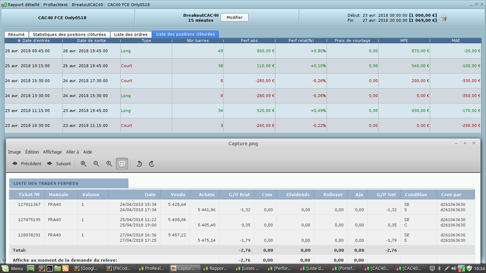
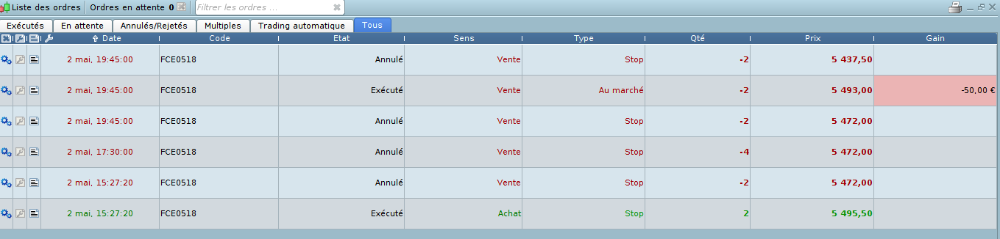

# Breakout trading strategy on French CAC40

> Source: https://fxcodebase.com/code/viewtopic.php?f=31&t=65945  
> Forum: 31 · Topic 65945 · 12 post(s)

---

## Breakout trading strategy on French CAC40

**Apprentice** · Tue Apr 17, 2018 7:43 am

Based on the request.
[viewtopic.php?f=27&t=65878](https://fxcodebase.com/code/viewtopic.php?f=27&t=65878)

 [Breakout trading strategy on French CAC40.lua](files/118700/Breakout%20trading%20strategy%20on%20French%20CAC40.lua)

This strategy is really weird. I converted it as is... and it didn't open any positions in a year. I've made some changed to the algorithm which looks logical and it started to trade. Not sure whether it is correct or not.

---

## Re: Breakout trading strategy on French CAC40

**Avignon** · Wed Apr 18, 2018 3:01 pm

Thank you so much Apprentice.

I would have liked to compare with a backtest on PRT as well as run them in parallel, but impossible to open a demo account.

When you say "it didn't open any positions in a year", did you respect the unit time M15 ?

---

## Re: Breakout trading strategy on French CAC40

**Apprentice** · Mon Apr 23, 2018 5:17 am

PRT?
What are the results of your testing?

---

## Re: Breakout trading strategy on French CAC40

**Avignon** · Tue Apr 24, 2018 2:00 pm

Impossible to test, I finished the trial period and it's not easy to recreate another account.

I would have liked to help to check if the conversion was good.

---

## Re: Breakout trading strategy on French CAC40

**Avignon** · Thu Apr 26, 2018 2:29 pm

It's possible to give me the beta version that you made ?

This Thursday we had a nice trend but no trade.

---

## Re: Breakout trading strategy on French CAC40

**Avignon** · Mon Apr 30, 2018 5:46 am

I post quickly, I have to go. I managed to create a demo account at PRT for 14 days.

Ask to me what you need.

 

Be careful, Monday I not run the strategy.

---

## Re: Breakout trading strategy on French CAC40

**Avignon** · Sun May 06, 2018 7:18 am

No trade with yours.

Do I have hope that you retrace it?

---

## Re: Breakout trading strategy on French CAC40

**Avignon** · Tue Jun 26, 2018 5:22 am

(I use Google translate)

Hello,

I could have waited at least 2 full months but now I do not care: the results are good!

An idea of improvement: could one not maximize gains during the gain phase? Renko? Pyramiding?

[https://www.myfxbook.com/members/Avigno ... 40/2577106](https://www.myfxbook.com/members/Avignon/breakout-cac40/2577106)

---

## Re: Breakout trading strategy on French CAC40

**Avignon** · Mon Jul 02, 2018 5:29 pm

> **Avignon wrote:**
> (I use Google translate)
>
> Hello,
>
> I could have waited at least 2 full months but now I do not care: the results are good!
>
> An idea of improvement: could one not maximize gains during the gain phase? Renko? Pyramiding?
>
>
> [https://www.myfxbook.com/members/Avigno ... 40/2577106](https://www.myfxbook.com/members/Avignon/breakout-cac40/2577106)

No add to the development list?

---

## Re: Breakout trading strategy on French CAC40

**Apprentice** · Sat Aug 04, 2018 7:17 am

Your request is added to the development list under Id Number 4214

---

## Re: Breakout trading strategy on French CAC40

**Avignon** · Sat Aug 04, 2018 5:24 pm

Thank you but you can put it in low priority because finally the results are not so good.

[https://www.myfxbook.com/portfolio/brea ... 40/2577106](https://www.myfxbook.com/portfolio/breakout-cac40/2577106)

---

## Re: Breakout trading strategy on French CAC40

**Avignon** · Sun Nov 04, 2018 7:38 pm

My demo account closed. As the strategy was not conclusive, I stop the test.

RIP.
