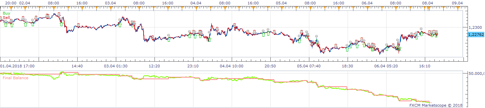
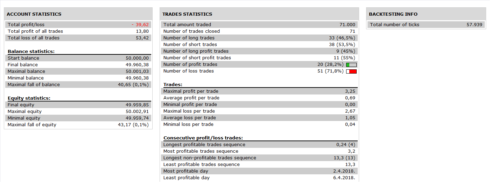

# Breaks strategy

> Source: https://fxcodebase.com/code/viewtopic.php?f=31&t=66940  
> Forum: 31 · Topic 66940 · 4 post(s)

---

## Breaks strategy

**Apprentice** · Mon Nov 19, 2018 10:06 am

 

Based on request.
[viewtopic.php?f=17&t=66861](https://fxcodebase.com/code/viewtopic.php?f=17&t=66861)

 [breaks strategy.lua](files/122209/breaks%20strategy.lua)

---

## Re: Breaks strategy

**bruno2017** · Wed Nov 21, 2018 12:07 pm

Hello
here is the stategy and the parameters
GER 30
UT: 15 minutes

---

## Re: Breaks strategy

**Carbine** · Sun Jan 20, 2019 9:25 pm

Hi Apprentice,

I seem to be having trouble with the stops on this strategy, they don't seem to be activating.

Am I correct in thinking it places the stop above/below the high/low of the period that precedes the period that opens the trade?

Would it be at all possible to have an option to set the stop limit manually?

Many Thanks

Carbine

---

## Re: Breaks strategy

**Apprentice** · Sat Jan 26, 2019 5:19 am

Added another stop option.

 [breaks strategy.lua](files/123544/breaks%20strategy.lua)
