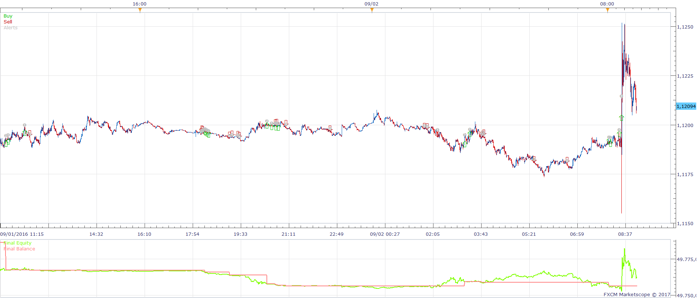
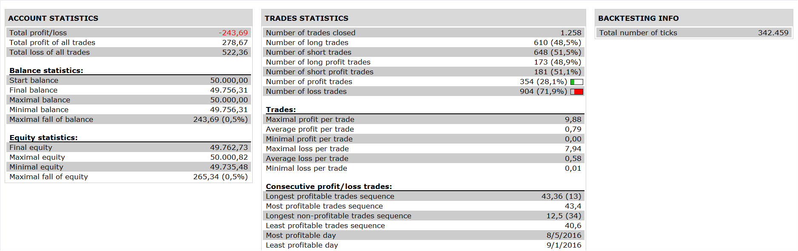

# Brooky_Trend_Strength Strategy

> Source: https://fxcodebase.com/code/viewtopic.php?f=31&t=64361  
> Forum: 31 · Topic 64361 · 1 post(s)

---

## Brooky_Trend_Strength Strategy

**Apprentice** · Sat Jan 28, 2017 8:01 am

 

Open Long
signal < buy level and UP < buy level and UP cross over signal
Open Short
signal< sell level and DN < sell level and DN cross over signal

 [Brooky_Trend_Strength Strategy.lua](files/110755/Brooky_Trend_Strength%20Strategy.lua)

Brooky_Trend_Strength.lua is available here.
[viewtopic.php?f=17&t=2377](https://fxcodebase.com/code/viewtopic.php?f=17&t=2377)
StdDev2.lua is available here.
[viewtopic.php?f=17&t=870&p=5132#p5132](https://fxcodebase.com/code/viewtopic.php?f=17&t=870&p=5132#p5132)

The Strategy was revised and updated on January 19, 2019.
