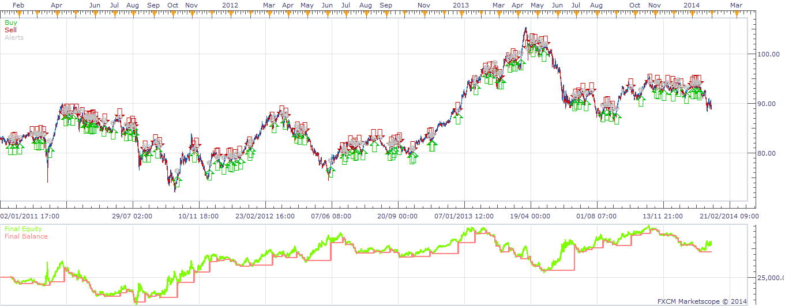

# Bulls and Bears Heatmap Strategy

> Source: https://fxcodebase.com/code/viewtopic.php?f=31&t=60298  
> Forum: 31 · Topic 60298 · 4 post(s)

---

## Bulls and Bears Heatmap Strategy

**moomoofx** · Thu Feb 13, 2014 8:09 am

As requested on: [viewtopic.php?f=17&t=11904&start=10](https://fxcodebase.com/code/viewtopic.php?f=17&t=11904&start=10)

Trade Signals do not match the Indicator values in back-testing exactly as the strategy runs live and the indicator values do not refresh properly - but generally same logic.
Cheers,
MooMooFX

 [Bulls_Bears_HM2.lua](files/92636/Bulls_Bears_HM2.lua)

 [BBHeatMapStrategy.lua](files/92636/BBHeatMapStrategy.lua)

Please install the new indicator BULLS_BEARS_HM2 for this strategy to work.

Make sure to install Bulls.lua and Bears.lua Indicators.
[viewtopic.php?f=17&t=1376&p=2648](https://fxcodebase.com/code/viewtopic.php?f=17&t=1376&p=2648)

The Strategy was revised and updated on December 11, 2018.

---

## Re: Bulls and Bears Heatmap Strategy

**alextrade** · Thu May 01, 2014 2:04 am

Hi, could someone help me? I cant seem to get any results out of this strategy when I back test it, could I be missing something simple?

Regards

Alex M

---

## Re: Bulls and Bears Heatmap Strategy

**Apprentice** · Thu May 01, 2014 2:52 am

I had no problems during the test.

Make sure to install Bulls.lua and Bears.lua Indicators.
[viewtopic.php?f=17&t=1376&p=2648](https://fxcodebase.com/code/viewtopic.php?f=17&t=1376&p=2648)
I hope this will help.

---

## Re: Bulls and Bears Heatmap Strategy

**Apprentice** · Sun Dec 11, 2016 6:39 am

Strategy was revised and updated.
