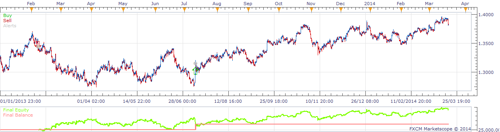

# Buy/Sell Threshold EMA Strategy

> Source: https://fxcodebase.com/code/viewtopic.php?f=31&t=60440  
> Forum: 31 · Topic 60440 · 2 post(s)

---

## Buy/Sell Threshold EMA Strategy

**moomoofx** · Thu Mar 20, 2014 6:45 pm

As requested on: [viewtopic.php?f=27&t=60252](https://fxcodebase.com/code/viewtopic.php?f=27&t=60252)

 



Enters based on thresholds of a ratio comparing a short EMA and long EMA. I changed the buy enter condition as I believe the less than sign should be a greater than sign, otherwise the strategy will never enter sell positions it seems. So now it enters based on this.

```
diff = 100 * (short_ema - long_ema) / ((short_ema + long_ema) / 2)

if diff > buy_threshold:
    buy(price)
else:
    if diff < -sell_threshold:
        sell(price)
```

Cheers,
MooMooFX

The Strategy was revised and updated on December 10, 2018.

---

## Re: Buy/Sell Threshold EMA Strategy

**Apprentice** · Sun Dec 11, 2016 5:17 am

Strategy was revised and updated.
