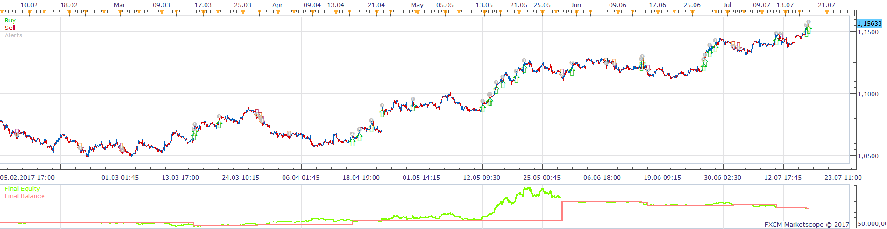
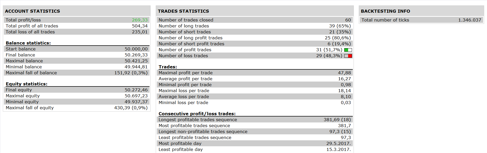

# Buying Selling Pressure Strategy

> Source: https://fxcodebase.com/code/viewtopic.php?f=31&t=64989  
> Forum: 31 · Topic 64989 · 1 post(s)

---

## Buying Selling Pressure Strategy

**Apprentice** · Sun Aug 13, 2017 6:38 am

 

Open Long

1. SBP (H4) > SSP( H4) AND SBP (H4)- SSP(H4) > ATR(H4) *MULTIPLIER FOR H4(2.0)

2.SBP(H1)> SSP(H1) AND SBP(H1)-SSP(H1) > ATR(H1)*MULTIPLIER FOR H1(1.0)

3. SBP (M15 ) CROSS OVER SSP (M 15)

Open Short

1. SSP(H4) > SSP( H4) AND SSP(H4) -SBP(H4) > ATR (H4) * MULTIPLIER FOR H4( 2.0)

2.SSP(H1) > SBP(H1) AND SSP(H1) - SBP(H1) > ATR(H1)*MULTIPLIER FOR H1(1.0)

3.SSP (M15) CROSS OVER SBP (M15)

 [Buying Selling Pressure Strategy.lua](files/114160/Buying%20Selling%20Pressure%20Strategy.lua)

BSP.lua is available here.
[viewtopic.php?f=17&t=32052](https://fxcodebase.com/code/viewtopic.php?f=17&t=32052)

The Strategy was revised and updated on January 21, 2019.
