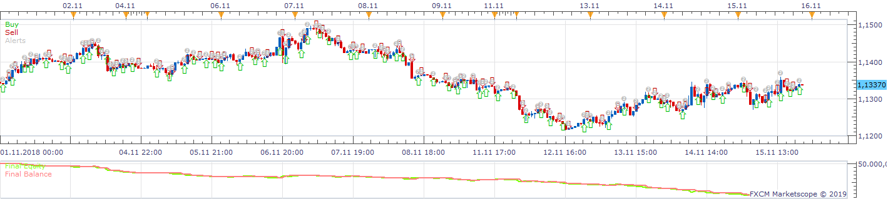
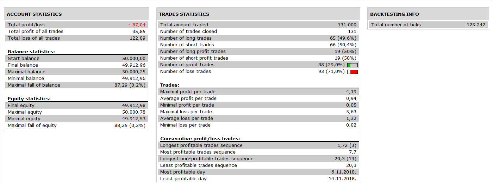

# Candle chaser strategy

> Source: https://fxcodebase.com/code/viewtopic.php?f=31&t=67340  
> Forum: 31 · Topic 67340 · 3 post(s)

---

## Candle chaser strategy

**Apprentice** · Tue Feb 12, 2019 4:45 am

 

Based on request.
[viewtopic.php?f=27&t=67336](https://fxcodebase.com/code/viewtopic.php?f=27&t=67336)
Open Long on Up candle
Open Short on Down candle
The strategy will open a new position as soon as candle color changes.
It can be volatile at smaller time frames, or as the new candle is opened.

 [Candle chaser Strategy.lua](files/123840/Candle%20chaser%20Strategy.lua)

MT4/MQ4 version.
[https://fxcodebase.com/code/viewtopic.php?f=38&t=67350](https://fxcodebase.com/code/viewtopic.php?f=38&t=67350)

---

## Re: Candle chaser strategy

**Gilles** · Fri Jul 22, 2022 9:31 am

Hi Apprentice, the link to get the MT4 version does not work. Thanks.

---

## Re: Candle chaser strategy

**Apprentice** · Sun Jul 24, 2022 4:21 am

Fixed.
