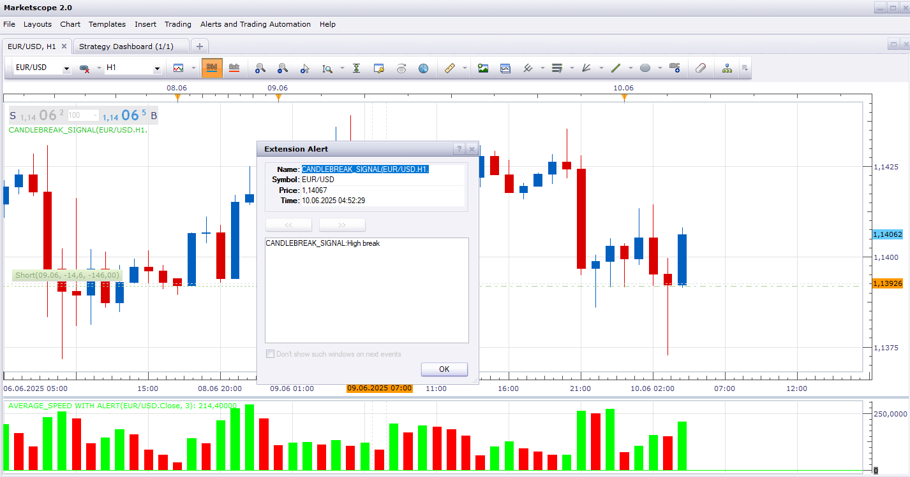

# CandleBreak_Signal

> Source: https://fxcodebase.com/code/viewtopic.php?f=31&t=76005  
> Forum: 31 · Topic 76005 · 4 post(s)

---

## CandleBreak_Signal

**Apprentice** · Thu Jun 05, 2025 1:03 pm

Based on the request.
[https://fxcodebase.com/code/viewtopic.p ... 86#p159086](https://fxcodebase.com/code/viewtopic.php?f=27&t=75869&p=159086#p159086)

 [CandleBreak_Signal.lua](files/159493/CandleBreak_Signal.lua)

---

## Re: CandleBreak_Signal

**7000306337** · Fri Jun 06, 2025 7:22 am

Hello Dear Apprentice Mario:

Appreciate your valuable time and mentor.

I kindly requested MODIFYING this exact famous "CandleBreak_Signal" file so it would work immediately upon launching.
As it stands right now in its current form ,,,,,,, there will be NO SIGNALS GENERATED till the first id==3 event is received. If the time frame of id==3 is a daily candle then no signals will be generated till a new day begins (i.e. no signals will not be generated for up to 24 hours).

Cordial Best Regards,
Khairy

---

## Re: CandleBreak_Signal

**Apprentice** · Mon Jun 09, 2025 10:43 am

We have added your request to the development list.
Development reference 379

---

## Re: CandleBreak_Signal

**Apprentice** · Tue Jun 10, 2025 5:06 am

The modified signal has no such delay.
