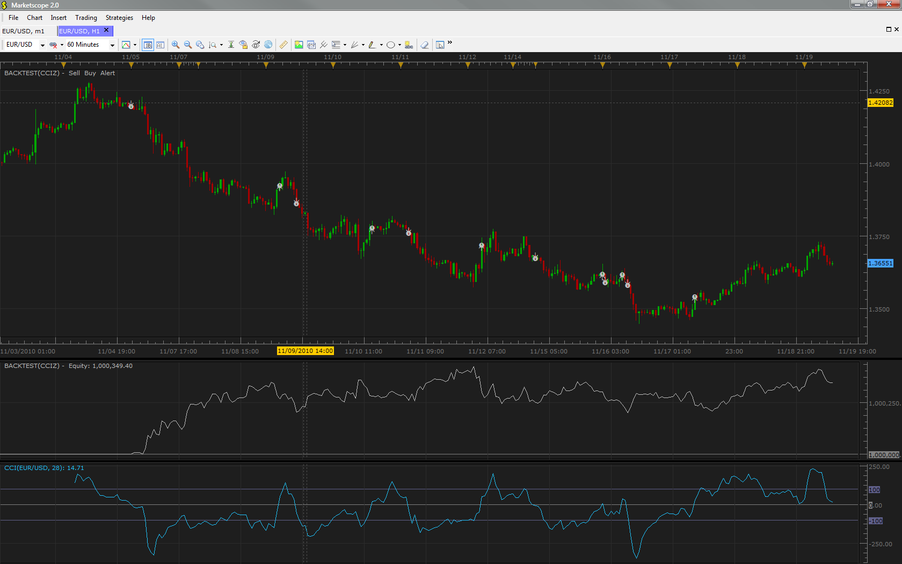

# CCI cross zero Strategy

> Source: https://fxcodebase.com/code/viewtopic.php?f=31&t=2743  
> Forum: 31 · Topic 2743 · 6 post(s)

---

## CCI cross zero Strategy

**vstrelnikov** · Fri Nov 19, 2010 10:37 am

There is a simple CCI based strategy, which enters to market when CCI indicators closed zero line.

 



 [CCIZ.lua](files/6226/CCIZ.lua)

---

## Re: CCI cross zero Strategy

**JaimeO** · Fri Jan 28, 2011 11:13 am

very useful, thank you!

I have a question though... it might be the same for all the other strategies so this might not be something that can be changed...

I setup the strategy and it seems to work, but the signal comes way after it actually happens... Are the parameters for giving signals continuously checked or they only check every once in a while?

I've attached a pic of what I mean. The CCI has crossed over 0 (bottom part of the pic) but the signal hasn't shown up yet (it would show with a circle on the graph on top).

Thanks
-Jaime

---

## Re: CCI cross zero Strategy

**sunshine** · Tue Feb 01, 2011 8:25 am

Hi,
Actually the strategy works on close prices. This means that the system checks the strategy condition each time a bar closes.

For example, you apply the strategy on one-hour time frame. The current time is 18:37. The CCI indicator crosses the zero level at 18:49. In case this crossing is retained on closing of this bar, that is at 19:00, you'll get a signal at this moment.

Checking closing of bars allows avoiding false signals, since the crossing can occur several times inside the same bar.

---

## Re: CCI cross zero Strategy

**JaimeO** · Tue Feb 01, 2011 5:04 pm

Yes, and it makes sense to do so but if you are using longer time spans like dailies or monthlies, waiting for the close of the candle takes a bite out of the trend.

I've looked into the code and it seems that the changes required are not that big, maybe somebody can help me process through it...?

So this is what how I'm trying to modify it...
On FIFO trading
* The buy/sell signal gets generated when the actual CCI crosses 0 (or some defined value after 0)
 Variable "openLevel" and "closeLevel" seem to have been created for this but are not being used as far as I can see.
* To prevent the multiple buying/selling that was mentioned in the previous post, once the buy/sell signal is generated, a reverse signal cannot be generated on the same candlestick (or we can set another threshold that it needs to reach before a reverse signal can be generated "openLevel+50") .
 "function enter(BuySell)" already has the condition not to trade if "haveTrades(BuySell)" returns true so maybe another condition there...?

I just can't seem to figure out how it is all put together...
function ExtUpdate is the core of the call but how does this
"if (CCI.CCI[period - 1] <= 0 and CCI.CCI[period] > 0) then"
equate to this?
 -- Open BUY (Long) position if MACD line crosses over SIGNAL line
 -- in negative area below openLevel. Also check MA trend if
 -- confirmTrend flag is 'true'

Any help is very much appreciated
-JO

---

## Re: CCI cross zero Strategy

**Victor.Tereschenko** · Fri Feb 11, 2011 4:16 am

> **JaimeO wrote:**
> I just can't seem to figure out how it is all put together...
> function ExtUpdate is the core of the call but how does this
> "if (CCI.CCI[period - 1] <= 0 and CCI.CCI[period] > 0) then"
> equate to this?
> -- Open BUY (Long) position if MACD line crosses over SIGNAL line
> -- in negative area below openLevel. Also check MA trend if
> -- confirmTrend flag is 'true'
>
> Any help is very much appreciated
> -JO

You can use timers:

```lua
local CHECK_CONDITIONS=12345;
function Prepare()
...
local timerIntervalSeconds = 60; -- run checks each menute
core.host:execute("setTimer", CHECK_CONDITIONS, timerIntervalSeconds);
...
end

function ExtAsyncOperationFinished(cookie, success, message)
    if cookie == CHECK_CONDITIONS then
        -- call checks
        ExtUpdate(2, source, source:size() - 1);
    end
end

function ReleaseInstance()
    core.host:execute("killTimer", CHECK_CONDITIONS);
end
```

---

## Re: CCI cross zero Strategy

**Apprentice** · Mon Jan 29, 2018 7:44 am

The strategy was revised and updated.
