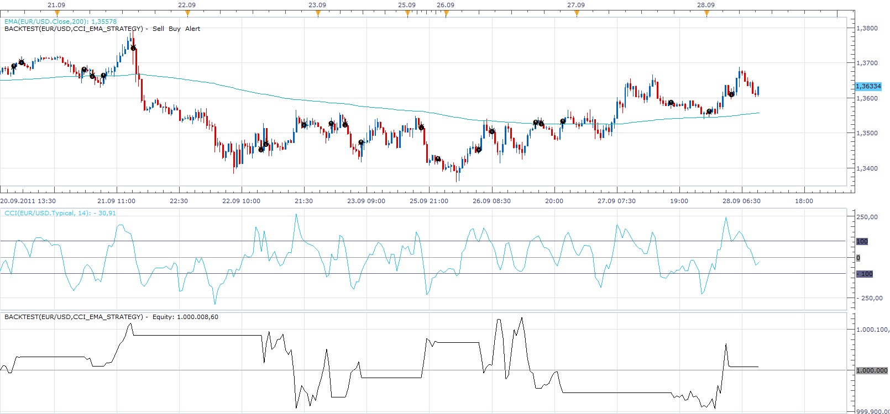

# CCI_EMA_STRATEGY

> Source: https://fxcodebase.com/code/viewtopic.php?f=31&t=6919  
> Forum: 31 · Topic 6919 · 16 post(s)

---

## CCI_EMA_STRATEGY

**Apprentice** · Wed Sep 28, 2011 8:50 am

STRAGEGY NAME : “CCI AND EMA 200 STRATEGY”

INDICATORS USED:

1.	EMA [PERIOD 200]
2.	CCI [PERIOD 14] WITH
 BUY ENTRY LEVEL [ -100]
SELL ENTRY LEVEL[100]

BUYING CONDITIONS:

1. PRICE > EMA [PERIOD 200] {AND}
2.CCI[PERIOD 14] CROSSOVER BUYENTRY LEVEL

SELLING CONDITIONS
1.PRICE < EMA[PERIOD 200]{AND}
2. CCI[PERIOD 14] CROSSUNDER SELLENTRY LEVEL

EXIT BUY CONDITIONS:
1. CCI[PERIOD 14] CROSSUNDER SELLENTRY LEVEL[100]{OR}
2.PRICE CROSSUNDER EMA[PERIOD 200]

EXIT SELL CONDITIONS
1.	CCI [PERIOD 14] CROSSOVER BUYENTRY LEVEL [-100]{OR}
2.	PRICE CROSS OVER EMA [PERIOD 200]

 [CCI_EMA_STRATEGY.lua](files/15587/CCI_EMA_STRATEGY.lua)

 [CCI_EMA_STRATEGY Mod.lua](files/15587/CCI_EMA_STRATEGY%20Mod.lua)

The Strategy was revised and updated on December 11, 2018.

---

## Re: CCI_EMA_STRATEGY

**mosesnobleraj** · Wed Sep 28, 2011 9:13 am

Sir,
Thanks a lot

---

## Re: CCI_EMA_STRATEGY

**estoroth** · Tue Oct 04, 2011 8:25 am

Very interesant, clear and simple strategy. How do you set your StopLoss and ProfitTarget?

---

## Re: CCI_EMA_STRATEGY

**mosesnobleraj** · Tue Oct 04, 2011 11:21 am

sir,
i use this strategy in m5 time frame . lower highs uptrend higher lows down trend . never go against trend. take profit will be highest level in up trend; lowest level in down trend. stop loss 75% of TP.

---

## Re: CCI_EMA_STRATEGY

**swingtrader** · Tue Oct 25, 2011 1:41 am

hi,
 For a best strategy it should contain 3 factors . one is trend direction identifying indicator . second is high low identifying indicator. third is trend strength identifying indicator. here in this strategy trend direction identifying indicator [ema 200] is present. price high low identifying indicator [cci 14] is present. but trend strength indicator is not present. ADX 14 is one of the trend strength identifying indicator. there fore if we add **{adx 14> 30}**to the buying condition and selling condition it will give good results.

---

## Re: CCI_EMA_STRATEGY

**pttillman** · Sat Nov 12, 2011 8:33 pm

Apprentice,

Thanks you creating this strategy. Are you able to add a simple moving average option to the strategy?

---

## Re: CCI_EMA_STRATEGY

**Apprentice** · Mon Nov 14, 2011 11:41 am

Your request is added to the development queue.

---

## Re: CCI_EMA_STRATEGY

**smythe** · Mon Nov 14, 2011 5:40 pm

Hey... looks like exactly what I need! I cant get it to actually place test trades though... it just shows me the "up" and "down" trends on the chart. How do I get it to place trades? Thanks,

---

## Re: CCI_EMA_STRATEGY

**smythe** · Mon Nov 14, 2011 6:45 pm

Hi... looks good but how do I get the strategy to actually book trades in the backtest? It just seems to mark uptends and downtrends but doest actually book anything?

---

## Re: CCI_EMA_STRATEGY

**Apprentice** · Fri Jan 23, 2015 3:23 am

Updated.
Alternative MA method selection added.

---

## Re: CCI_EMA_STRATEGY

**nweiss** · Mon Feb 02, 2015 9:46 am

Hey I had a Problem with the backtest of the strategy when i set Limits they only hit on the EUR/USD and on the other pairs not I dont know why -.-

Maybe someone could help me!

---

## Re: CCI_EMA_STRATEGY

**nweiss** · Mon Feb 02, 2015 1:26 pm

Now the strategy do not trade a little bit crazy !

---

## Re: CCI_EMA_STRATEGY

**nweiss** · Mon Feb 02, 2015 6:16 pm

And the Stratege is not Reading in the Time i have Chose so i have Chose from 9 to 21 nur the Stratege opend steht 24 a Trade y ?

---

## Re: CCI_EMA_STRATEGY

**nweiss** · Tue Feb 03, 2015 4:07 am

Sorry for my english it was my Smartphone and T9

So my Problem ist that the Strategy Sometimes is trading and not !
I couldn't make backtests on all pairs only with the EUR/USD
Yesterday I saw that the strategy is Trading over the Time I have set, so I set that the strategy only have to Trade between 8 and 21 o clock but yesterday the strategy have open a trade at 23 o clock !

Maybe you could help me with the strategy !

---

## Re: CCI_EMA_STRATEGY

**nweiss** · Thu Feb 12, 2015 8:58 am

Nobody who could help me ?

Now their is the next Problem the strategy opens trades without a signal but only on EUR/USD

---

## Re: CCI_EMA_STRATEGY

**Apprentice** · Sun Dec 11, 2016 1:08 pm

Strategy was revised and updated.
