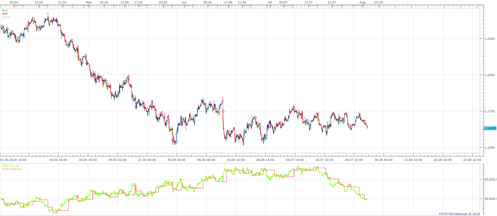
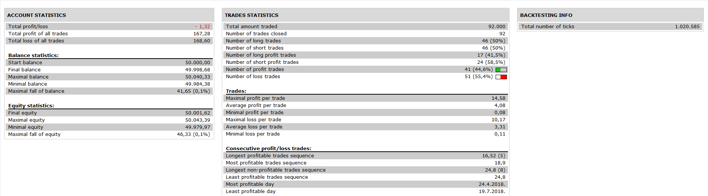
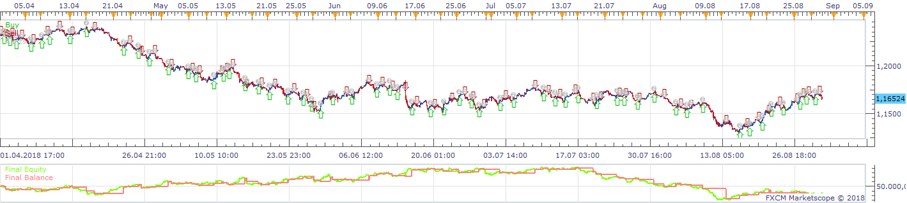

# CCI HA StochasticRSI ZONE_TRADE STRATEGY

> Source: https://fxcodebase.com/code/viewtopic.php?f=31&t=66931  
> Forum: 31 · Topic 66931 · 10 post(s)

---

## CCI HA StochasticRSI ZONE_TRADE STRATEGY

**Apprentice** · Thu Nov 15, 2018 5:28 pm

 

Based on request.
[viewtopic.php?f=31&t=2567](https://fxcodebase.com/code/viewtopic.php?f=31&t=2567)

Long Signal
StochRSI / OS Cross Over
Short Signal
StochRSI / OB Cross Under

CCI Filters
Long CCI > 0
Viceversa for Short

Heikin-Ashi Filters
HA Up Candle
Viceversa for Short

Awesome Oscillator Filters
Awesome Oscillator Upslope
Viceversa for Short

Accelerator Indicator Filters
Accelerator Indicator Upslope
Viceversa for Short

 [CCI HA StochasticRSI ZONE_TRADE STRATEGY.lua](files/122132/CCI%20HA%20StochasticRSI%20ZONE_TRADE%20STRATEGY.lua)

You can download Stochastic RSI from here.
[viewtopic.php?f=17&t=451](https://fxcodebase.com/code/viewtopic.php?f=17&t=451)

---

## Re: CCI HA StochasticRSI ZONE_TRADE STRATEGY

**kankatrader** · Thu Nov 15, 2018 9:06 pm

Hi
I still have 3_Level_ZZ_Semafor.lua as confirmation

If the label of the 3rd zigzag (orange color) is displayed above the market price confirmation only for SellOrders.

If the label of the 3rd zigzag (orange color) is displayed under the market price confirmation only for buy orders

Exact description can be viewed here

[https://www.youtube.com/watch?v=WZ2eCHvS6Jk&t=24s](https://www.youtube.com/watch?v=WZ2eCHvS6Jk&t=24s)

---

## Re: CCI HA StochasticRSI ZONE_TRADE STRATEGY

**Apprentice** · Fri Nov 16, 2018 6:27 am

Your request is added to the development list under Id Number 4318

---

## Re: CCI HA StochasticRSI ZONE_TRADE STRATEGY

**Apprentice** · Sun Nov 18, 2018 7:42 am

Try this version.

 [CCI HA StochasticRSI ZONE_TRADE STRATEGY.kankatrader.lua](files/122178/CCI%20HA%20StochasticRSI%20ZONE_TRADE%20STRATEGY.kankatrader.lua)

---

## Re: CCI HA StochasticRSI ZONE_TRADE STRATEGY

**kankatrader** · Mon Nov 19, 2018 2:46 am

Hi
Compared to the first version, the semicolon is always missing behind the code lines. is this intentional or a typographical error. because the strategy does not work as it should.

---

## Re: CCI HA StochasticRSI ZONE_TRADE STRATEGY

**kankatrader** · Tue Nov 20, 2018 3:28 am

I changed the lines in code 547 and 561 Strategy works now as I want it to be

---

## Re: CCI HA StochasticRSI ZONE_TRADE STRATEGY

**MC. Trend Trader** · Tue Nov 20, 2018 3:49 pm

if I choose Use 3-rd ZZ Semafor ", false) the following error message appears

C: / Program Files (x86) / Candleworks / FXTS2 / Strategies / Custom / CCI HA StochasticRSI ZONE_TRADE STRATEGY.kankatrader.lua: 385: attempt to index local 'indi' (a nil value)

---

## Re: CCI HA StochasticRSI ZONE_TRADE STRATEGY

**Apprentice** · Thu Nov 22, 2018 9:48 am

Fixed.

---

## Re: CCI HA StochasticRSI ZONE_TRADE STRATEGY

**kankatrader** · Thu Nov 22, 2018 1:57 pm

repaired strategy does not open any positions at all

---

## Re: CCI HA StochasticRSI ZONE_TRADE STRATEGY

**Apprentice** · Thu Nov 22, 2018 3:09 pm

It should work.
Try to re-download.
