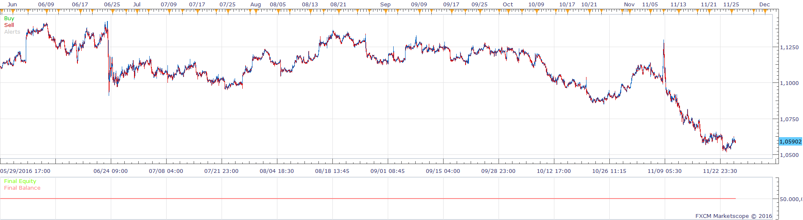
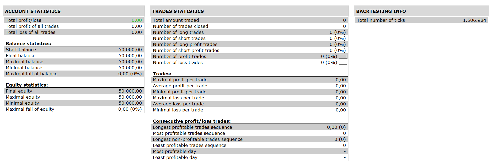

# CCI MA Crossover Indicator Strategy

> Source: https://fxcodebase.com/code/viewtopic.php?f=31&t=64175  
> Forum: 31 · Topic 64175 · 1 post(s)

---

## CCI MA Crossover Indicator Strategy

**Apprentice** · Mon Dec 05, 2016 7:49 am

 

Open Long
raw >signal in h4,d1
signal> buy level in h4 ,d1
signal<buy level in m15 and raw cross over signal

Open Short
raw <signal in h4,d1
signal< sell level in h4 ,d1
signal<sell level in m15 and raw cross under signal

CCI MA Crossover Indicator is available here.
[viewtopic.php?f=17&t=63926&p=108378&hilit=cci+ma+crossover#p108378](https://fxcodebase.com/code/viewtopic.php?f=17&t=63926&p=108378&hilit=cci+ma+crossover#p108378)

 [CCI MA Crossover Strategy.lua](files/109509/CCI%20MA%20Crossover%20Strategy.lua)
