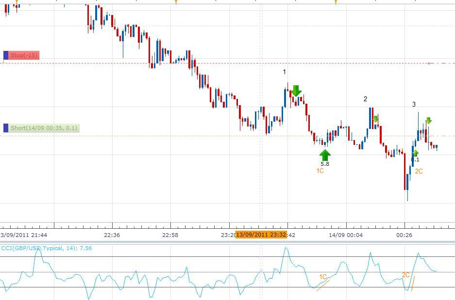
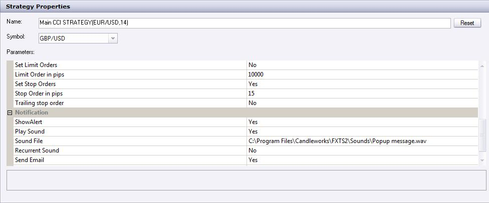

# CCI Strategy

> Source: https://fxcodebase.com/code/viewtopic.php?f=31&t=2202  
> Forum: 31 · Topic 2202 · 45 post(s)

---

## CCI Strategy

**Apprentice** · Fri Sep 17, 2010 4:38 am

 [CCI Strategy.lua](files/4579/CCI%20Strategy.lua)

Buy
Crossover Above Oversold
But only if it has previously reached Oversold Confirmation, Level (150)

Sell
Crossover Below overbought
But only if it has previously reached overbought Confirmation, Level (-150)

The Strategy was revised and updated on December 18, 2018.

---

## Re: CCI Strategy

**Nikolay.Gekht** · Fri Sep 17, 2010 9:43 am

Please make "CanTrade" parameter "false" by default. Just to protect the users who aren't attentive enough for loosing when the strategy is applied by mistake on a live account.

---

## Re: CCI Strategy

**spinemaligna** · Thu Sep 23, 2010 12:48 am

Many thanks for the prompt action. I am only sorry I couldnt reply earlier but my mobile lifestyle precludes that.
The red warning is well advised but I needed this strategy as a development tool to test trends.
I am using a demo account on DBFX and notice that not all the triggers occur and if they do they are sometimes up to three candles behind. Is this to be expected or could it be down to my current indiferent web connection.

Ross

---

## Re: CCI Strategy

**Apprentice** · Thu Sep 23, 2010 4:35 am

Thanks for the notice.
There was an error in the algorithm.
The algorithm is also simplified.

---

## Re: CCI Strategy

**mmarwaha** · Thu Sep 23, 2010 4:58 am

hi,
i was just wondering if this strategy can be set to only take buy or sell signals and is there a way by which it can close a position if there is an opposite signal.

---

## Re: CCI Strategy

**spinemaligna** · Sat Sep 25, 2010 1:40 am

I am now operating on the FXCM platform to see if there is any difference in performance however they both seem to react the same. There is still a one or two candle lag between CCI crossing the trigger level and a trade being opened.
When I "test strategy" the stops and limits I place seem not to be taken into account on the strategy performance report. Is this to be expected? If so how can I perform a realistic check on how the strategy is operating? Would I have to look at each trigger event manually and note how the trade progressed. Have I missed a control that needs to be switched on.
Is it possible to have the signal trigger a market order instead of an entry order so that the trade can be delayed by a set number of pips to get it going in the correct direction, or would I have to switch "can trade" off and do it manually.
Thanks in anticipation,

Ross

---

## Re: CCI Strategy

**Apprentice** · Sat Sep 25, 2010 4:15 am

Last Update of this strategy should solve your first problem.

---

## Re: CCI Strategy

**spinemaligna** · Sun Sep 26, 2010 12:06 am

Yes it does, thanks.
Any thoughts on the rest of my last post as I have started looking at trades following signals manually and it really is taking all night just to look at a weeks worth of data.

Ross

---

## Re: CCI Strategy

**Nikolay.Gekht** · Sun Sep 26, 2010 6:05 pm

1) To backtest stops and limits you must choose non-FIFO simulation mode (by default, backtester simulates FIFO account where stops and limits does not exist).

2) For more realistic simulation I recommend to use smaller time frame to simulate prices. For example, if you "run" your strategy on 15 minutes timeframe, use 1-minute history to simulate price. In that case you'll have 45 "ticks" per minute instead of 3 "ticks" (high, low, close). This let you to have more "smooth" prices for stops and limits, especially for trailings.

Hm... Isn't "smoother" simulation for bars more convenient? If it is, I can prepare unofficial update with smoother price movement (something like open, (open + high) / 2, high, (high + low) / 2, (close + low) / 2, low) - 6 tick instead of 3 and so on (using 4 as divisor instead 2 we can have 12 ticks per candle).

---

## Re: CCI Strategy

**michal33** · Mon Dec 20, 2010 8:05 pm

Hello Nikolay!, privet!
I am just wondering if it is possible to make your strategy to work without closing previous position, which was opened in different direction. Other words, if first opened position was "BUY" and sell order is came to next, so leave BUY position open and open short, instead of closing "BUY".
And other Q for you. Could you please, provide me with the link to simple compiler for lua files--this way I'll be able to make little changes on my own without asking you for that.
Thank you in advance
Misha Levin (from fair lawn,btw)

---

## Re: CCI Strategy

**JaimeO** · Mon Jan 24, 2011 11:58 am

Apprentice,
Thanks for all your work!

I'm trying to get the backtesting to work but I'm having a problem I hope you can figure out...

I'm new at this so please bare with me..
* I downloaded the strategy and loaded it up from the manage strategy menu.
* I "Test Strategy", Change signal to the CCI Strategy, change the "Allow Trading" to Yes and this is what I get

"[string "CCI Strategy.lua"]: 103: attempt to index a nil value"

If I don't set the "Test Strategy" parameter to "yes", the Buys/Sells show up ok.

I'm using FXCM Trading Station Version: 01.10.010311
Everything is set to default

What am I missing?
Thanks in advance.

-Jaime

PS: I'm using a demo account

---

## Re: CCI Strategy

**Apprentice** · Tue Jan 25, 2011 3:59 am

Interesting, I have tested this strategy and everything worked as expected.
The investigation is continuing.

---

## Re: CCI Strategy

**alepan72** · Tue Jan 25, 2011 4:04 am

> **JaimeO wrote:**
> Apprentice,
> Thanks for all your work!
>
> I'm trying to get the backtesting to work but I'm having a problem I hope you can figure out...
>
> .....................................
>
> "[string "CCI Strategy.lua"]: 103: attempt to index a nil value"
>
> If I don't set the "Test Strategy" parameter to "yes", the Buys/Sells show up ok.
>
> I'm using FXCM Trading Station Version: 01.10.010311
>
> ........................
> PS: I'm using a demo account

Hi there!
I have the same problem and I use a real (no FIFO) account.
Best regards!!!
Kisses from greece

---

## Re: CCI Strategy

**Apprentice** · Tue Jan 25, 2011 4:55 am

First, thanks to Jaime for repporting this one.
We continue to discover the cause.

Try manualy put custom strategies to "C:\Program Files\Candleworks\FXTS2\strategies\Custom" folder and restart FXTS.

I hope that this will help.

---

## Re: CCI Strategy

**JaimeO** · Tue Jan 25, 2011 12:10 pm

An update on this...
I was trying different strategies with different problems here and there...

One that worked was the FBSR strategy after I installed the FBSR indicator.

I'm not 100 percent sure but I think CCI Strategy (and others) started working right after that. With the failed strategies the luo program always seemed to crash at a core.host command.

Alenpan, try installing that one and let us know...

-Jaime

---

## Re: CCI Strategy

**snakesandladders** · Wed Jan 26, 2011 1:15 pm

Apprentice,

Some excellent work as usual, from what I have seen.

Being a two week old novice on FXCM, this is my first post on this site. Most of the past two weeks I have spent evaluating FXCM and all the strategies and indicators developed here.

Something I learnt early on is that most times you load a new strategy (and you want autotrading on) you have to close and reopen FXCM to get it to work.

Of all the strategies I have investigated and tried, and in my opinion, this particular one seems to be the most promising.

However, I believe it could be improved further to maximise pips and not to produce false signals.

A) I thought perhaps along the lines of having a confirmation by a selectable MA .e.g. if the strategy is all set to Buy but the MA is moving in the opposing direction at that time (or over the previous 'x' number of ticks) the CCI strategy calculation is reset and no trade is placed (the calculation should NOT wait until the MA is moving in the right direction, it should be cancelled). This is how I currently use it on a manual basis and it does stop you entering most loosing trades.

B) I like the feature of this strategy that allows multiple buys or sells and an opposing signal closes all of them. However, what I find frustrating is that it does not then open the opposing trade on that correct signal.

C) A trailing stop option, with fixed or dynamic.

You can check the potential of these additions by adding a "Show Indicator" on the chart of this strategy and checking vaious MAs at the time of the trade.

Not being a programmer myself it may take me several weeks if not months to work out how to amend this strategy.

Does anyone else have an views on how this strategy may be improved?

---

## Re: CCI Strategy

**NID007** · Thu Mar 24, 2011 5:21 pm

> **Nikolay.Gekht wrote:**
> 1) To backtest stops and limits you must choose non-FIFO simulation mode (by default, backtester simulates FIFO account where stops and limits does not exist).
>
> 2) For more realistic simulation I recommend to use smaller time frame to simulate prices. For example, if you "run" your strategy on 15 minutes timeframe, use 1-minute history to simulate price. In that case you'll have 45 "ticks" per minute instead of 3 "ticks" (high, low, close). This let you to have more "smooth" prices for stops and limits, especially for trailings.
>
> Hm... Isn't "smoother" simulation for bars more convenient? If it is, I can prepare unofficial update with smoother price movement (something like open, (open + high) / 2, high, (high + low) / 2, (close + low) / 2, low) - 6 tick instead of 3 and so on (using 4 as divisor instead 2 we can have 12 ticks per candle).

Hi
I see you can set it to Tick time frame and it loads but when it trades I get this message
[string "CCI Strategy.lua"]:136: [string "CCI.lua"]:48: attempt to index upvalue 'source' (a nil value)

please can you help i want it to trade on a tick data feed ,(T)
it would be a great help
Nid007

---

## Re: CCI Strategy

**Apprentice** · Fri Mar 25, 2011 3:39 am

After testing.
This problem occurs when you try to use this strategy in the (T) ick Time Frame.
In all other cases the strategy works as expected.

I added an additional check of this situation, in order to avoid this situation.

---

## Re: CCI Strategy

**NID007** · Fri Mar 25, 2011 5:14 am

Ok so you have a version that works on Tick please can i have the link to download it

thank you,

Nid007

---

## Re: CCI Strategy

**Apprentice** · Fri Mar 25, 2011 5:23 am

Nope, i do not have Tick Version.
I simply protect indicator, if the situation occurs, that the user uses the strategy on (T) ick Time Frame

---

## Re: tick chart operating Strategy

**NID007** · Fri Mar 25, 2011 4:25 pm

> **Apprentice wrote:**
> Nope, i do not have Tick Version.
> I simply protect indicator, if the situation occurs, that the user uses the strategy on (T) ick Time Frame

Hi apprentice

I was told you could help me get a strategy that works on a tick time frame any srtategy please that trades long and short please its very important can you provide me with a good strategy that works on a tick Chart (tick feed data) there must be one. Dbfx told me they have clients trading a tick chart and not manually ,automated.Help please !!

many thanks
Nid007

---

## Re: CCI Strategy

**PipStar** · Mon Mar 28, 2011 4:48 am

Hello

I have loaded the strategy and it looks like it should work as I had hoped. I do have a question. If I set the time frame to 1 hour will the alert sound when the indicator value crosses my indicated value or will the alert trigger on the close of the candle? If the alert is set to trigger on the close of the candle is there a way I can set it to trigger as soon as the indicator value crosses my overbought and oversold value? Any help would be greatly appreciated.

JD

---

## Re: CCI Strategy

**sunshine** · Tue Mar 29, 2011 12:40 am

Hello,
The alert will trigger on the close of the candle. Why? I'd recommend to read this article:
[Why so many signals work only with already closed bars](https://fxcodebase.com/code/viewtopic.php?f=28&t=2027)
However if you need triggering on the ticks, the strategy code can be modified.

> **PipStar wrote:**
> Hello
>
> I have loaded the strategy and it looks like it should work as I had hoped. I do have a question. If I set the time frame to 1 hour will the alert sound when the indicator value crosses my indicated value or will the alert trigger on the close of the candle? If the alert is set to trigger on the close of the candle is there a way I can set it to trigger as soon as the indicator value crosses my overbought and oversold value? Any help would be greatly appreciated.
>
> JD

---

## Re: CCI Strategy

**PipStar** · Tue Mar 29, 2011 3:09 am

> **sunshine wrote:**
> Hello,
> The alert will trigger on the close of the candle. Why? I'd recommend to read this article:
> [Why so many signals work only with already closed bars](https://fxcodebase.com/code/viewtopic.php?f=28&t=2027)
> However if you need triggering on the ticks, the strategy code can be modified.

How do i modify the the code to have it trigger by individual ticks on a 1 hr chart?

---

## Re: CCI Strategy

**sunshine** · Wed Mar 30, 2011 7:24 am

Hi,
Please use the version from the attachment to trade without waiting the closing of the bar.

---

## Re: CCI Strategy

**NID007** · Wed Mar 30, 2011 6:24 pm

> **sunshine wrote:**
> Hi,
> Please use the version from the attachment to trade without waiting the closing of the bar.

Hi I have loaded the CCI Strategy (tick) on a tick (T) frame setting in the parameters ,but will not allow to trate on a tick chart please advise Sunshine ,as I need a strategie to trade on a tick chart ,

thank you ,

Nid007

---

## Re: CCI Strategy

**Rainbowlighthousecp** · Wed Mar 30, 2011 11:14 pm

Hi,

Can I ask for a variation of this strategy by adding in an indicator EMA? It is like the strategy published here: [http://forexforums.dailyfx.com/free-tra ... erage.html](http://forexforums.dailyfx.com/free-trading-strategies/343708-indicator-entry-exit-5034-50-period-cci-34-period-moving-average.html)

The 5034 is a momentum based strategy that uses 50 period CCI, and a 34 period Moving Average.

The 50 period CCI is used as a trend filter. If CCI is > 0 - only long trades will be opened. If CCI is < 0 - only short trades will be opened.

The trigger for the strategy is a cross of the 34 period Moving Average. If price crosses over the 34 period Moving Average, while CCI is > 0 - strategy will go long.

If price crosses under the 34 period Moving Average, and CCI is < 0, strategy will go short.

Exit is performed by Stop/Profit Target/Break-even Stop, which are in Dollars - not number of pips. [Note: Pips is fine, no need to be set in Dollars)

Can you also make the strategy accept timeframes of 15mins and less?

Thanks!!

---

## Re: CCI Strategy

**Apprentice** · Thu Mar 31, 2011 2:11 am

Your request has been added to developmental cue.

---

## Re: CCI Strategy

**fxprobie** · Tue May 10, 2011 4:57 am

Is it possible to allow for changes in buy and sell parameters. For instance I would want to be alerted when an up trending pair cci level goes above -100 for a long position and below 100 for short position.
Thanks
FX PROBIE

---

## Re: CCI Strategy

**fxprobie** · Tue May 10, 2011 8:22 am

Sorry - I don't think I made myself clear on the last msg. AT the moment the CCI strategy is set to Alert/enter when CCI signal crosses above 100 (buy signal) and below -100 (sell signal) is it possible to add/create the option to choose ie I would want an Alert/enter when CCI crossed below 100 and above -100.

Hope that makes sense now.
Cheers

---

## Re: CCI Strategy

**Alexander.Gettinger** · Tue May 10, 2011 9:41 pm

> **fxprobie wrote:**
> Is it possible to allow for changes in buy and sell parameters. For instance I would want to be alerted when an up trending pair cci level goes above -100 for a long position and below 100 for short position.
> Thanks
> FX PROBIE

Strategy with change direction option.

Download:

 [CCI Strategy (Tick) with direction.lua](files/10510/CCI%20Strategy%20%28Tick%29%20with%20direction.lua)

---

## Re: CCI Strategy

**Franco** · Thu Sep 01, 2011 12:12 pm

Hello Apprentice,

Could I change the parameters of the strategy to CCI 20 and SELL when it crosses the +100 what I mean it is the cci will cross above the 100 oversold area and when the cci crosses back in take the trade short. and the same for BUY when occurs the same but in the -100 area. LON-NY Startegy by Walker England.

Thank you

---

## Re: CCI Strategy

**prospector** · Fri Sep 09, 2011 4:19 pm

> Could I change the parameters of the strategy to CCI 20 and SELL when it crosses the +100 what I mean it is the cci will cross above the 100 oversold area and when the cci crosses back in take the trade short. and the same for BUY when occurs the same but in the -100 area. LON-NY Startegy by Walker England.

I would also be very grateful for this indicator.
TIA.

---

## Re: CCI Strategy

**chimpy** · Mon Sep 12, 2011 1:25 pm

Hello everyone/apprentice,

Having some problems. Close all positions command seems to automatically close my trades after about 15-18pips..

I started to test this strategy. I am using four instances of the CCI strategy to control multiple trade units.
Ones its running, the positions are put in the market when they should be. Two of the positions are closed after a few pips correctly as part of a limit order. Then the other two trades appear to get wacked by the "close all order"
I think its to do with the strategy (i only run this one) because two "close all" orders are fired off at the same time and the Actions message says you are only allowed one instance of that command..

Doe anyone know why this is happening and now to fix it?

C

---

## Re: CCI Strategy

**chimpy** · Tue Sep 13, 2011 3:41 am

A picture of the "close all positions for symbol" mentioned above.

Is it the CCI Stratagy itself causing this issue or is there something else at play?
Keep in mind that only 2 units had limit orders on them, the others just had regular stops on them.

---

## Re: CCI Strategy

**Apprentice** · Tue Sep 13, 2011 4:33 am

I do not know which version you use.
But most of the strategy uses a simple algorithm.
That closes all open positions.

---

## Re: CCI Strategy

**chimpy** · Tue Sep 13, 2011 8:45 am

Hi apprentice,

I am using the CCI Strategy.lua

The "close all positions" action has a logical conflict with the "Allow Multiple = Yes" option.
As if two or three trades get triggared then the 2nd and 3rd trades will get closed out when the Limit is reached of the 1st trade, instead of their own Sop and Limit orders.
It will also close out any long term positions you may have that are not part of this trading strategy, such as hedges and multiple securities investment's.

Can it please be change so that the strategy closes just the position it opened?

---

## Re: CCI Strategy

**chimpy** · Wed Sep 14, 2011 10:16 am

Apprentice,

I discovered the problem. It is not as I first thought related to the Limit order executing which closes the correct position if it gets a chance to..

The problem is that, in the case of an existing short position previously triggered: when the CCI turns up from the -150 line, a "close all positions" command is executed.

The the case of an existing long position previously triggered: when the CCI turns down from the 150 line, a "close all positions" command is executed.
This is despite no limit order being set (see attached picture 2)

In picture 1, you can see three trades that the strategy had executed over a period of time.
The "Allowed side=Sell" and "Set Limit Orders=No"
You can see trades marked 1 and 2 are exited as the CCI-14 turns upwards (the CCI strategy set to 14) marked as C1, C2.

With this happening every time the cci turns up/down you cannot make use of the Limit order, trailing stop or "allow multiple=yes" command to manage the trade exit.
Can this please be fixed so that the trade management features will work? Thanks a lot.

 

*1*

 

*2*

---

## Re: CCI Strategy

**Apprentice** · Thu Sep 15, 2011 4:55 am

This strategy was designed this way.
However, you can write a new strategy or options.
What does not have in strategy, risk management.

---

## Re: CCI Strategy

**chimpy** · Thu Sep 15, 2011 5:34 am

ok thanks. Can I request a version of this CCI that can be used to trade in the direction of a trend please.
But out of interest, what is the purpose of the original CCI strategy.lua?
For example, say a trader spots a bear trend that he thinks will last 30 minutes. He will want to enter a trade at the end of the next bull correction. The CCI does this job. However in the next 30 minutes or so the CCI will go up and down many times on a m1,m5 timeframe, even though the bear trend continues for 30mins or more. The stop, trailing stop and limit orders are used to manage the exit of the trade, but, they will not have any effect if the CCI turning back up closes you out.
In the picture I posted, I may want to set my limit order to 50pips but, in this example, trades 1 and 2 never got there, as they were closed out at 5.8 and 0.1 pips respectively.

---

## Re: CCI Strategy

**Apprentice** · Thu Sep 15, 2011 7:07 am

When I trade, I do not use strategy or indicator.
Strategy is written upon request.

---

## Re: CCI Strategy

**chimpy** · Thu Sep 15, 2011 8:48 am

I agree. Same with me. I just need something to mop-up shorts or longs in the direction I am trading rather than watching the screen. Once I am in, I like to manage the exit myself.
With the "close all when cci turns up/down" rule turned off, this strategy would be useful.
Can I request a version with that turned off here? Or do I start a new thread?

---

## Re: CCI Strategy

**chimpy** · Sat Sep 17, 2011 8:34 am

Apprentice,

Please disregard the above request, as I have discovered the Highly adaptable CCI Strategy, which does exactly what I need, you can turn off the close all command and let your trades run. Thanks.

The only problem is that the Highly Adaptable Strategy does not have the Overbought/Oversold Confirmation Levels that the standard CCI strategy has, which work quite well.

 Is it possible that you can make the two strategies consitant and include these confirmation levels in the highly adaptable strategy?
[viewtopic.php?f=31&t=4562&start=0&hilit=cci+highly](https://fxcodebase.com/code/viewtopic.php?f=31&t=4562&start=0&hilit=cci+highly)

thank you.

---

## Re: CCI Strategy

**vesanthosh** · Thu Apr 07, 2016 9:18 am

Can you please filter these trades with moving average, so i can trade with trend. and please add time parameters for start and stop time for trading.

thanks in advance

---

## Re: CCI Strategy

**Apprentice** · Fri Dec 16, 2016 6:11 am

Strategy was revised and updated.
