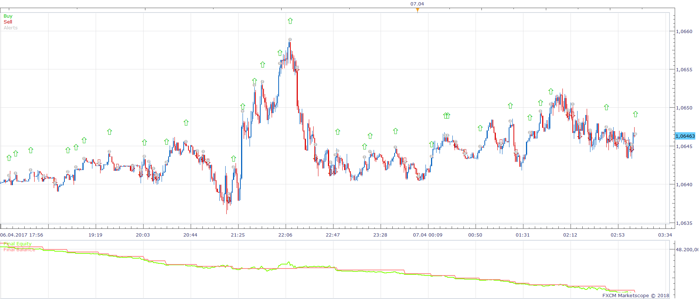
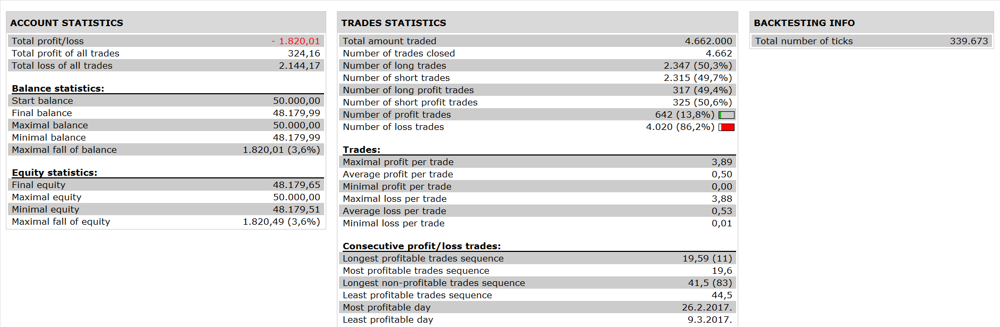

# CCI with TEMA Filter Strategy

> Source: https://fxcodebase.com/code/viewtopic.php?f=31&t=65669  
> Forum: 31 · Topic 65669 · 6 post(s)

---

## CCI with TEMA Filter Strategy

**Apprentice** · Wed Jan 24, 2018 5:58 am

 

Open Long
Price > TEMA
CCI Cross Over Buy Level

Vice Versa for Short

TEMA.lua is available here.
[viewtopic.php?f=17&t=1052&hilit=tema](https://fxcodebase.com/code/viewtopic.php?f=17&t=1052&hilit=tema)

 [CCI with TEMA Filter Strategy .lua](files/117227/CCI%20with%20TEMA%20Filter%20Strategy%20.lua)

---

## Re: CCI with TEMA Filter Strategy

**PinotGrigio** · Wed Jan 24, 2018 5:31 pm

Hi Apprentice,

Thanks for this!
I was able to back test with good results but the strategy will not work on a live account.
Changing the account type made no difference. My account is a non Fifo.
Any suggestions?
Can you also add in 'cross under' buy level and 'cross over' for sell.

Thanks for all your efforts!

---

## Re: CCI with TEMA Filter Strategy

**PinotGrigio** · Mon Jan 29, 2018 6:11 am

Hi Apprentice,

I tried this strategy on a Demo account and it does not work.

Thanks in advance

---

## Re: CCI with TEMA Filter Strategy

**Apprentice** · Mon Jan 29, 2018 8:03 am

You can provide more information.
Works in the simulator and backtester

---

## Re: CCI with TEMA Filter Strategy

**PinotGrigio** · Tue Jan 30, 2018 10:04 pm

The strategy properties box shows the settings I used. I let this run for a day on a demo account with no buy/sell positions generated. The back test, using the same settings shows at least 2 enrty's during the same period.

---

## Re: CCI with TEMA Filter Strategy

**Apprentice** · Wed Jan 31, 2018 5:43 am

After a few minutes on the demo, with default settings.

 

