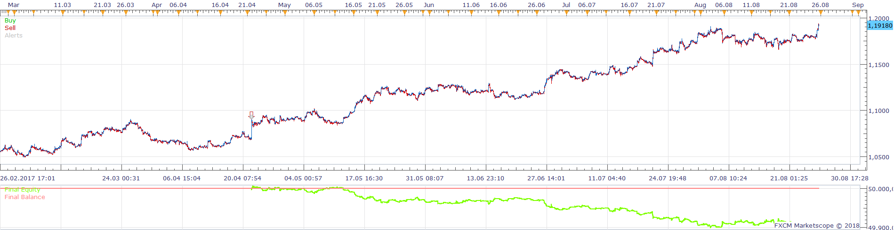
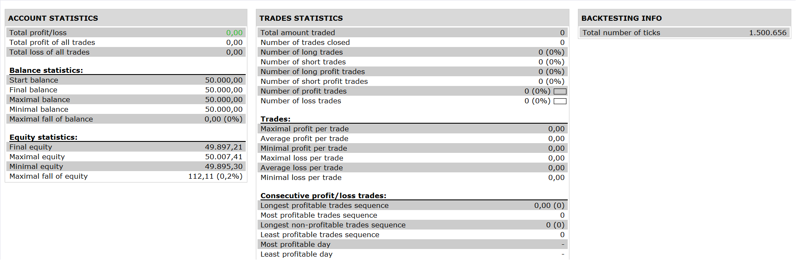

# Centred moving average Channel Strategy

> Source: https://fxcodebase.com/code/viewtopic.php?f=31&t=65693  
> Forum: 31 · Topic 65693 · 4 post(s)

---

## Centred moving average Channel Strategy

**Apprentice** · Sun Feb 04, 2018 6:14 am

 

Based on the request.
[viewtopic.php?f=17&t=32423&start=10](https://fxcodebase.com/code/viewtopic.php?f=17&t=32423&start=10)

Buy condition
((open > CMAC.Bottom) and (close < CMAC.Bottom))
Sell condition
((open<CMAC.Top) and (close > CMAC.Top))

Close long positions
( symbol profit ) > var)
Close short positions
( symbol profit ) > var)

CMAC.lua is available here.
[viewtopic.php?f=17&t=32423](https://fxcodebase.com/code/viewtopic.php?f=17&t=32423)
CMA.bin is available here.
[viewtopic.php?f=17&t=24476](https://fxcodebase.com/code/viewtopic.php?f=17&t=24476)

 [Centred moving average Channel Strategy.lua](files/117430/Centred%20moving%20average%20Channel%20Strategy.lua)

 [Highly adaptable Centred moving average Channel Strategy.lua](files/117430/Highly%20adaptable%20Centred%20moving%20average%20Channel%20Strategy.lua)

---

## Re: Centred moving average Channel Strategy

**Nather** · Tue Jul 24, 2018 2:34 am

Hi coding guru's
is it possible to get a highly adaptable version of this? One that has buy/sell/close top/middle/bottom line with the option to enter on price touch or close past?

Thank you

---

## Re: Centred moving average Channel Strategy

**Apprentice** · Sat Aug 04, 2018 8:46 am

Highly adaptable Centred moving average Channel Strategy.lua added.

---

## Re: Centred moving average Channel Strategy

**Nather** · Tue Aug 14, 2018 7:23 pm

Thank you
