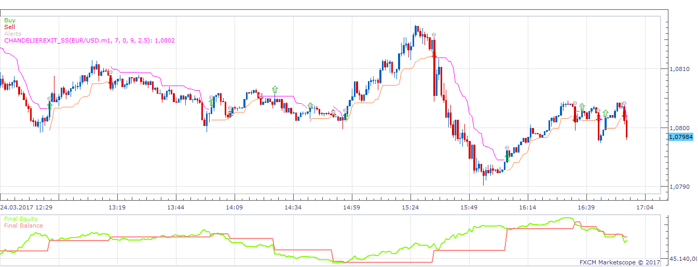
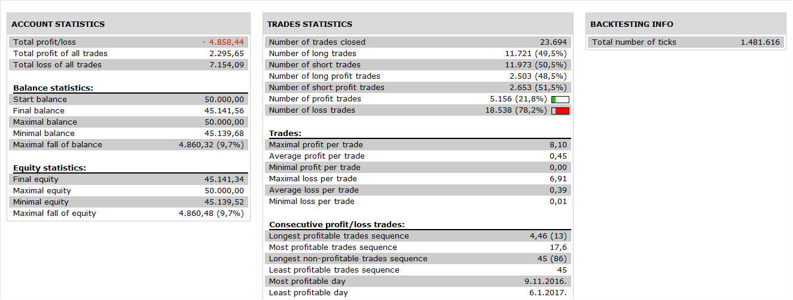

# ChandelierExit Strategy

> Source: https://fxcodebase.com/code/viewtopic.php?f=31&t=64552  
> Forum: 31 · Topic 64552 · 7 post(s)

---

## ChandelierExit Strategy

**Apprentice** · Tue Mar 28, 2017 7:19 am

 

Open Long
Price / ChandelierExit Line CrossOver
Open Short
Price / ChandelierExit Line CrossUnder

 [ChandelierExit Strategy.lua](files/111731/ChandelierExit%20Strategy.lua)

ChandelierExit_SS.lua is available here.
[viewtopic.php?f=17&t=884&p=1617#p1617](https://fxcodebase.com/code/viewtopic.php?f=17&t=884&p=1617#p1617)

---

## Chandelier Exit Indicator Close Strategy

**Apprentice** · Wed Mar 29, 2017 6:12 am

[Chandelier Exit Indicator Close Strategy.lua](files/111734/Chandelier%20Exit%20Indicator%20Close%20Strategy.lua)

Will close any/all position with the opposite direction, with the same custom identifier/instrument.

 [Chandelier Exit Indicator position Close Strategy.lua](files/111734/Chandelier%20Exit%20Indicator%20position%20Close%20Strategy.lua)

Will close selected position with the opposite direction,Strategy will be closed afterwards.
ChandelierExit_SS.lua is available here.
[viewtopic.php?f=17&t=884&p=1617#p1617](https://fxcodebase.com/code/viewtopic.php?f=17&t=884&p=1617#p1617)

 [Chandelier trailing stop Strategy.lua](files/111734/Chandelier%20trailing%20stop%20Strategy.lua)

Will trail stop for selected position.

---

## Re: ChandelierExit Strategy

**Gilles** · Wed Oct 10, 2018 1:18 pm

Hi, Apprentice,

Could you adapt the script chandelier trailing stop strategy to close all the trades at once, please ?

thanks,
see you soon,
Gilles.

---

## Re: ChandelierExit Strategy

**Gilles** · Wed Oct 17, 2018 6:20 pm

Hi,

What is the "Use Position Cap" ?

How can i use it, please ?

Thank you !

---

## Re: ChandelierExit Strategy

**Gilles** · Thu Oct 18, 2018 5:26 am

Hi Apprentice !

Could you consider this strategy based on a Kama (10, 2, 30) and Kama (10, 5, 30) so that the stop loss fits the Kama ?

Thanks !

---

## Re: ChandelierExit Strategy

**Apprentice** · Fri Oct 26, 2018 5:02 am

Your request is added to the development list under Id Number 4280

> What is the "Use Position Cap" ?

If on, will limit the number or opened positions.

---

## Re: ChandelierExit Strategy

**Apprentice** · Sat Oct 27, 2018 5:07 am

Try this version.

 [Chandelier trailing stop Strategy.lua](files/121785/Chandelier%20trailing%20stop%20Strategy.lua)
