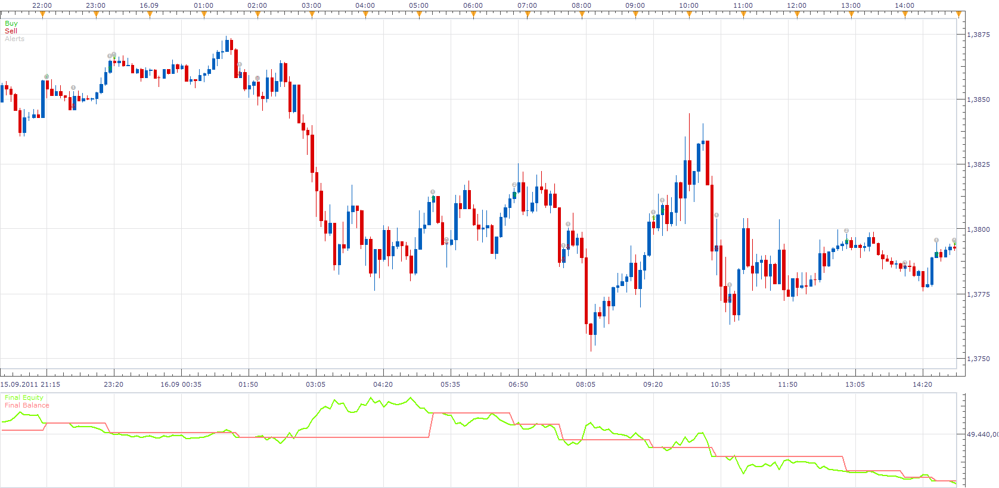

# CICR STRATEGY

> Source: https://fxcodebase.com/code/viewtopic.php?f=31&t=11290  
> Forum: 31 · Topic 11290 · 2 post(s)

---

## CICR STRATEGY

**Apprentice** · Mon Jan 09, 2012 9:00 am

indicators:

1. ema period 14
2. macd [12,26,9]
3. heikan ashi
4.rsi period 3 buy level (0) , sell level (0)
5. atr period 14 multiplier 1

buy:

1. price> ema and
2. macd > 0 and
3. heikan ashi up candle
4. rsi > 50

sell :
1. price < ema and
2. macd< 0 and
3.heikan ashi down candle
4.rsi < 50

take profit :
close - 2* atr

stop loss :

close + 2*atr

 [CICR STRATEGY.lua](files/22881/CICR%20STRATEGY.lua)

The Strategy was revised and updated on November 21, 2018.

---

## Re: CICR STRATEGY

**Apprentice** · Sun Dec 04, 2016 6:33 am

Bump up.
