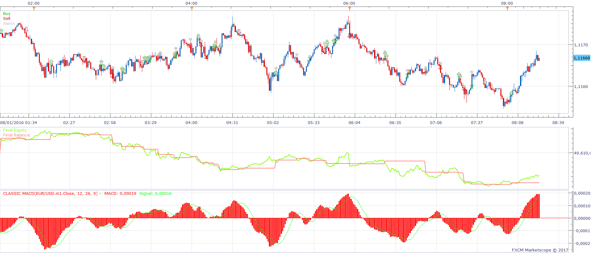
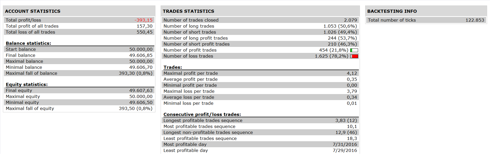

# Classic MACD Strategy

> Source: https://fxcodebase.com/code/viewtopic.php?f=31&t=64323  
> Forum: 31 · Topic 64323 · 1 post(s)

---

## Classic MACD Strategy

**Apprentice** · Sun Jan 22, 2017 6:44 am

 

Open Long
MACD / Signal CrossOver
Open Short
MACD / Signal CrossUnder

 [Classic MACD Strategy.lua](files/110652/Classic%20MACD%20Strategy.lua)

Additionally confirmation period can be used.
If confirmation period is different from zero.
The transaction will be delayed for confirmation periods.

During this period
For Long
MACD should be above the Signal
For Short
MACD should be below the Signal

Classic MACD is available here.
[viewtopic.php?f=17&t=64322&p=110651#p110651](https://fxcodebase.com/code/viewtopic.php?f=17&t=64322&p=110651#p110651)

The Strategy was revised and updated on January 19, 2019.
