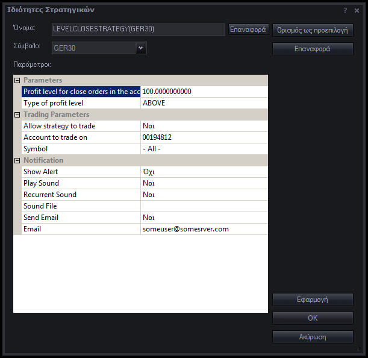
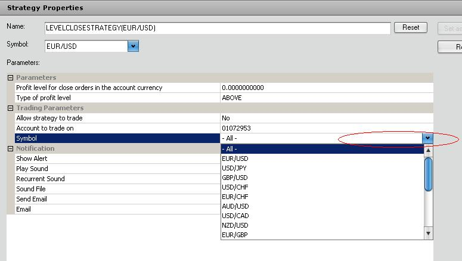

# Close strategy

> Source: https://fxcodebase.com/code/viewtopic.php?f=31&t=2901  
> Forum: 31 · Topic 2901 · 103 post(s)

---

## Close strategy

**Alexander.Gettinger** · Wed Dec 08, 2010 5:32 am

Strategy for close all open orders if all total profit/loss above/below user's level.

Download:

 [LevelCloseStrategy.lua](files/6627/LevelCloseStrategy.lua)

---

## Re: Close strategy

**alepan72** · Wed Dec 08, 2010 6:46 am

That's PERFECT. It is exactly what I want!!!

Thanx a lot for your services

---

## Re: Close strategy

**Ancient** · Wed Dec 08, 2010 7:44 am

Hi Alexander,

The following is not clear to me:

Parameters, Profit level for close orders in the account
Do we Enter Pips (P/L) OR Monetary Profit (Gross P/L)?

Thank You for taking the time.

Regards
Ancient

---

## Re: Close strategy

**Ancient** · Wed Dec 08, 2010 12:37 pm

Initially I thought I understood what this Strategy was about. But after taking a closer look at it I lost it totally!

Can someone explain what this Strategy is meant to do?

Regards

---

## Re: Close strategy

**Jason Rogers** · Wed Dec 08, 2010 4:41 pm

I tested the strategy and it's sending the order to "Close All Positions for Symbol" rather than "Close All Positions". So if I have multiple currency pairs open, it will only close the trades which I have the strategy attached to. And if I attach the strategy to both currency pairs and set the profit target to say $100, it will close all trades in 1 currency pair when total profit reaches $100 but remaining trades stay open. The remaining trades will only close when the profit on remaining trades goes back up to $100.

---

## Re: Close strategy

**alepan72** · Wed Dec 08, 2010 6:26 pm

> **Jason Rogers wrote:**
> I tested the strategy and it's sending the order to "Close All Positions for Symbol" rather than "Close All Positions".

Xmmm.... I suppose I m wrong. I thought that strategy close ALL pairs, but it's close only a pair.
Dear Alexander.Gettinger, can you fix it? I have a similar strategy for MT4 and I can send it to you if it 's help you to translate it.

---

## Re: Close strategy

**Ancient** · Wed Dec 08, 2010 7:12 pm

The name of this Strategy requires to be worded such that it more correctly describes its purpose.

If this is not possible, a brief explanation of the Strategy's Logical application would be useful. If this is also not possible, then possibly this Strategy should only exist on the Members pc that requested its development.

---

## Re: Close strategy

**Ancient** · Wed Dec 08, 2010 7:30 pm

This Strategy does anything else other than the initial request! Below is Alepans Request:

Re: Close all open markets if netpl is possitive strategy reque
by alepan72 » Wed Oct 27, 2010 12:27 pm

Hi, all!
I m interesting for a strategy like this. I usually open two or three positions on differents currencies or trading based on a correlation table.
I would like if some reason my net p/l is above or below a stop loss / profit value (20-30 pips e.g.), strategy close ALL positions automatically.
Thanks and my best regards for your job.
alepan72

Posts: 14
Joined: Wed Oct 27, 2010 12:19 pm
Private messageE-mail

This Strategy does anything else other than the initial request! For the life of me I cannot understand how Alepan came back so happy and content, thanking for the development of the Strategy he requested???

---

## Re: Close strategy

**Alexander.Gettinger** · Wed Dec 08, 2010 10:04 pm

> **Ancient wrote:**
> Hi Alexander,
>
> The following is not clear to me:
>
> Parameters, Profit level for close orders in the account
> Do we Enter Pips (P/L) OR Monetary Profit (Gross P/L)?
>
> Thank You for taking the time.
>
> Regards
> Ancient

Gross P/L

---

## Re: Close strategy

**Alexander.Gettinger** · Wed Dec 08, 2010 10:09 pm

> **Ancient wrote:**
> Initially I thought I understood what this Strategy was about. But after taking a closer look at it I lost it totally!
>
> Can someone explain what this Strategy is meant to do?
>
> Regards

For example:
Let [LevelType]=ABOVE. If your profit/loss for all open orders more than [ProfitLevel] strategy close all position.
For [LevelType]=BELOW. If profit/loss less than [ProfitLevel] strategy close all orders.

This strategy is a Stop/Limit level for all account, not for one order.

---

## Re: Close strategy

**Alexander.Gettinger** · Wed Dec 08, 2010 10:11 pm

> **Jason Rogers wrote:**
> I tested the strategy and it's sending the order to "Close All Positions for Symbol" rather than "Close All Positions". So if I have multiple currency pairs open, it will only close the trades which I have the strategy attached to. And if I attach the strategy to both currency pairs and set the profit target to say $100, it will close all trades in 1 currency pair when total profit reaches $100 but remaining trades stay open. The remaining trades will only close when the profit on remaining trades goes back up to $100.

OK.
I shall do this.

---

## Re: Close strategy

**Alexander.Gettinger** · Thu Dec 09, 2010 12:30 am

Strategy updated.
Added possibility to choice symbol for checking profit and closing.

---

## Re: Close strategy

**alepan72** · Thu Dec 09, 2010 4:11 am

That 's it!!! I test it and work properly
Thanx all of you!
Kisses from Greece!

---

## Re: Close strategy

**Jason Rogers** · Thu Dec 09, 2010 3:43 pm

It's working great now on my account with FXCM UK.

I tested it on an FXCM US demo from FXCM.com, but it's giving error message "EUR/USD	LEVELCLOSESTRATEGY (1)(EUR/USD)	Open order failedThe command is disabled.	12/09/2010 15:34:50	1.32330" .

---

## Re: Close strategy

**alepan72** · Thu Dec 09, 2010 5:23 pm

Dear Ancient,
I had three open trades (eurusd, gbpusd, GER30). Set the strategy at "above" 100 euros and when the total profit touch, strategy close ALL position automaticaly.
Also, if you wish.... I speak Greek better than english.
PM me if you want more. I m glad to "EXCHANGE" oppinions.

 

---

## Re: Close strategy

**Ancient** · Thu Dec 09, 2010 5:56 pm

Tested the revision, it is now working.

Nice Example of SDK's potential!

---

## Re: Close strategy

**Ancient** · Thu Dec 09, 2010 8:27 pm

> **Alexander.Gettinger wrote:**
> Strategy updated.
> Added possibility to choice symbol for checking profit and closing.

Good, now we definately know what this Strategy's purpose was initially intended for:

It is a good tool, but the development approach in terms of the Strategy's logical application works against the Strategy's purpose.

This is what this Tool or Strategy is supposed to do:

1) Monitor Gross P/L of a Symbol Selected and for all the Open Positions of the specific Symbol Selected.
2) Monitor Gross P/L of Selected Multiple Symbols and for the Multiple Open Positions of the Selected **SYMBOLSSS**
3) Profit level for Close Orders is OK... Here User Inputs the Gross P/L i.e. $500.00 and this works as Take Profit Limit. When all selected symbols sum=Users Input Value, All Open Positions are Exited with the Gross P/L (Monetary Profit) User Entered being realised.

Now: **Type of Profit Level**, This is not only misleading, but does not require to be there! User Can Input negative Gross P/L and this would then work as a Close Stop Loss Strategy. When all selected symbols sum=Users Input Value, All Open Positions are Exited with the Loss tolerance Entered by the User.

Moreover, presently if User Selects Type of Profit Level: BELOW, User has to Input minus sign before the Monetary Value anyway! This if User wants to use this as a Stop Loss Close Strategy. And of course one has to figure this out, as no guiding reference is made anywhere.

Lastly, if all the Above are taken into consideration, further to being able to Select ALL or ONE Symbol, User must have the Option to Select any number of Symbols according to need. **"Ctrl Select" Symbols**

Nevertheless, if the purpose of this development or Strategy is just meant to be here as an example of what can be done, it is a good example.

This remark was posted after the update of the first attempt or version of the Strategy Posted above this Post.

Just my 2 cents.

Regards
Ancient

---

## Re: Close strategy

**Ancient** · Fri Dec 10, 2010 8:35 am

Hi Alepan,

Yes it is now working better if applied with caution, and is something that can be useful for all those who trade Multiple Instruments or have Multiple Open Orders on a specific Instrument.

However, certain corrections or enhancements still have to be made as I have previously referenced if this tool is to realise its full potential.

Hopefully Alexander will find the time to make the necessary additions.

Regards
Ancient

---

## Re: Close strategy

**Alexander.Gettinger** · Sun Dec 12, 2010 10:37 pm

> **Ancient wrote:**
> Hopefully Alexander will find the time to make the necessary additions.

Yes, I shall find time.

---

## Re: Close strategy

**Alexander.Gettinger** · Mon Dec 13, 2010 11:23 pm

> **Ancient wrote:**
> 1) Monitor Gross P/L of a Symbol Selected and for all the Open Positions of the specific Symbol Selected.

Please, see this indicator: [viewtopic.php?f=17&t=2948](https://fxcodebase.com/code/viewtopic.php?f=17&t=2948)

---

## Re: Close strategy

**alepan72** · Tue Dec 14, 2010 4:32 am

Hi Alexander!
Does exists the probability I select who from the pairs will manage the strategy.
For example: Now I can select "all" or a specific pair. I would want to be possible to choose the three of the six open currencies (I have an open position of eurusd, eurjpy, gbpusd, oil, fra40. I would want to setup the strategy to manage ONLY eurusd, fra40 and oil).
Is it possible?
Thanx a lot and sorry for my english....

---

## Re: Close strategy

**Ancient** · Tue Dec 14, 2010 8:07 am

> **Alexander.Gettinger wrote:**
>
>
> > **Ancient wrote:**
> > 1) Monitor Gross P/L of a Symbol Selected and for all the Open Positions of the specific Symbol Selected.
>
>
>
> Please, see this indicator: [viewtopic.php?f=17&t=2948](https://fxcodebase.com/code/viewtopic.php?f=17&t=2948)

I don't think a visual representation is necessary for this Strategy. However, this is my opinion, possibly others would like to have a visual representation also.

What is missing from The Strategy is the ability to Select Instruments **"Ctrl Select"**

Presently the Options are ALL or ONE, requires Ctrl Select Instruments.

---

## Re: Close strategy

**Ancient** · Tue Dec 14, 2010 3:46 pm

Hi Alexander,

Could you please add the following Options to this Strategy as per Image below:

 

1) The Ability to Select Multiple Symbols
 Presently the Option is ALL or ONE
2) the Ability to Select Multiple or All Accounts
 Presently the Option is only for ONE

Thank You
Ancient

---

## Re: Close strategy

**4xtr8r** · Fri Dec 17, 2010 2:04 pm

Hi Alexander,

I understand this does not work for FXCM (US) clients, but i have a request.

Is there a way you can make this into an ALERT? No need to close out the positions, just an ALERT whenever the account is +/- a certain dollar or pip amount?

Thank you!
4xtr8r

---

## Re: Close strategy

**Ancient** · Fri Dec 17, 2010 5:31 pm

> **4xtr8r wrote:**
> I understand this does not work for FXCM (US) clients, but i have a request.

Instant Opposite Market Orders makes this work for you too chum... No need to request half a job! Request a full job... Alert and/or Close.

Lets hope Alexander finds the desire to entertain the whole list of requests here when he gets the time!

Regards
Ancient

---

## Re: Close strategy

**Ancient** · Fri Dec 17, 2010 6:07 pm

> **4xtr8r wrote:**
> Hi Alexander,
>
> I understand this does not work for FXCM (US) clients, but i have a request.
>
> Is there a way you can make this into an ALERT? No need to close out the positions, just an ALERT whenever the account is +/- a certain dollar or pip amount?
>
> Thank you!
> 4xtr8r

Have you tested to see whether this as is, is already working for US accounts? I viewed the code and from what I see it should.

---

## Re: Close strategy

**4xtr8r** · Mon Dec 20, 2010 9:36 pm

Hi,

couple of comments/questions

1) the "sound" option is incorrect... it only allows you to select a currency pair, not a file.

2) do you put the dollar amount you are targeting and select "above"?

thanks,
4xtr8r

---

## Re: Close strategy

**4xtr8r** · Mon Dec 20, 2010 9:39 pm

> **Ancient wrote:**
>
>
> > **4xtr8r wrote:**
> > Hi Alexander,
> >
> > I understand this does not work for FXCM (US) clients, but i have a request.
> >
> > Is there a way you can make this into an ALERT? No need to close out the positions, just an ALERT whenever the account is +/- a certain dollar or pip amount?
> >
> > Thank you!
> > 4xtr8r
>
>
>
> Have you tested to see whether this as is, is already working for US accounts? I viewed the code and from what I see it should.

I asked Jason from FXCM and he said it does not work for US clients. Anyways, he said it should work as an alert... so i'm testing it now.

---

## Re: Close strategy

**4xtr8r** · Mon Dec 20, 2010 10:06 pm

i've tried testing it and doesnt seem to work. not even the alert.

can you explain what the parameters should be? what each field means?

thanks.

---

## Re: Close strategy

**alepan72** · Tue Dec 21, 2010 4:02 am

> **4xtr8r wrote:**
> i've tried testing it and doesnt seem to work. not even the alert.
>
> can you explain what the parameters should be? what each field means?
>
> thanks.

Goodmorning friend.
Do you have install the patch below? Many strategies does n't work without it.
[http://fxcodebase.com/code/viewtopic.php?f=31&t=2337](https://fxcodebase.com/code/viewtopic.php?f=31&t=2337)

---

## Re: Close strategy

**Ancient** · Tue Dec 21, 2010 8:03 am

Example 1: Assuming you want to Use it to Close with Profit

Profit Level for close orders in the account currency: 100.00
[You set the Monetary Amount you want to realise as Profit i.e. 100 Dollars Input as above]

Type of Profit Level: ABOVE
[You set to Above if you want to close with Profit]

Symbol: Two Options Available here, either ALL or ONE
[If you want to Exit with Profit irrespective of Symbol, Select ALL. If you have Multiple Positions on a specific Symbol and want to Close all Positions for the Particular Symbol in Profit, Select the Specific Symbol]

Example 2: Assuming you want to Use this Strategy as a Stop Loss

Profit Level for close orders in the account currency: **-**100.00
[You set the Monetary Stop Loss Tolerance Amount i.e. -100 Dollars Input as above]

Type of Profit Level: BELOW
[You set to BELOW if you want to use as Gross P/L Stop Loss]

**On Another Note:**

I have previously suggested the code is commented such that it also gives us the ability to Select multiple Symbols accoridng to preference further to ALL or Just ONE, which are the only two options presently available.

If you are not getting the Drop Down Menu to Select All or ONE, reload the Strategy, there also seems to be a bug there too.

You may want to view my suggestions in previous posts pertaining to what still needs to be added to this Strategy and possibly add your comments.

Regards
Ancient

---

## Re: Close strategy

**4xtr8r** · Tue Dec 21, 2010 10:38 am

> **alepan72 wrote:**
>
>
> > **4xtr8r wrote:**
> > i've tried testing it and doesnt seem to work. not even the alert.
> >
> > can you explain what the parameters should be? what each field means?
> >
> > thanks.
>
>
>
> Goodmorning friend.
> Do you have install the patch below? Many strategies does n't work without it.
> [viewtopic.php?f=31&t=2337](https://fxcodebase.com/code/viewtopic.php?f=31&t=2337)

Thank you! Installed new version. Will try again.

---

## Re: Close strategy

**4xtr8r** · Tue Dec 21, 2010 10:44 am

@Ancient --> Thank you.

---

## Re: Close strategy

**Ancient** · Wed Dec 29, 2010 7:26 am

> **Alexander.Gettinger wrote:**
> Strategy updated.
> Added possibility to choice symbol for checking profit and closing.

When Strategy is loaded the first time, User is able to Select ALL Instruments or One Instrument.

However, when Market reaches the defined level and Strategy is Disabled / Stopped, then if User attempts to Re-Set the Properties in order to Re-Activate / Re-Start the Strategy, User is unable to Edit the previously Selected Option pertaining to Instruments.

User has to Re-load the Strategy from Manage Custom Strategies go to Manage Strategies, Add the Strategy and then only is the User able to Select Instrument Options either ALL Instruments or ONE Instrument.

Whilst on this note, please also comment such that User has the ability to Select any number of pairs to be Included in the Strategy.

Regards
Ancient

**PS: I have made reference pertaining to commenting the code such that User is given the ability to Select any number of pairs according to preference many times. If this for some reason cannot be done please inform as such!**

---

## Re: Close strategy

**Ancient** · Wed Dec 29, 2010 8:44 am

Further to my remarks above, and since this discussion has done the roundtrip of the Forum, I would like to add all relative discussions pertaining to this Strategy here.

The discussion pertaining to this Strategy namely the Close Strategy, was also continued under General Discussions --> Market Scope Suggestions found at [viewtopic.php?f=25&t=424&start=30](https://fxcodebase.com/code/viewtopic.php?f=25&t=424&start=30) initially assuming that this would possibly be a Global Requirement within Market Scope, BUT...

> **Ancient wrote:**
> **My query:** Is this a Global Support Requirement; or can the code within the Strategy be commented such that it offers the user the further option? i.e to select the Symbols to be included for the Gross P/L calculation.
>
> Your feedback pertaining to the above will be highly appreciated. Moreover, should it be a matter of commenting the code in the Strategy only, if such could be done, will be great.
>
> Either way, your comments regarding my query above is what is of interest to me.

**And Nikolays reply below:** Found at [viewtopic.php?f=25&t=424&start=30](https://fxcodebase.com/code/viewtopic.php?f=25&t=424&start=30)

> **Nikolay.Gekht wrote:**
> Well, the strategy CAN work as on multiple accounts as well as on multiple instruments if it is written to work in this mode. The problem is that there is no such strategies developed yet.

However, Nikolays reply could have been misinterpreted very easily since the query was referencing both Muti Accounts and Multi Instruments.

Subsequently, since I viewed that the Selection of Multi Instruments to be included in the Close Strategy were developed, I understood that providing the one further Option missing being the ability to Select Instruments from the list "**Ctrl + Select**" according to preference is possible deriving this from Nikolays reply mentioning that "multiple instruments CAN if it is written to work in this mode".

Finally, I am requesting from Alexander to either please comment the code such that the further oprtion is made available to the User, in order for the Stategy to realise its full potential, or inform that such is not possible for any reason.

Regards
Ancient

---

## Re: Close strategy

**4xtr8r** · Wed Dec 29, 2010 4:24 pm

I tried using the "close strategy" and it gives me an error message when i select yes to "allow strategy to trade." At least i get a popup and the email alert works. If i select "no" for the "allow strategy to trade" it will not alert me (by popup or email).

Would be nice if the "sound" option worked too. You can select yes for sound, but no option to select which sound file!?!?

All in all, i'm not too concerned for it to close the trade automatically, but would be nice if at least the alert system would work properly.

Please advise. Thanks.

4xtr8r

---

## Re: Close strategy

**Ancient** · Thu Dec 30, 2010 2:17 am

Have you tried entering the path to the sound file?

---

## Re: Close strategy

**JJBungles** · Tue Jan 04, 2011 12:55 pm

Alexander,

Thank you for this strategy. It works perfectly. I use two instances of this strategy whilst in multiple positions. One instance on EU, one instance on GU. The EU takes care of the TP target. The GU takes care of the SL target. I can adjust these levels throughout my trade. I am currently using it on a UK spreadbet demo account and it works fine.

One question: when the close command occurs, what type of close order is commenced;

-a Market order or
-an At Best order

What extra code would be required to select either type within this strategy?

Kindest Regards,

JJ

---

## Re: Close strategy

**rehan727** · Fri Jan 07, 2011 11:34 am

> **Ancient wrote:**
> When Strategy is loaded the first time, User is able to Select ALL Instruments or One Instrument.
>
> However, when Market reaches the defined level and Strategy is Disabled / Stopped, then if User attempts to Re-Set the Properties in order to Re-Activate / Re-Start the Strategy, User is unable to Edit the previously Selected Option pertaining to Instruments.
>
> User has to Re-load the Strategy from Manage Custom Strategies go to Manage Strategies, Add the Strategy and then only is the User able to Select Instrument Options either ALL Instruments or ONE Instrument.

Facing the same problem. The currency selection is disabled once the strategy closes the trades. Have to remove the strategy and add it again.

 

*Currency list shows first time*

---

## Re: Close strategy

**JJBungles** · Fri Jan 07, 2011 2:13 pm

When the strategy executes (Closes the trades) it is turned off and a red dot shows up on the strategy manager.

Menu is Strategies --> Manage Strategies.

 Select the strategy and start it again. When it goes green you can change the settings.

---

## Re: Close strategy

**rehan727** · Fri Jan 07, 2011 4:01 pm

Probably found the solution as well. Maybe OP can update in the next version.
Original code

Code: [Select all](https://fxcodebase.com/code/)
`while true do
     local row = enum:next();
     if row == nil then break end
     strategy.parameters:addStringAlternative("Symbol", row.Instrument, "", row.Instrument);
    end`

New code . Only change is the addition of code line enum:reset(); immediately after end

Code: [Select all](https://fxcodebase.com/code/)
`while true do
     local row = enum:next();
     if row == nil then break end
     strategy.parameters:addStringAlternative("Symbol", row.Instrument, "", row.Instrument);
    end
-- addition 
 enum:reset();`

---

## Re: Close strategy

**midnightvulture** · Mon Jan 17, 2011 8:16 am

Hi Alexander,

Is the LevelCloseStrategy compatible with dbfx please?

Regards,

Alex

---

## Re: Close strategy

**Apprentice** · Mon Jan 17, 2011 1:06 pm

If you are using Trade Station II (Marketskop) you can use this strategy.

---

## Re: Close strategy

**davidf515** · Wed Feb 09, 2011 2:50 am

This strategy is EXACTLY what I need, which is why this is so frustrating! Why will this not work on US accounts? Applied it yesterday to a US practice account and, as has been noted in this thread, I just got a series of error notifications. I assume that the problem has something to do with our lovely FIFO handicap here in the States, but is there NO WAY around this? I just want ALL of my positions to close when I get to a certain Total Gain / Loss. Is there anything that can be done for us poor souls under the CFTC's thumb, er, protection?

Any help you can give would be greatly appreciated.

---

## Re: Close strategy

**NID007** · Tue Mar 08, 2011 8:42 am

Hi Nikalay ,

I would please like to know ,is there a strategy that closes all profitable trades . Also limit order in pips ,settable to less than one pip . ie ,,0.2, 0.3 0.4 , 0.5 etc .

I ve got the level close strategy which is settable ,but it only closes one trade at a one time ,then strategy shuts itself off .

Hope you can assist.

Many thanks

Nid007

---

## Re: Close strategy

**lisa_baby_xx** · Fri Jun 03, 2011 4:25 am

Hi Guys,

There is a problem with the sound file with this stratagy, it will not allow me to specilfy one.

Much love guys. XX
lisa_baby_xx

---

## Re: Close strategy

**Apprentice** · Fri Jun 03, 2011 11:27 am

Sound bug fixed.

---

## Re: Close strategy

**4xtr8r** · Thu Jun 09, 2011 9:57 pm

Hi,

Is there a way you can set how many lots you would like to sell instead of it selling everything?

Thank you!

---

## Re: Close strategy

**Ancient** · Fri Jun 10, 2011 3:13 am

> **Apprentice wrote:**
> Sound bug fixed.

**What about the bug that disables Currency Selection after the Strategy Closes the Trades?**

**Reminder:**

> **Ancient wrote:**
> When Strategy is loaded the first time, User is able to Select ALL Instruments or One Instrument.
>
> However, when Market reaches the defined level and Strategy is Disabled / Stopped, then if User attempts to Re-Set the Properties in order to Re-Activate / Re-Start the Strategy, User is unable to Edit the previously Selected Option pertaining to Instruments.
>
> User has to Re-load the Strategy from Manage Custom Strategies go to Manage Strategies, Add the Strategy and then only is the User able to Select Instrument Options either ALL Instruments or ONE Instrument.

**The suggestion below, although temporarily provides a solution, is somewhat of a dangerous approach in the sense that the User may have forgotten to reset the properties before initiating New Trades ...**

> **JJBungles wrote:**
> When the strategy executes (Closes the trades) it is turned off and a red dot shows up on the strategy manager.
>
> Menu is Strategies --> Manage Strategies.
>
> Select the strategy and start it again. When it goes green you can change the settings.

**The Correction or Additional Code suggested below ... well, I am not sure that it works. I added the Code as per example, but No Solution ...**

> **rehan727 wrote:**
> Probably found the solution as well. Maybe OP can update in the next version.
> Original code
>
>
> Code: [Select all](https://fxcodebase.com/code/)
> `while true do
> local row = enum:next();
> if row == nil then break end
> strategy.parameters:addStringAlternative("Symbol", row.Instrument, "", row.Instrument);
> end`
>
> New code . Only change is the addition of code line enum:reset(); immediately after end
>
>
> Code: [Select all](https://fxcodebase.com/code/)
> `while true do
> local row = enum:next();
> if row == nil then break end
> strategy.parameters:addStringAlternative("Symbol", row.Instrument, "", row.Instrument);
> end
> -- addition
> enum:reset();`

**Lastly, what still is missing, if this Strategy is to realise its full potential, is the ability to select Instruments Selectively, instead of either All or Only One... i.e. Out of the Say 20 Listed Instruments, the ability to select 3 or 4 etc out of the 20...**

-------------------------------------

---

## Re: Close strategy

**fabfxcm** · Thu Aug 25, 2011 8:50 am

Hi everybody,
I tried to test the level close strategy, but it appear the following error: string 90 unsopported! What does it means? What I have to do?
Thank you

---

## Re: Close strategy

**sunshine** · Fri Feb 10, 2012 6:54 am

The version of the strategy which supports US accounts is attached.

---

## Re: Close strategy

**lindsaybaggen** · Mon Feb 20, 2012 4:22 am

Thank you for developing this. For some reason every time the strategy activates and closes the open positions it turns itself off. I am using FXCM Trade Station II. Can you advise on this?

Thank you

---

## Re: Close strategy

**Hug Coder** · Mon Feb 20, 2012 10:39 am

> **lindsaybaggen wrote:**
> Thank you for developing this. For some reason every time the strategy activates and closes the open positions it turns itself off. I am using FXCM Trade Station II. Can you advise on this?
>
> Thank you

That's suppose to happen to prevent unwanted action after it has done what it's suppose to. After securing your profit it will stop. It's possible to make it not stop though, I can make an option for it if you really have considered the consequences and want it.

I think the purpose of this strategy is to close with a Daily profit, or what ever time period you are at. Then you are suppose to enter your trades and so on again, and start this strategy afterwards, and let it close at profit again. Then you repeat this. Maybe you don't want to close at same profit every time too, then you gotta restart strategy anyway. So I think it's good that it stops.

---

## Re: Close strategy

**mybrainhertz** · Wed Apr 25, 2012 10:01 am

It is strange to me that FXCM have a **Close all Positions**s under their **Trading** menu but don't have a macro that does it at predefined levels. This Strategy doesn't seem to work as advertised.

To be clear, what is required is a strategy that would close all positions regardless of their symbol, symbol meaning currency pair.

**Symbol Box** at the top of the Strategy is misleading as it only allows you to select one currency pair. Again we are looking for all currency pairs to be selected.

**Parameter Fields for the strategy would be:-**

**Total Profit level Pip**s or **Total Profit Level Dollars $** (You'd have a switch to select which you'd prefer)
**Total Loss Level Pips** or **Total Loss Level Dollars $** (You'd have a switch to select which you'd prefer)

Trading Parameters would be the same although I don't see the need for Symbol All as that is the basis of the strategy.

Is this possible?

---

## Re: Close strategy

**Apprentice** · Thu Apr 26, 2012 2:28 am

Thank you for the suggestions, I see no reason why this would not be possible.

---

## Re: Close strategy additional BUY/SELL function ?

**julio123** · Mon May 14, 2012 6:38 am

Hello,

Is there a way to add a function where you can select also that it close only all
the BUY positions of a certain currency or only all the SELL positions ?

Thanks Julio.

---

## Re: Close strategy

**Apprentice** · Mon May 14, 2012 1:59 pm

This option can b addded.

---

## Re: Close strategy

**whitekit04** · Mon Jun 18, 2012 11:30 am

So, we still do not have strategy that the automatically close position with selected multiple currency pairs?

Thanks for your help.

---

## Re: Close strategy

**njagadish** · Wed Jun 20, 2012 2:50 am

Hi,
Can anybody help me to explain how to write a simple code to close a specific open trade? For example, if I have three open trade open from my startegy, during opening of each trade how I can store the Trade.ID and later I can call-up this Trade.ID to close it (close one trade out of three open trades)

Thanks

---

## Re: Close strategy

**veight** · Thu Jul 05, 2012 11:47 am

Hi there,

May I know is the strategy below available? If not, is it difficult to be coded? Thanks!

Close 2 tickets simultaneously when hit combined profit

To close 2 tickets (any symbol, e.g. 'buy' EUR/USD with 'sell' EUR/JPY) at the same time, when the aggregate profit (of the 2 tickets) hits a targeted profit.

Well, my idea is the program should allow user to manually key in the 2 tickets number, and set the targeted profit. Ideally, user should be able to have multiple sets of this program running at the same time e.g. 1st set - 'buy' EUR/USD with 'sell' EUR/JPY; 2nd set - 'buy' EUR/JPY with 'sell' EUR/USD; 3rd set - 'buy' CHF/JPY with 'sell' USD/JPY; 4th set - 'buy' GBP/USD with 'sell' EUR/JPY and so on.

---

## Re: Close strategy

**willcsk** · Sat Jan 12, 2013 1:18 pm

[quote="Alexander.Gettinger"]Strategy for close all open orders if all total profit/loss above/below user's level.

hi Alex,,,

i know it has been a while since u created this stretagy,
 i just wana say thank you as i find it very usefull.

Alex, i would like to ask for your help to futher enhance the stretagy if u have time,
thanks in advance.

i would like the stretagy place 2 trade at market price when it loaded.
1. buy trade, user specify instrument and lot number.
2. sell trade, user specify instrument and lot number.

thank you Alex ,,,^^

-willie-

---

## Re: Close strategy

**Apprentice** · Sun Jan 13, 2013 6:43 am

Something like a hedge.

If profit reaches a certain level.
Open new position, not to close, existing one.
Or offer a choice, Close Existing or Open New One.

Can you confirm that.

---

## Re: Close strategy

**willcsk** · Mon Jan 14, 2013 8:10 pm

> **Apprentice wrote:**
> Something like a hedge.
>
> If profit reaches a certain level.
> Open new position, not to close, existing one.
> Or offer a choice, Close Existing or Open New One.
>
> Can you confirm that.

hi Apprentice,

1. yes , itz a hedge.
**2.when the stretagy start/loaded, open one buy trade, and one sell trade of my choice n lot num.**
3. when profit level of my choice reach, close trade, n stop.
4. end stretagy n exit.

that all Apprentice, iz the same as original one, just modify to enable entry of trade.

thank you n have a nice day ,,,^^

-willie-

---

## Re: Close strategy

**luigipg** · Thu Oct 31, 2013 9:40 am

Hi apprentice, can You add to this strategy the ability to close all opened positions (all currencies) when the "Equity" reaches a specified ammount? Thanks a lot for ever. Luigi!!!

---

## Re: Close strategy

**Apprentice** · Thu Oct 31, 2013 12:07 pm

Your request is added to the development list.

---

## Re: Close strategy

**mfoster** · Wed Oct 15, 2014 12:33 pm

I am getting two errors when I load this strategy. Could someone please correct this? Thanks

---

## Re: Close strategy

**zoltanh** · Thu Feb 19, 2015 5:57 am

Hi,

This strategy is quite cool and thanks for it however I would have an idea to maximize the profit.

The S/L part is OK with me but I would change the T/P logic adding a [TrailingProfit].
For example the [ProfitLevel] is set to $500 and the [TrailingProfit] to $100 -> if the Gross P/L reaches the $500 the strategy doesn't close any deals but set the S/L to $400. If the P/L goes up to $600 ( [ProfitLevel] + [TrailingProfit] ) then it sets the S/L to $500 which is then trailing by the [TrailingProfit]

---

## Close strategy

**gabrielocomex** · Sun May 03, 2015 11:13 pm

Good night Alexander, I'm trying to install your strategy "close strategy" but I get the next messages: Levelclosestrategy.lua:16:attempt to index field "host" (a nil value) and the next message too: Levelclosestrategy.lua:2:attempt to index global strategy (a nil value).

Could you help me please to install the close strategy?

Thank you

Gabriel Martinez

---

## Re: Close strategy

**Apprentice** · Mon May 04, 2015 7:37 am

Have fixed the strategy, it should work now.
Please re-download and re-install.
Evidently, the strategy worked once.
The question of compatibility.

---

## Re: Close strategy

**gabrielocomex** · Mon May 04, 2015 11:15 am

> **Apprentice wrote:**
> Have fixed the strategy, it should work now.
> Please re-download and re-install.
> Evidently, the strategy worked once.
> The question of compatibility.

Thank you. It works.

---

## Re: Close strategy

**toscapane** · Mon Feb 01, 2016 12:02 pm

This strategy levelcosestrategy.lua[http://fxcodebase.com/code/viewtopic.php?f=31&t=2901&hilit=close](https://fxcodebase.com/code/viewtopic.php?f=31&t=2901&hilit=close), instead close all symbol close only symbol where you get it on, please can you fix it so all orders are closed when rich above or belove closing level. Thank you all.

---

## Re: Close strategy

**Apprentice** · Thu Feb 04, 2016 3:52 am

Your request is added to the development list.

---

## Re: Close strategy

**Atmotrader** · Tue Jul 05, 2016 4:04 pm

Dear Apprentice,

this would be such a nice strategy if it would close all positions and not just the one it is used on.

Could you please change the strategy?

I have uploaded a Metatrade EA which does it perfectly.

Thanks!
Masoud

---

## Re: Close strategy

**Apprentice** · Wed Jul 06, 2016 2:36 am

Your request is added to the development list,
Under Bugzilla Id Number 3558

Bugzilla is developer internal requests database.
If someone is interested to do any task from this list please contact me.

---

## Re: Close strategy

**ronald3rg** · Tue Sep 06, 2016 6:34 pm

Hello all,

Strategy works great, can we make it not stop after it closes positions. it'd be awesome if it would just restart.

Best,
Ramirez

---

## Re: Close strategy

**Apprentice** · Thu Sep 15, 2016 5:30 am

"Terminate after execution " On/Off option added.

---

## Re: Close strategy

**Apprentice** · Sat Dec 17, 2016 10:30 am

Strategy was revised and updated.

---

## Re: Close strategy

**aladin** · Tue Aug 08, 2017 4:36 pm

Hi, after a big search I finally found this " LevelCloseStrategy.lua "

It works very fine, it's helpfull for who, like me, is not always on PC !!

My question is if is possible add a command that when close the opened positions also cancel all pending orders (OCO or OTO) for the pair you selected ?

This avoids that a possible pullback of the market touches and opens the pending orders.

Thanks for your work !

---

## Re: Close strategy

**Apprentice** · Sun Aug 13, 2017 5:24 am

Your request is added to the development list, Under Id Number 3852
 If someone is interested to do this task, please contact me.

---

## Re: Close strategy

**Apprentice** · Sat Aug 19, 2017 3:15 pm

Try this version.

 [LevelCloseStrategy.lua](files/114290/LevelCloseStrategy.lua)

---

## Re: Close strategy

**moneyman** · Sun Aug 20, 2017 2:04 pm

Is it possible to get mt4 version. cheers

---

## Re: Close strategy

**aladin** · Sun Aug 20, 2017 4:56 pm

WOW !! This is Perfect !!!

Thank You !!!!

---

## Re: Close strategy

**Apprentice** · Mon Aug 21, 2017 3:46 am

Your request is added to the development list, Under Id Number 3864
 If someone is interested to do this task, please contact me.

---

## Re: Close strategy

**conjure** · Mon Aug 21, 2017 5:15 pm

Is it possible to close all positions when profit is above a specific percentage of balance instead of fixed $ ?

---

## Re: Close strategy

**Apprentice** · Wed Aug 23, 2017 4:05 am

sure.

---

## Re: Close strategy

**conjure** · Sat Aug 26, 2017 10:21 am

> **Apprentice wrote:**
> sure.

How?

---

## Re: Close strategy

**Apprentice** · Mon Aug 28, 2017 5:20 am

Have this task added to the development order.
Hopefully, one of my colleagues will find time for it.

---

## Re: Close strategy

**Apprentice** · Wed Aug 30, 2017 3:41 am

Try this version.

 [LevelCloseStrategy.lua](files/114560/LevelCloseStrategy.lua)

---

## Re: Close strategy

**conjure** · Wed Aug 30, 2017 7:26 am

Thank you Apprentice

---

## Re: Close strategy

**Alexander.Gettinger** · Thu Aug 31, 2017 1:28 pm

> **moneyman wrote:**
> Is it possible to get mt4 version. cheers

Please, try this MT4 strategy: [viewtopic.php?f=38&t=65044](https://fxcodebase.com/code/viewtopic.php?f=38&t=65044)

---

## Re: Close strategy

**CARBON** · Fri Nov 03, 2017 11:58 am

Is it possible to close all positions when Loss is above a specific percentage of balance instead of fixed $ ? because when i setup -4% for exemple thats give me an error

---

## Re: Close strategy

**CARBON** · Fri Nov 03, 2017 12:01 pm

Is it possible to close all positions when "**Loss**" is above a specific percentage of balance instead of fixed $ ? for exemple when i setup -1% thats give me a error and don't work

---

## Re: Close strategy

**Mountaintrader** · Fri Nov 03, 2017 2:34 pm

Hi,

Is it possible to add the parameter option to select between "Gross or Net" P/L ?

---

## Re: Close strategy

**Apprentice** · Tue Nov 21, 2017 7:11 am

Sent to development team.

---

## Re: Close strategy

**conjure** · Thu Jan 18, 2018 6:02 am

> **conjure wrote:**
> Is it possible to close all positions when profit is above a specific percentage of balance instead of fixed $ ?

> **Apprentice wrote:**
> Try this version.
>
>
> LevelCloseStrategy.lua

Apprentice
I tested the strategy and it's sending the order to "Close All Positions for Symbol" rather than "Close All Positions". So if I have multiple currency pairs open, it will only close the trades which I have the strategy attached to. And if I attach the strategy to both currency pairs and set the profit target to say 2.5%, it will close all trades in 1or2 currency pair when total profit reaches 2.5% but remaining trades stay open. The remaining trades will only close when the profit on remaining trades goes back up to 2.5%.

Can it be fixed?
Thank you

---

## Re: Close strategy

**Apprentice** · Wed Jan 24, 2018 7:23 am

Your request is added to the development list under Id Number 4024

---

## Re: Close strategy

**Apprentice** · Sun Jan 28, 2018 9:08 am

Please "Use on All Symbols" parameter.

---

## Re: Close strategy

**Apprentice** · Mon Feb 19, 2018 6:55 am

> by luigipg » Wed Feb 14, 2018 11:23 pm
>
> I would need, and I think that it was very usefull, who someone can add the ability to close all opened positions (all currencies) AND/OR delete all pending orders when the "EQUITY" reaches a specified ammount (NOT when total profit/loss is above/below user's level).

Try this version.

 [LevelCloseStrategy.luigipg.lua](files/117809/LevelCloseStrategy.luigipg.lua)

---

## Re: Close strategy

**luigipg** · Fri Feb 23, 2018 7:13 am

Thanks so much and best wishes for your birthday. Luigi!!!

---

## Re: Close strategy

**luigipg** · Fri Feb 23, 2018 7:25 am

In all cases you can add the option to also close pending orders? Thank you. Luigi!!!

---

## Re: Close strategy

**Apprentice** · Mon Mar 05, 2018 11:25 am

Your request is added to the development list under Id Number 4063

---

## Re: Close strategy

**Apprentice** · Mon Mar 05, 2018 12:32 pm

[LevelCloseStrategy.luigipg.lua](files/118037/LevelCloseStrategy.luigipg.lua)

Try this version.

---

## Re: Close strategy

**luigipg** · Mon Mar 19, 2018 10:49 am

Thanks a lot apprentice, you're great!!!
