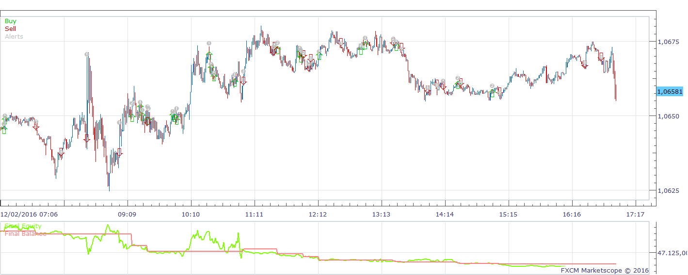
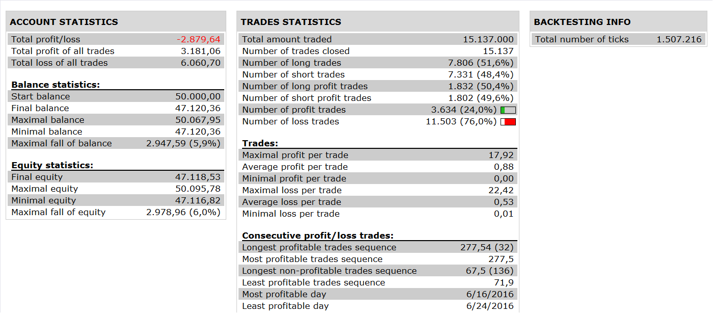

# CMF RSI STRATEGY

> Source: https://fxcodebase.com/code/viewtopic.php?f=31&t=64195  
> Forum: 31 · Topic 64195 · 1 post(s)

---

## CMF RSI STRATEGY

**Apprentice** · Sat Dec 10, 2016 7:11 am

 

Open Long
 RSI> BUY LEVEL(50)
AND CHAIKIN MONEY FLOW INDICATOR CROSS OVER BUY LINE

Open Short
 RSI < SELL LEVEL (50)
 AND CHAIKIN MONEY FLOW INDICATOR CROSS UNDER SELL LINE

 [CMF RSI STRATEGY.lua](files/109683/CMF%20RSI%20STRATEGY.lua)

The Strategy was revised and updated on December 10, 2018.
