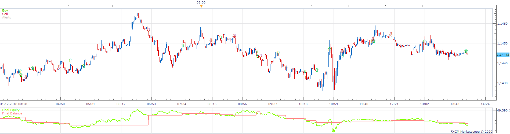
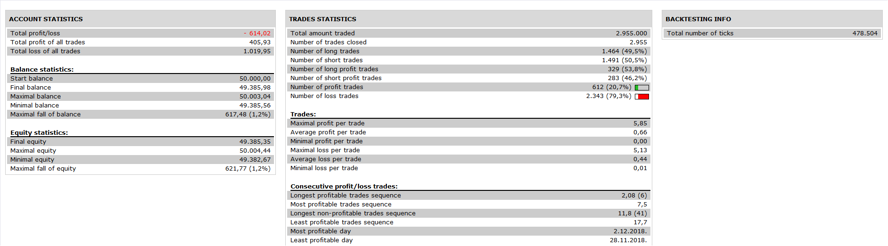

# CMO_MA Strategy

> Source: https://fxcodebase.com/code/viewtopic.php?f=31&t=69599  
> Forum: 31 · Topic 69599 · 14 post(s)

---

## CMO_MA Strategy

**Apprentice** · Tue Mar 31, 2020 6:27 am

 

 [CMO_MA Strategy.lua](files/132411/CMO_MA%20Strategy.lua)

if the price of the indicator is > 0 open a buy trade
 and
 if the price of the indicator is < 0 open a sell trade

You will have to install.
CMO_MA.lua
[viewtopic.php?f=17&t=10551](https://fxcodebase.com/code/viewtopic.php?f=17&t=10551)
Averages.lua
[viewtopic.php?f=17&t=2430](https://fxcodebase.com/code/viewtopic.php?f=17&t=2430)

---

## Re: CMO_MA Strategy

**ANTONIO** · Tue Mar 31, 2020 5:19 pm

Hi apprentice,

THERE IS NO ALERT (EMAILS) FOR OPENING THE TRADES (IMPORTANT)

Thank you

---

## Re: CMO_MA Strategy

**Apprentice** · Wed Apr 01, 2020 6:26 am

Your request is added to the development list.
Development reference 988.

---

## Re: CMO_MA Strategy

**ANTONIO** · Wed Apr 01, 2020 1:43 pm

HI APPRENTICE,
THERE IS A PROBLEM WITH THE "LIVE" OPERATION OF THE STRATEGY.
FOR EXAMPLE:  AT TIMEFRAME H1 THE PRICE OF THE INDICATOR CMO IS BELOW ZERO AND OPENS A SALE TRADE, DURING THE SAME TIMEFRAME PRICE RISES OVER ZERO AND STAYS THERE. AND THE STRATEGY DOESN'T CLOSE LIVE THE SALE TRADE AND TO OPEN A BUY TRADE. 
THIS IT DOES ONLY AT THE "END OF TURN" OF TIMEFRAME

Thank you

---

## Re: CMO_MA Strategy

**Apprentice** · Thu Apr 02, 2020 6:35 am

Try it now.

---

## Re: CMO_MA Strategy

**MC. Trend Trader** · Thu Apr 02, 2020 11:55 am

Hello,

Can you please add Time Parameters for Start/Stop Trading and Use Mandatory Closing /Mandatory Closing Time

Best regards

---

## Re: CMO_MA Strategy

**ANTONIO** · Thu Apr 02, 2020 1:16 pm

HI APPRENTICE,

THE PROBLEM OF "LIVE" OPERATION OF STRATEGY STILL REMAIN.

FOR EXAMPLE: AT TIMEFRAME H1 THE PRICE OF THE INDICATOR CMO IS BELOW ZERO AND OPENS A SALE TRADE, DURING THE SAME TIMEFRAME PRICE RISES OVER ZERO AND STAYS THERE. AND THE STRATEGY DOESN'T CLOSE LIVE THE SALE TRADE AND TO OPEN A BUY TRADE.
THIS IT DOES ONLY AT THE "END OF TURN" OF TIMEFRAME

Thank you

---

## Re: CMO_MA Strategy

**Apprentice** · Fri Apr 03, 2020 5:42 am

Your request is added to the development list.
Development reference 1005.

---

## Re: CMO_MA Strategy

**Apprentice** · Tue Apr 07, 2020 4:58 am

[CMO_MA Strategy.lua](files/132612/CMO_MA%20Strategy.lua)

Considering "LIVE"
Yes, it's expected. You can't cancel this option live. This is the downside of the live option

---

## Re: CMO_MA Strategy

**ANTONIO** · Tue Apr 07, 2020 7:43 am

Hi Apprentice,
does not work

---

## Re: CMO_MA Strategy

**Apprentice** · Tue Apr 07, 2020 3:24 pm

Your request is added to the development list.
Development reference 1026.

---

## Re: CMO_MA Strategy

**Apprentice** · Wed Apr 08, 2020 4:57 am

You need to install the latest version of averages indicator
[http://www.fxcodebase.com/code/download ... p?id=19033](http://www.fxcodebase.com/code/download/file.php?id=19033)

---

## Re: CMO_MA Strategy

**ANTONIO** · Wed Apr 08, 2020 1:34 pm

I did it, but still does not work and appears the same message.

---

## Re: CMO_MA Strategy

**Apprentice** · Thu Apr 09, 2020 5:25 am

Work without any problem in Strategy Backtester.
Averages.lua and CMO_MA.lua ware installed.
