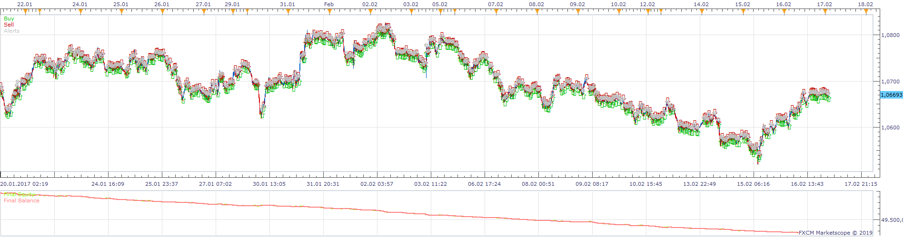
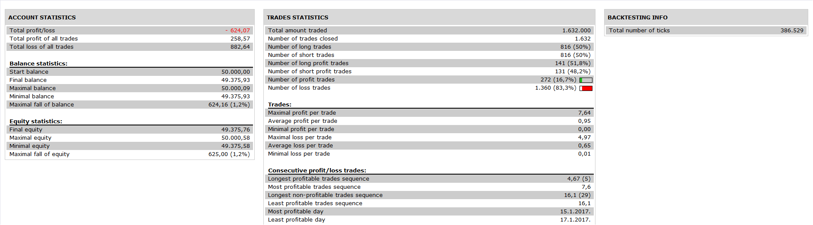

# Colored RSI Moving Average Strategy

> Source: https://fxcodebase.com/code/viewtopic.php?f=31&t=68323  
> Forum: 31 · Topic 68323 · 1 post(s)

---

## Colored RSI Moving Average Strategy

**Apprentice** · Thu Apr 11, 2019 3:44 pm

 

Based on request.
[viewtopic.php?f=27&t=68315](https://fxcodebase.com/code/viewtopic.php?f=27&t=68315)
Based on Indicator.
[viewtopic.php?f=17&t=65839](https://fxcodebase.com/code/viewtopic.php?f=17&t=65839)
Open Long on Line/Level CrossOver
Close Long on Line/Level CrossUnder
Viceversa sfor Short

 [Colored RSI Moving Average Strategy.lua](files/125675/Colored%20RSI%20Moving%20Average%20Strategy.lua)
