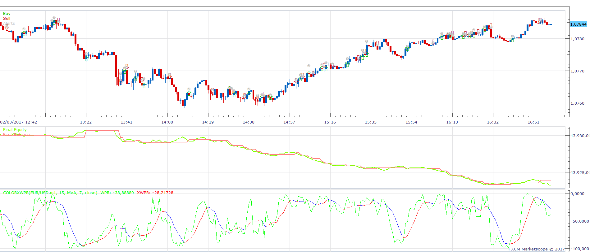
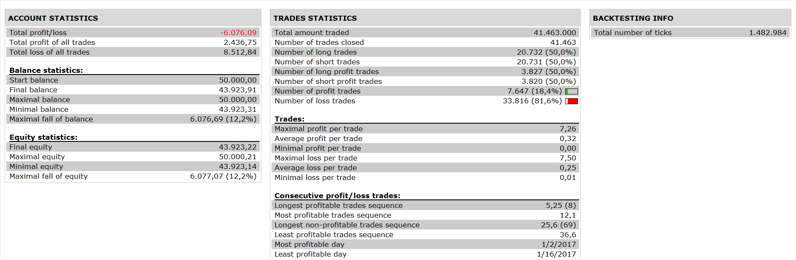

# ColorXWPR oscillator Strategy

> Source: https://fxcodebase.com/code/viewtopic.php?f=31&t=64574  
> Forum: 31 · Topic 64574 · 1 post(s)

---

## ColorXWPR oscillator Strategy

**Apprentice** · Fri Apr 07, 2017 1:45 pm

 

XWPR slope signal
Open Long if we have XWPR slope turned up
Open Short if we have XWPR scope turned down

WPR signal
Open Long
WPR/XWPR CrossOver
Open Short
WPR/XWPR CrossUnder

 [ColorXWPR oscillator Strategy.lua](files/111875/ColorXWPR%20oscillator%20Strategy.lua)

ColorXWPR oscillator is available here.
[viewtopic.php?f=17&t=12832](https://fxcodebase.com/code/viewtopic.php?f=17&t=12832)
Averages indicator is available here.
[viewtopic.php?f=17&t=2430](https://fxcodebase.com/code/viewtopic.php?f=17&t=2430)

The Strategy was revised and updated on January 19, 2019.
