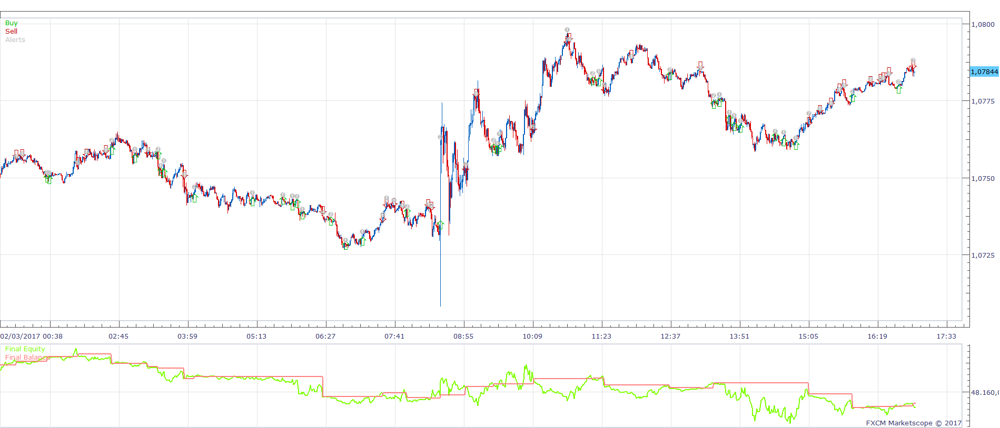
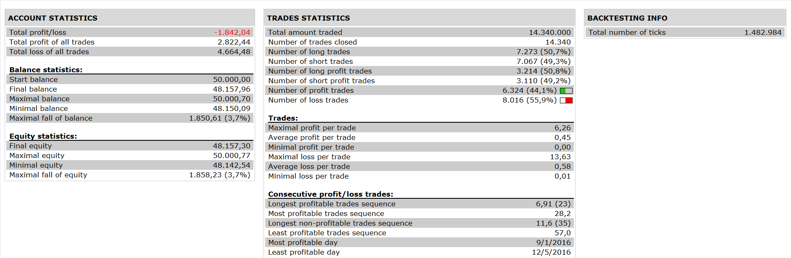

# ColorXWPR Strategy

> Source: https://fxcodebase.com/code/viewtopic.php?f=31&t=64582  
> Forum: 31 · Topic 64582 · 1 post(s)

---

## ColorXWPR Strategy

**Apprentice** · Mon Apr 10, 2017 7:34 am

 

Open Long
wpr cross over xwpr
xwpr(period)>xwpr (period - 1)
xwpr < buy level
Open Short
wpr cross under xwpr
xwpr(period) < xwpr (period - 1)
xwpr >sell leve

 [ColorXWPR Strategy.lua](files/111912/ColorXWPR%20Strategy.lua)

ColorXWPR oscillator is available here.
[viewtopic.php?f=17&t=12832](https://fxcodebase.com/code/viewtopic.php?f=17&t=12832)
Averages indicator is available here.
[viewtopic.php?f=17&t=2430](https://fxcodebase.com/code/viewtopic.php?f=17&t=2430)

The Strategy was revised and updated on January 19, 2019.
