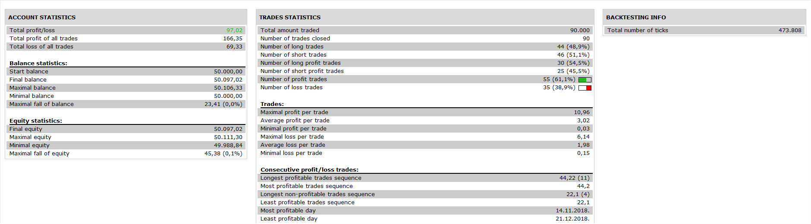

# COMBINING BOLLINGER BANDS WITH CANDLES Strategy

> Source: https://fxcodebase.com/code/viewtopic.php?f=31&t=68948  
> Forum: 31 · Topic 68948 · 1 post(s)

---

## COMBINING BOLLINGER BANDS WITH CANDLES Strategy

**Apprentice** · Tue Sep 24, 2019 7:58 am

 

Based on Pawel Kosinski article When West Meets East - Combining Bollinger Bands
With Candlesticks, October 2019 issue of "S&C" magazine.

 [COMBINING BOLLINGER BANDS WITH CANDLES Strategy.lua](files/128850/COMBINING%20BOLLINGER%20BANDS%20WITH%20CANDLES%20Strategy.lua)

Risk Reward indicator.
[viewtopic.php?f=17&t=68949](https://fxcodebase.com/code/viewtopic.php?f=17&t=68949)
