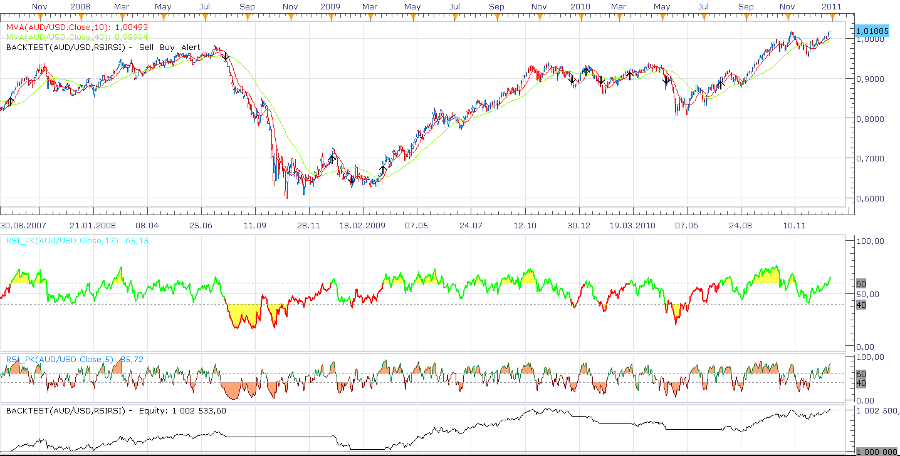
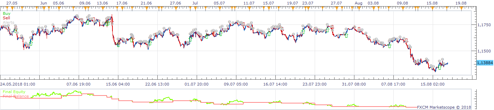
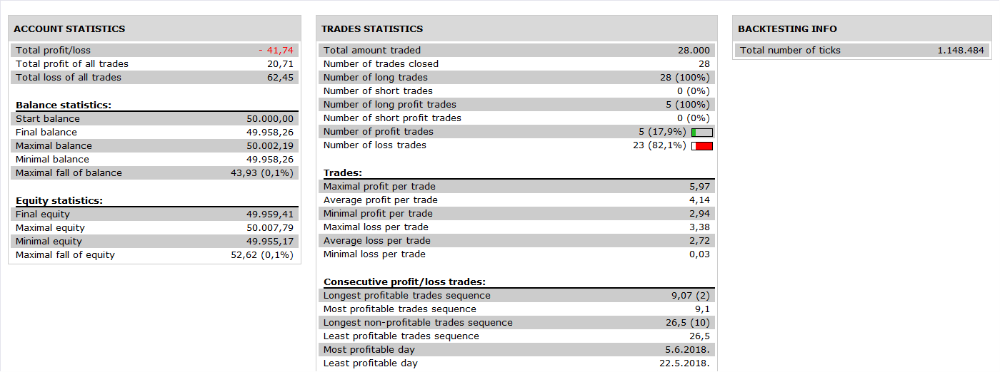

# Combining RSI with RSI strategy (Jan, 2011 S&C)

> Source: https://fxcodebase.com/code/viewtopic.php?f=31&t=3081  
> Forum: 31 · Topic 3081 · 2 post(s)

---

## Combining RSI with RSI strategy (Jan, 2011 S&C)

**Nikolay.Gekht** · Mon Jan 03, 2011 4:31 pm

This demo strategy is described in the January 2011 issue of Stocks&Commodities in Peter Konner's article "Combining RSI with RSI" (pg. 17-21).

The strategy works well on trendy market and, at first glance, is almost useless (at least with default parameters) on the Forex Market. However, the strategy is a good example of selective position management. Yeah, because of selective position management the strategy does not work on FIFO accounts.

The idea of the strategy is to use two RSI (the article mentioned that other indicators can be used as well - MACD, KST, Stochastic), the long for main trend detection and the short for correction detection. Both, main trend and correction position is managed individually.

 



 



 



Download:

 [rsirsi.lua](files/7180/rsirsi.lua)

The strategy requires RSI_PK_Indicator which can be found in this topic:
([viewtopic.php?f=17&t=3080](https://fxcodebase.com/code/viewtopic.php?f=17&t=3080))

Source code:

```lua
-- This strategy is based on the TASC Article in the
-- January 2011 issue titled "Combining RSI With RSI"
-- by Peter Konner.  This strategy takes long positions
-- only based on the RSI and a Simple Moving Average.
-- This strategy is coded for end of bar only (IOG set
-- to false).
--
-- Buy Conditions:
-- 1.  Slow RSI crosses above 60 and the Close is greater
--     than the Slow Moving Average.
--    OR
-- 2.  Quick RSI crosses above 60, the Close is greater
--     than the Quick Moving Average and the Slow RSI
--     is indicating a down trend.
--
-- Exit Conditions:
-- 1.  The Slow RSI entry is exited if the Slow RSI
--     crosses below 40 OR the Close is less than the
--     Slow Moving Average.
-- 2.  The Quick RSI entry is exited if the Quick RSI
--     crosses below 40 OR the Close is less than the
--     Quick Moving Average.

function Init()
    strategy:name("Double RSI strategy");
    strategy:description("The strategy is described in Peter's Conner article in Jan 2011 issue of Stock & Commodities");

    strategy.parameters:addGroup("Parameters");
    strategy.parameters:addInteger("FRSI", "Fast RSI", "", 5, 2, 30);
    strategy.parameters:addInteger("SRSI", "Slow RSI", "", 17, 2, 30);
    strategy.parameters:addInteger("RSIB", "RSI Buy Level", "", 60, 0, 100);
    strategy.parameters:addInteger("RSIS", "RSI Sell Level", "", 40, 0, 100);
    strategy.parameters:addInteger("FMVA", "Fast Moving Average", "", 10, 2, 100);
    strategy.parameters:addInteger("SMVA", "Slow Moving Average", "", 40, 2, 100);

    strategy.parameters:addGroup("Price");
    strategy.parameters:addString("Type", "Price type", "", "Bid");
    strategy.parameters:addStringAlternative("Type", "Bid", "", "Bid");
    strategy.parameters:addStringAlternative("Type", "Ask", "", "Ask");
    strategy.parameters:addString("TF", "Timeframe", "", "H1");
    strategy.parameters:setFlag("TF", core.FLAG_PERIODS);

    strategy.parameters:addGroup("Trading Parameters");
    strategy.parameters:addBoolean("CanTrade", "Allow Trading", "", false);
    strategy.parameters:addString("Account", "Account to Trade On", "", "");
    strategy.parameters:setFlag("Account", core.FLAG_ACCOUNT);
    strategy.parameters:addInteger("Amount", "Trade Size", "", 1, 1, 100);
    strategy.parameters:addBoolean("SetLimit", "Set Limit", "", false);
    strategy.parameters:addInteger("Limit", "Limit in pips", "", 30, 0, 300);
    strategy.parameters:addBoolean("SetStop", "Set Stop", "", true);
    strategy.parameters:addInteger("Stop", "Stop in pips", "", 30, 0, 300);
    strategy.parameters:addBoolean("TrailingStop", "Trailing Stop", "", false);

    strategy.parameters:addGroup("Signal Parameters");
    strategy.parameters:addBoolean("ShowAlert", "Show Alert", "", true);
    strategy.parameters:addBoolean("PlaySound", "Play Sound", "", false);
    strategy.parameters:addFile("SoundFile", "Sound File", "", "");
    strategy.parameters:setFlag("SoundFile", core.FLAG_SOUND);
    strategy.parameters:addBoolean("RecurrentSound", "Recurrent Sound", "", false);
end

local name;

-- source and indicators
local source;
local SRSI, FRSI, SMA, FMA;
local first;
local RSIB, RSIS;

-- notification parameters
local ShowAlert, SoundFile, RecurrentSound;

-- trading parameters
local CanTrade, Account, Offer;
local SetStop, Stop, TrailingStop, SetLimit, Limit;

function Prepare(onlyName)
    assert(core.indicators:findIndicator("RSI_PK") ~= nil, "RSI_PK indicator must be installed");

    assert(instance.parameters.TF ~= "t1", "The strategy cannot be applied on ticks");

    ShowAlert = instance.parameters.ShowAlert;

    ShowAlert = instance.parameters.ShowAlert;
    local PlaySound = instance.parameters.PlaySound;
    if PlaySound then
        SoundFile = instance.parameters.SoundFile;
        RecurrentSound = instance.parameters.RecurrentSound;
    else
        SoundFile = nil;
        RecurrentSound = false;
    end
    assert(not(PlaySound) or (PlaySound and SoundFile ~= ""), "Sound File must be chosen in case the sound is no");

    CanTrade = instance.parameters.CanTrade;
    assert(core.host:execute("getTradingProperty", "canCreateMarketClose", instance.bid:instrument(), Account), "The stategy cannot work on FIFO accounts");

    local tradingname;

    if instance.parameters.CanTrade then
        tradingname = "trade(" .. instance.parameters.Account .. ")";
    else
        tradingname = "signal";
    end

    name = profile:id() .. "(" .. instance.bid:instrument() .. "." .. instance.parameters.Type .. "(" .. instance.parameters.TF .. ")" ..
                               "," .. "RSI(" .. instance.parameters.FRSI .. ")" ..
                               "," .. "RSI(" .. instance.parameters.SRSI .. ")" ..
                               "," .. instance.parameters.RSIB .. "," .. instance.parameters.RSIS ..
                               "," .. "MVA(" .. instance.parameters.FMVA .. ")" ..
                               "," .. "MVA(" .. instance.parameters.SMVA .. ")" ..
                               tradingname .. ")";
    instance:name(name);
    if onlyName then
        return ;
    end

    if CanTrade then
        Account = instance.parameters.Account;
        Amount = instance.parameters.Amount *
                 core.host:execute("getTradingProperty", "baseUnitSize", instance.bid:instrument(), Account);
        Offer = core.host:findTable("offers"):find("Instrument", instance.bid:instrument()).OfferID;
        SetLimit = instance.parameters.SetLimit;
        Limit = instance.parameters.Limit;
        SetStop = instance.parameters.SetStop;
        Stop = instance.parameters.Stop;
        TrailingStop = instance.parameters.TrailingStop;
    end

    close = ExtSubscribe(2, nil, instance.parameters.TF, instance.parameters.Type == "Bid", "close");
    FRSI = core.indicators:create("RSI_PK", close, instance.parameters.FRSI);
    SRSI = core.indicators:create("RSI_PK", close, instance.parameters.SRSI);
    FMVA = core.indicators:create("MVA", close, instance.parameters.FMVA);
    SMVA = core.indicators:create("MVA", close, instance.parameters.SMVA);
    RSIB = instance.parameters.RSIB;
    RSIS = instance.parameters.RSIS;
    first = math.max(FRSI.DATA:first(), SRSI.DATA:first(), FMVA.DATA:first(), SMVA.DATA:first(), instance.parameters.SRSI * 10);
end

function ExtUpdate(id, source, period)
    if id == 2 then
        FRSI:update(core.UpdateLast);
        SRSI:update(core.UpdateLast);
        FMVA:update(core.UpdateLast);
        SMVA:update(core.UpdateLast);

        if period >= first then
            -- entry condition
            if SRSI.DATA[period - 1] <= RSIB and
               SRSI.DATA[period] > RSIB and
               close[period] > SMVA.DATA[period] then
               Enter("Slow");
            end

            if FRSI.DATA[period - 1] <= RSIB and
               FRSI.DATA[period] > RSIB and
               close[period] > FMVA.DATA[period] and
               SRSI.DATA[period] < 40 then
               Enter("Fast");
            end

            -- exit condition
            if SRSI.DATA[period - 1] >= RSIS and
               SRSI.DATA[period] < RSIS and
               close[period] < SMVA.DATA[period] then
               Exit("Slow");
            end

            if FRSI.DATA[period - 1] >= RSIS and
               FRSI.DATA[period] < RSIS and
               close[period] < FMVA.DATA[period] then
               Exit("Fast");
            end
        end
    end
end

function Enter(type)
    Alert("Enter " .. type);

    if not CanTrade then
        return ;
    end

    local id = "RSIRSI" .. type;

    -- avoid double enter, check whether a trade exist first
    local valuemap, success, msg;
    local enum, row;
    enum = core.host:findTable("trades"):enumerator();
    row = enum:next();
    while row ~= nil do
        if row.AccountID == Account and
            row.OfferID == Offer and
            row.QTXT == id then
                break;
        end
        row = enum:next();
    end

    -- trade already exist
    if row ~= nil then
        return ;
    end

    valuemap = core.valuemap();
    valuemap.Command = "CreateOrder";
    valuemap.OrderType = "OM";
    valuemap.OfferID = Offer;
    valuemap.AcctID = Account;
    valuemap.Quantity = Amount;
    valuemap.BuySell = "B";
    valuemap.CustomID = id;

    if SetStop or SetLimit then
        valuemap.PegTypeStop = "M";

        if SetLimit then
            valuemap.PegPriceOffsetPipsLimit = Limit;
        end

        if SetStop then
            valuemap.PegPriceOffsetPipsStop = -Limit;
            if instance.parameters.TrailingStop then
               valuemap.TrailStepStop = 1;
            end
        end
    end

    success, msg = terminal:execute(100, valuemap);
    if not(success) then
        terminal:alertMessage(instance.bid:instrument(), instance.bid[instance.bid:size() - 1], "buy order failed:" .. msg, instance.bid:date(instance.bid:size() - 1));
        return false;
    end
end

function Exit(type)
    local valuemap, success, msg;
    local enum, row;

    Alert("Exit " .. type);

    if not(CanTrade) then
        return ;
    end

    local id = "RSIRSI" .. type;

    -- check whether there is at least one position of RSIRSI strategy
    enum = core.host:findTable("trades"):enumerator();
    row = enum:next();
    while row ~= nil do
        if row.AccountID == Account and
           row.OfferID == Offer and
           row.QTXT == id then
            valuemap = core.valuemap();
            valuemap.Command = "CreateOrder";
            valuemap.OrderType = "CM";
            valuemap.OfferID = Offer;
            valuemap.AcctID = Account;
            valuemap.Quantity = row.Lot;
            valuemap.TradeID = row.TradeID;
            valuemap.BuySell = "S";
            success, msg = terminal:execute(101, valuemap);
            if not(success) then
                terminal:alertMessage(instance.bid:instrument(), instance.bid[instance.bid:size() - 1], "sell order failed:" .. msg, instance.bid:date(instance.bid:size() - 1));
                return false;
            end
        end
        row = enum:next();
    end
end

function Alert(signal)
    if ShowAlert then
        terminal:alertMessage(instance.bid:instrument(), instance.bid[NOW], name .. ":" .. signal, instance.bid:date(NOW));
        if SoundFile ~= nil then
            terminal:alertSound(SoundFile, RecurrentSound);
        end
    end
end

function ExtAsyncOperationFinished(cookie, successful, msg)
    if cookie == 100 and not(successful) then
        terminal:alertMessage(instance.bid:instrument(), instance.bid[instance.bid:size() - 1], "buy order failed:" .. msg, instance.bid:date(instance.bid:size() - 1));
    elseif cookie == 101 and not(successful) then
        terminal:alertMessage(instance.bid:instrument(), instance.bid[instance.bid:size() - 1], "sell order failed:" .. msg, instance.bid:date(instance.bid:size() - 1));
    end
end

dofile(core.app_path() .. "\\strategies\\standard\\include\\helper.lua");
```

---

## Re: Combining RSI with RSI strategy (Jan, 2011 S&C)

**Apprentice** · Sun Nov 11, 2018 6:25 am

The Strategy was revised and updated on November 11. 2018.
