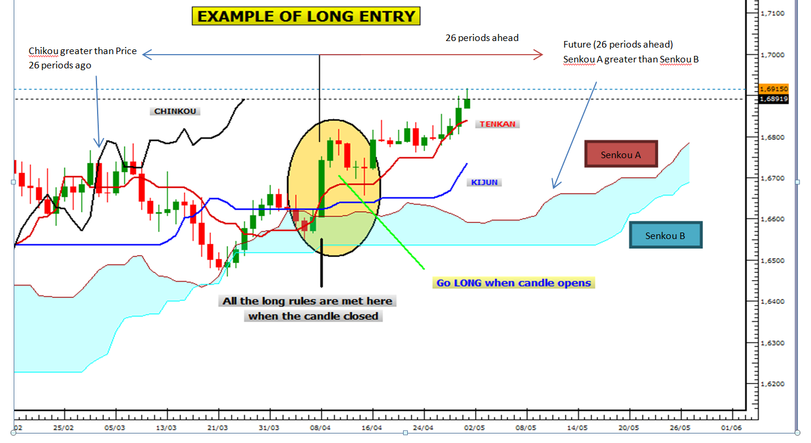
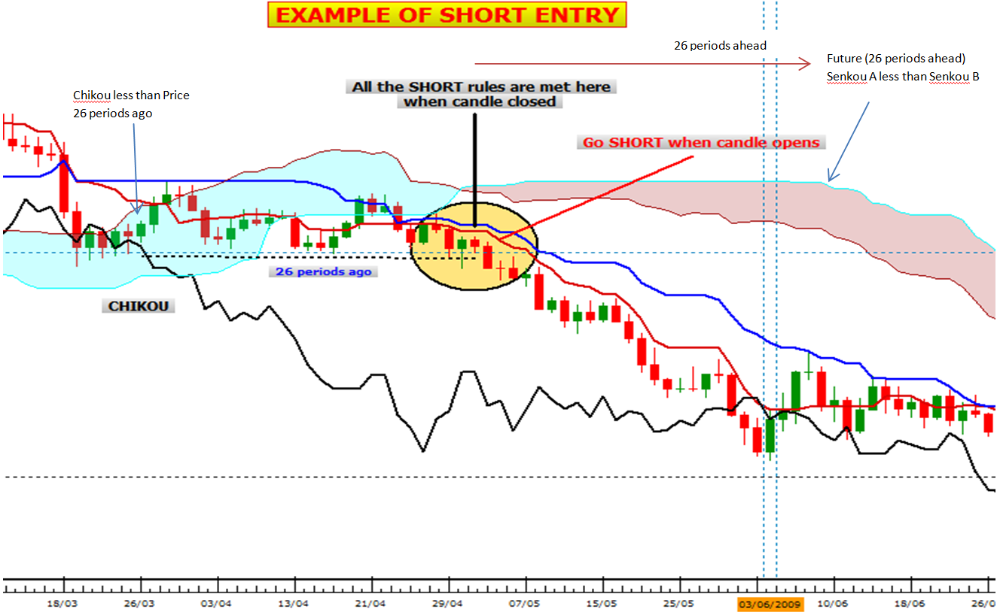

# Complete Ichimoku Strategy

> Source: https://fxcodebase.com/code/viewtopic.php?f=31&t=61121  
> Forum: 31 · Topic 61121 · 46 post(s)

---

## Complete Ichimoku Strategy

**Apprentice** · Thu Sep 11, 2014 4:49 am

 

 

Based on the request.
[viewtopic.php?f=27&t=60619#p93769](https://fxcodebase.com/code/viewtopic.php?f=27&t=60619#p93769)

**LONG ENTRIES**

Price above Kumo (greater than Senkou A (SA) and Senkou B (SB))
Tenkan (T) greater than Kijun (K)
Chikou (C) greater than price 26 periods ago
Future (26 periods ahead) SA greater than Future SB
T and K greater than SA and SB

**SHORT ENTRIES**

Price below Kumo (less than Senkou A (SA) and Senkou B (SB))
Tenkan (T) less than Kijun (K)
Chikou (C) less than price 26 periods ago
Future (26 periods ahead) SA less than Future SB
T and K less than SB and SA

 [Complete Ichimoku Strategy.lua](files/95808/Complete%20Ichimoku%20Strategy.lua)

---

## Re: Complete Ichimoku Strategy

**Apprentice** · Sun Dec 11, 2016 7:15 am

Strategy was revised and updated.

---

## Re: Complete Ichimoku Strategy

**alerander81** · Thu May 03, 2018 6:25 am

Hello Apprentice,

Is it possible for you to add with this strategy daily pivot points, in order to move the stop?

I explain, for example in UT 15mn.

Buy situation
Same ichimoku conditions to enter long. But when candle is closing above the first near daily pivot point, we move the stop to place it 10 pips under this daily pivot point.

Sell situation
Same ichimoku conditions to enter short . But when candle is closing below the first near daily pivot point, we move the stop to place it 10 pips over this daily pivot point.

Thanks you very much !

---

## Re: Complete Ichimoku Strategy

**Apprentice** · Fri May 18, 2018 5:59 am

Your request is added to the development list under Id Number 4143

---

## Re: Complete Ichimoku Strategy

**Apprentice** · Fri Jun 01, 2018 6:27 am

Try this version.

 [Complete Ichimoku Strategy.alerander81.lua](files/119426/Complete%20Ichimoku%20Strategy.alerander81.lua)

---

## Re: Complete Ichimoku Strategy

**Gilles** · Wed Sep 26, 2018 7:27 am

Hi Apprentice,

Please could you incorporate your ChandelierExit Strategy into this one.

Could you automatically get the ATR value to calculate the multiplier coéficient. This prevents us from calculating it ourselves to define it in ATRMultipl parameter.

Getting it dynamically would be a considerable time saver.

By the way, in the trading station, ATR is calculated over 14 periods.

A big thank you in advance

---

## Re: Complete Ichimoku Strategy

**Apprentice** · Thu Sep 27, 2018 2:47 am

ChandelierExit Strategy
[http://fxcodebase.com/code/viewtopic.php?f=31&t=64552](https://fxcodebase.com/code/viewtopic.php?f=31&t=64552)
I am NOT sure how you calculate / select parameters for ATR.

---

## Re: Complete Ichimoku Strategy

**Gilles** · Thu Sep 27, 2018 8:01 am

Hi, Apprentice! I will explain everything to you with image to support.

[u]Step 1[/u]

I want to open a position now.
At the opening of the candle, the price is 12859.50.
I look at its ATR which is 4.47 (Image step 1).

[attachment=3]Step1.png[/attachment]

[u]Step 2[/u]

Since the ATR indicator is used in the trading station and is calculated over 14 periods.
We'll do the same by taking the last 14 periods.

So we're looking for the highest price of the range with its own ATR.
In my example: 12872.00 with an ATR of 2.83 (Image Step 2.1).

[attachment=2]Step 2.1.png[/attachment]

Then we just look for the lowest price in the range.
In my example: 12851.90 (Image step 2.2).

[attachment=1]Step 2.2.png[/attachment]

[u]Step 3[/u]

We're going to calculate X

= Highest price of range – Lowest price of range
= 12872.00-12851.90 = 20.10
X = 20.10/(ATR of the highest price of the range)
X = 20.10/2.83 = 7.10
X = 7.10

[u]Etape 4 : formule[/u]

So to determine a profit limit :

LIMIT = PRICE + (ATR * X)

LIMIT = 12859.50 + (4.47 * 7.10)
LIMIT = 12859.50 + 32
LIMIT = 12891.00

And to determine a stop loss

STOP = PRICE – (ATR * X)
STOP = 12859.50 – (4.47 * 7.10)
STOP = 12859.50 – 32
STOP = 12828.00

Finally, for more details on the steps to follow, I invite you to look at the Excel steps image.

[attachment=0]Excel steps.JPG[/attachment]

You're great, I'll tell you very soon.

---

## Re: Complete Ichimoku Strategy

**Gilles** · Fri Sep 28, 2018 12:00 pm

What I explained to you will look like this technique Chandelier trailing stop Strategy except that the stop loss calculation will be done every moment. As soon as the trade starts, the stop will adjust as you go along. So we will take as much gain as possible by controlling our losses more.

About this technique, what is very annoying is that one is obliged to choose a particular trade. It would have to apply to all open trades when it closes operations. For my part, when I take a position, I do it with several trades simultaneously.

Excuse me Apprentice for my English, college level:). I'm trying to do my best.
Regards, Gilles.

---

## Re: Complete Ichimoku Strategy

**Gilles** · Mon Oct 15, 2018 11:13 am

Hi, Apprentice,

What do you think about my ATR coeficient explanation, graphics and Excel support ?

Can you set it up with the closing of all open trades at the same time ?

Then I told you already but could you also add a feature that allows to stop trading as soon as our goal of profit is reached for the day ?

I would like to have your feedback on these different points :)

Thanks,

---

## Re: Complete Ichimoku Strategy

**Apprentice** · Fri Oct 26, 2018 5:16 am

Your request is added to the development list under Id Number 4282

---

## Re: Complete Ichimoku Strategy

**Apprentice** · Sat Oct 27, 2018 5:13 am

Try this version.

 [Complete Ichimoku Strategy.Gilles.lua](files/121787/Complete%20Ichimoku%20Strategy.Gilles.lua)

---

## Re: Complete Ichimoku Strategy

**Gilles** · Sun Jan 06, 2019 6:07 pm

Hi ! Apprentice,

Very good work, I thank you, and before writing to give you news, I tested the script.

Here are my observations and improvements to make if you agree.

The correction is as follows :

As the STOP LOSS closes all open positions at the same time, objective sought.

Would it be possible to do the same with the limit gain ?
Today, each new position gets its own gain limit. However, it would be better if all open positions were the same gain limit to close all open positions.

Proposal for improvement 1 :

Would it be possible for the strategy to check the BUY/SELL signal in D1 and open the positions with each new H1 candle ?

I would also like to add the following.
If we have a BUY signal in D1, is it possible to close all open BUY positions in H1 when the price reaches a new HIGH price in D1 ?

So, for a SELL signal in D1, we are looking for the new LOW price in D1 to close all open SELL positions in H1 ?

This solution that I propose allows you not to keep a large number of open positions, which reduces the risk in case of reversal of market.
Do you think my proposals are feasible where does it seem too complicated?

Proposal for improvement 2 :

Would it be possible to integrate LevelCloseStrategy.Lua into the complete Ichimoku strategy.Gilles.Lua ?

I would like to have your feedback on my message to see if it is possible. Maybe it's a challenge for you, I don't know.
In any case, thanks again for the work already done.

Regards,
Gilles.

---

## Re: Complete Ichimoku Strategy

**Gilles** · Tue Jan 08, 2019 6:14 pm

Hi, Apprentice,
Waiting for your feedback on my proposal, I present my best wishes for this New year 2019.
Who I hope will be beneficial.
See you soon.

---

## Re: Complete Ichimoku Strategy

**Apprentice** · Mon Jan 21, 2019 9:04 am

Your request is added to the development list under Id Number 4437

---

## Re: Complete Ichimoku Strategy

**Apprentice** · Mon Jan 28, 2019 6:53 am

Try this version.

 [Complete Ichimoku Strategy.Gilles.lua](files/123553/Complete%20Ichimoku%20Strategy.Gilles.lua)

---

## Re: Complete Ichimoku Strategy

**Gilles** · Fri Feb 01, 2019 5:34 am

Hi, Apprentice,
I have encountered some problems with the latest version of the policy that has an incorrect behavior:).

In D1 we detect the signal BUY or SELL and at each hour of the day, we take 1 new position in the direction of the signal detected in D1.

Example:

D1 = BUY

Then in H1:
8:00 am = open BUY position
9:00 am = open BUY position
10:00 am = Open BUY position
11:00 am = Open BUY position
Etc.

When the signal is BUY, the position closes only when the price has reached a new HIGH in D1 and if the signal is SELL a new LOW in D1.

For the calculation of the LIMIT and STOP LOSS gain with the ATR indicator, it is to protect the positions taken in H1.

Kind regards
Gilles.

---

## Re: Complete Ichimoku Strategy

**Apprentice** · Sat Feb 09, 2019 4:59 am

Try this version.

 [Complete Ichimoku Strategy.Gilles.v3.lua](files/123800/Complete%20Ichimoku%20Strategy.Gilles.v3.lua)

---

## Re: Complete Ichimoku Strategy

**LoneWolf** · Sun Feb 24, 2019 5:40 am

is it possible to exit a position when price close on the support 1 or 2 line of the cloud ?

---

## Re: Complete Ichimoku Strategy

**Apprentice** · Thu Feb 28, 2019 5:44 am

Your request is added to the development list under Id Number 4503

---

## Re: Complete Ichimoku Strategy

**Apprentice** · Tue Mar 05, 2019 5:48 am

Try this version.

 [Complete Ichimoku Strategy.Gilles.v4.lua](files/124242/Complete%20Ichimoku%20Strategy.Gilles.v4.lua)

---

## Re: Complete Ichimoku Strategy

**MemphisRokudo** · Thu Mar 07, 2019 6:46 am

Is there a mt4 version?

---

## Re: Complete Ichimoku Strategy

**Apprentice** · Mon Apr 01, 2019 10:14 am

Your request is added to the development list under Id Number 4579

---

## Re: Complete Ichimoku Strategy

**Apprentice** · Mon Apr 15, 2019 5:01 am

Try this version.
[viewtopic.php?f=38&t=68336](https://fxcodebase.com/code/viewtopic.php?f=38&t=68336)

---

## Re: Complete Ichimoku Strategy

**Gilles** · Mon Apr 15, 2019 5:36 am

Hi apprentice,

The v3 version does not do what I proposed to you.

For example :
If BUY signal was detected in D1, the new open position in H1 should only close when we have reached a new higher price in D1.

Vice versa with a SELL position.

I'm going to go back to zero and keep it closer. To help me do you agree to make a simple version MTF complete ichimoku strategy.

Once modified, I'll send you the code so you'll tell me what you think.

Thank you and see you soon.

---

## Re: Complete Ichimoku Strategy

**Gilles** · Tue Apr 16, 2019 4:27 am

Hi Apprentice,

Needless to predict the development of MTF complete ichimoku, it is done.
I would like to look at the closure of positions that do not work as proposed.
This is certainly related to the setting up of the limit gain according to the ATR.

See you soon.

---

## Re: Complete Ichimoku Strategy

**Apprentice** · Fri Apr 26, 2019 7:02 am

Your request is added to the development list under Id Number 4625

---

## Re: Complete Ichimoku Strategy

**Gilles** · Sat Apr 27, 2019 5:25 am

Hi, Apprentice,

Please,

It is possible to make a Complete Ichimoku Strategy version with a net entry stop at Zero-Profit Point of All Positions ?

Example :
[http://www.fxcodebase.com/documents/Ind ... er_SE.html](http://www.fxcodebase.com/documents/IndicoreSDK/TradingCommandsCreateOrder_SE.html)

Thank you.
See you soon.

---

## Re: Complete Ichimoku Strategy

**dispococo** · Sat Apr 27, 2019 12:08 pm

Hi Apprentice,

Your strategy is really interesting. I am actually working with ichimoku.
I have just one idea if possible. It could be interesting to close the position and take money when price cross the kitjun. It avoid to put an approximated take profit. Cross under if it is a buy position or cross over if it a sell position.

Thank you

---

## Re: Complete Ichimoku Strategy

**dispococo** · Sat Apr 27, 2019 12:43 pm

Hi Apprentice,

I come back to you because i was not totaly clear in my first post.
In fact it could be interesting to do :

Stop : Close the position when Price cross kitjun under or over depending on buy/sell position respectively in an end of turn format.
Take profit : Value of the first resistance or support depending on the tendance (buy or sell position). Maybe it could be interesting to use daily pivot as these objectives.

In this way we avoid in major part the lose and try to max the gain. Indeed, the stop will be use as stop lose in the first part of the trade and then it will be a following stop lose with possible gain in case where the take profit is not reach. So we can exit trade with profit by following the kitjun stop lose and maybe take maximum gain if dayly pivot is reach.

Thank you !

---

## Re: Complete Ichimoku Strategy

**Apprentice** · Tue May 07, 2019 4:44 am

The v3 version does not do what I proposed to you.
For example :
If BUY signal was detected in D1, the new open position in H1 should only close when we have reached a new higher price in D1.
Vice versa with a SELL position.

The latest version is v4 and it works like that

---

## Re: Complete Ichimoku Strategy

**Gilles** · Fri Dec 06, 2019 5:31 am

Hi Apprentice,

Could you make an indicator that draws the supports and resistances:
- when SSB and Kijun are flat, at the same level, for D1, W1, M1,
- 42 months of history.

Archive the results in an external CSV file.
- Items of the current day will not be archived.

In advance thank you for your help.
See you soon.

---

## Re: Complete Ichimoku Strategy

**Apprentice** · Fri Dec 06, 2019 2:20 pm

Your request is added to the development list.
Development reference 411.

---

## Re: Complete Ichimoku Strategy

**Apprentice** · Thu Dec 12, 2019 6:10 pm

Can you confirm
Is it
SSB and Kijun are flat during the same time period, regardless of their level.
Or
SSB and Kijun have the same level on different time frames.

---

## Re: Complete Ichimoku Strategy

**Gilles** · Fri Dec 13, 2019 4:05 pm

hi Apprentice !

For each time frame we look for SSB, Kijun flat levels independently.

For D1, we have (X) SSB, Kijun flat level.

For W1, we have (X) SSB, Kijun flat level

For M1, we have (X) SSB, Kijun flat level

If we find the same levels in these 3 units of time, it will be a coincidence or a support/resistance that will be strong enough to coincide in the 3 units of time.

I hope to be precise enough.

Thank you Apprentice, see you soon.

---

## Re: Complete Ichimoku Strategy

**Apprentice** · Wed Dec 18, 2019 4:50 pm

[Ichimoku_resistance.lua](files/130323/Ichimoku_resistance.lua)

Didn't manage to find any matches for that.

---

## Re: Complete Ichimoku Strategy

**Gilles** · Wed Dec 18, 2019 5:01 pm

Hi Apprentice,

Please verify this rule :

ICH.TL[period] == ICH.SB[period + Kijun]

Thank you, see you soon :)

---

## Re: Complete Ichimoku Strategy

**Gilles** · Wed Dec 18, 2019 5:19 pm

Apprentice,
each time frame is independent.
So, when we look for levels kijun/SB flat levels, some have no relation to each other.

Each time unit has its own Kijun/SB flat level.

(n) flat level for D1
(n) flat level for W1
(n) flat level for D1

Don't forget the backup in an external file (*.txt ou *.csv).

Thank you.
See you soon :)

---

## Re: Complete Ichimoku Strategy

**Apprentice** · Thu Dec 19, 2019 11:35 am

Your request is added to the development list.
Development reference 455.

---

## Re: Complete Ichimoku Strategy

**Apprentice** · Fri Dec 20, 2019 9:12 am

I do not understand the request. There are two statements:
ICH.TL[period] == ICH.SB[period + Kijun]
and kijun/SB.
TL is Tenkan-sen, KL is Kujun-sen. Why do we need three timeframes? Why we can't use just on of them and just add three indicators with different timeframes (this is a better way to do that). And CSV export can be done by FXTS2 command.

 [Ichimoku_resistance.lua](files/130360/Ichimoku_resistance.lua)

---

## Re: Complete Ichimoku Strategy

**Gilles** · Fri Dec 20, 2019 9:36 am

Hi Apprentice,

Since I learn to use strategies. I noticed that in the complete ichimoku strategy:
ICH.SL - Tenkan-sen line
ICH.TL - Kijun-sen line.

That's why I use these terms.

My request only concerns Kijun/SB flat levels.

Yes, I agree, it takes 3 separate time units to get these 3 separate searches.

TF1(D1) - Kijun/SB flat levels.
TF2 (W1) - Kijun/SB flat levels.
TF3(M1) - Kijun/SB flat levels.

As stated in our previous exchanges.

For export backup in an external file (CSV or TXT). I don't know what command you're talking about.

I have already used the recipe (io.open, io.output, io.close) in a strategy to allow me to save all the ticks of a week trading on GER30. I used this valuable data to study the production of different patterns.

My knowledge does not yet allow me to realize what I asked you to do. This is why this indicator that will trace all Kijun/SB dishes (regardless of the time unit concerned) will be very useful to me and to the other members.

See you soon.

---

## Re: Complete Ichimoku Strategy

**Apprentice** · Mon Dec 23, 2019 6:22 am

[Ichimoku_resistance.lua](files/130408/Ichimoku_resistance.lua)

Something like this?

---

## Re: Complete Ichimoku Strategy

**Gilles** · Mon Dec 23, 2019 8:06 am

I do not understand the result.

I can't verify the result because I don't understand what the items are. I have the impression that they are merged.

This indicator must show all supports, resistances found, definitely. It should be able to read the history of the media and resistances already found in the file and add new items to update it. Here they disappear from the screen.

Apprentice, could you explain it to me?

however, I think we are close to the expected result.

In advance, thank you.

---

## Re: Complete Ichimoku Strategy

**Gilles** · Sat Jan 04, 2020 8:17 am

Hi Apprentice,

For the indicator, did you succeed in making all the supports and resistances permanently displayed?

For my part, I sent you an exhaustive list of all the supports/resistances found with the proposed method.

If this can make things easier for you, I suggest you make only an indicator that draws the lines by reading the saved file.

I'm in charge of the search for supports/resistances (Kijun/SSB flat levels).

This tool would be welcome because I currently do it manually. It is used to determine prices that are resistant to the market. I use them every day to set my targets (TP1, TP2 and TP3).

The range areas can also be clearly determined with this method.

Apprentice, what do you think of this solution?

See you soon.
Happy new year :)!

---

## Re: Complete Ichimoku Strategy

**Apprentice** · Tue Jan 07, 2020 8:36 am

Your request is added to the development list.
Development reference 529.

---

## Re: Complete Ichimoku Strategy

**Gilles** · Tue Feb 25, 2020 6:10 pm

Hi, Apprentice !

Are you still interested in developing the idea i proposed or not?

For my part, I have made good progress.
I'll still be curious to see how you do it on your side.

See you soon.
