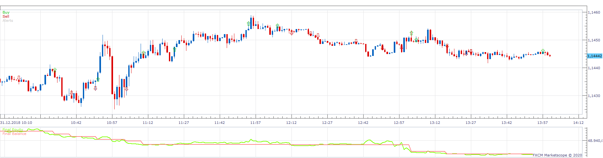
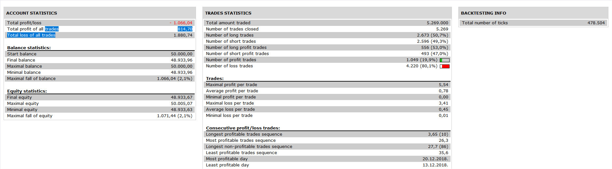

# Conqueror Strategy

> Source: https://fxcodebase.com/code/viewtopic.php?f=31&t=69568  
> Forum: 31 · Topic 69568 · 6 post(s)

---

## Conqueror Strategy

**Apprentice** · Mon Mar 23, 2020 6:49 am

 

You need to install updated indicators as well Conqueror.lua (First/Top post of the topic)
[viewtopic.php?f=17&t=1989](https://fxcodebase.com/code/viewtopic.php?f=17&t=1989)

 [Conqueror Strategy.lua](files/132204/Conqueror%20Strategy.lua)

---

## Re: Conqueror Strategy

**papynou34** · Tue Mar 24, 2020 6:34 am

Thanks a lot.

---

## Re: Conqueror Strategy

**papynou34** · Thu Mar 26, 2020 3:45 am

Hello,
When I backtest or optimize the stratégy, it runs fine, but when i want to run normally i have the attached error.
Thanks

---

## Re: Conqueror Strategy

**Apprentice** · Thu Mar 26, 2020 6:30 am

Your request is added to the development list.
Development reference 948.

---

## Re: Conqueror Strategy

**Apprentice** · Fri Mar 27, 2020 7:59 am

Please install the fixed indicator.

 [Conqueror.lua](files/132320/Conqueror.lua)

---

## Re: Conqueror Strategy

**papynou34** · Fri Mar 27, 2020 9:27 am

Thanks a lot Appentice, it is working well.
