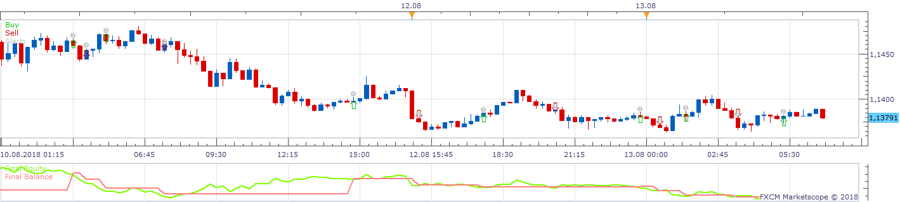
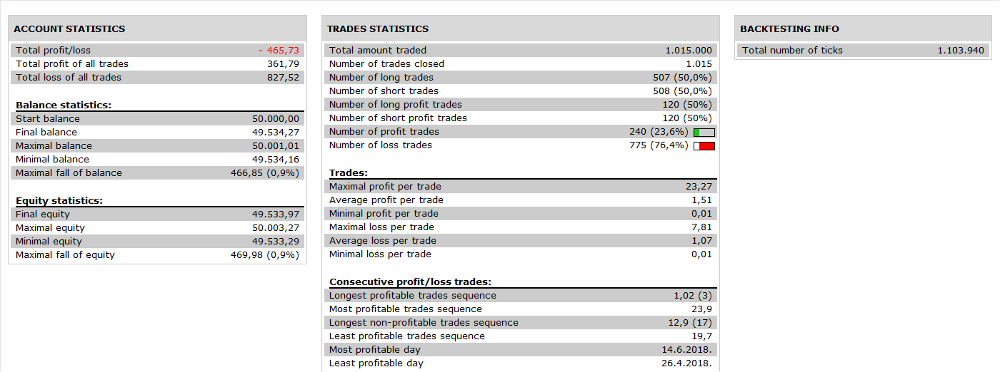

# Coral indicator Strategy

> Source: https://fxcodebase.com/code/viewtopic.php?f=31&t=4934  
> Forum: 31 · Topic 4934 · 3 post(s)

---

## Coral indicator Strategy

**Apprentice** · Fri Jul 01, 2011 10:16 am

 

 

Signals are generated by a simple line Crossover.

Buy
Coral (0.5) CrossOver Coral (0.3)
Sell
Coral (0.5) CrossUnder Coral (0.3)

 [Coral indicator Strategy.lua](files/12230/Coral%20indicator%20Strategy.lua)

Download and install the Coral indicator.
[viewtopic.php?f=17&t=3522&p=8414&hilit=Coral+Indicator#p8414](https://fxcodebase.com/code/viewtopic.php?f=17&t=3522&p=8414&hilit=Coral+Indicator#p8414)

---

## Re: Coral indicator Strategy

**Apprentice** · Wed Nov 30, 2016 8:25 am

Bump up.

---

## Re: Coral indicator Strategy

**Apprentice** · Sun Nov 18, 2018 9:47 am

The Strategy was revised and updated on November 18. 2018.
