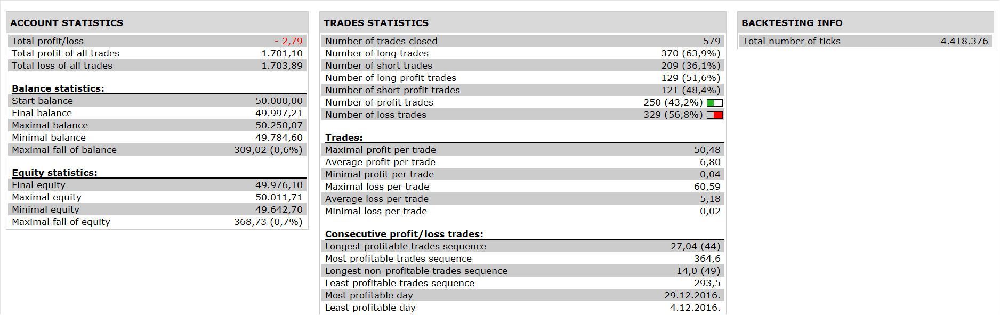

# Corelation Indicator Strategy

> Source: https://fxcodebase.com/code/viewtopic.php?f=31&t=64623  
> Forum: 31 · Topic 64623 · 3 post(s)

---

## Corelation Indicator Strategy

**Apprentice** · Thu Apr 27, 2017 5:12 pm

 

Corelation indicator >= 15
Open Long EUR/USD
Open Long USD/CHF
Open Short EUR/CHF
Correlation indicator <=-0.5
CLOSE all

Corelation indicator <= - 15
Open Short EUR/USD
Open Short USD/CHF
Open Long EUR/CHF
Correlation indicator >= 0.5
CLOSE all

Reverse for short.

 [Corelation Indicator Strategy.lua](files/112194/Corelation%20Indicator%20Strategy.lua)

Based on Corelation Indicator
[viewtopic.php?f=17&t=64609&p=112195#p112195](https://fxcodebase.com/code/viewtopic.php?f=17&t=64609&p=112195#p112195)

The Strategy was revised and updated on January 19, 2019.

---

## Re: Corelation Indicator Strategy

**sebgautier49** · Mon May 01, 2017 2:36 am

Thanks for your help!

Sébastien

---

## Re: Corelation Indicator Strategy

**sebgautier49** · Thu Jun 01, 2017 2:09 pm

Dear apprentice,

i would like to change this strategie in two strategies and I will try to explain it :
The first one :
Corelation indicator >= 5
Open Long EUR/GBP
Open Long GBP/JPY
Open Short EUR/JPY
Correlation indicator <=-3
CLOSE all

The second One :
Corelation indicator <= - 5
Open Short EUR/GBP
Open Short GBP/JPY
Open Long EUR/JPY
Correlation indicator >= 3
CLOSE all

Is it possible to have :
"100" for multiplier,
"true" for use position cap
Max number of open position in any direction : 1
Max number of open position in one direction : 1

Thanks for your help

Sébastien
