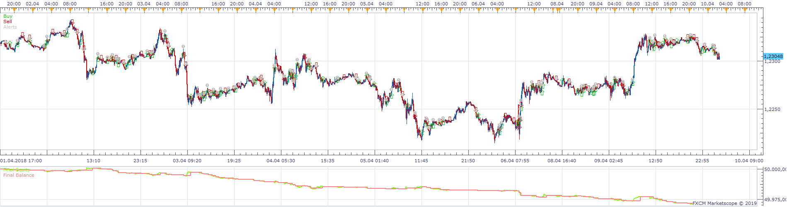
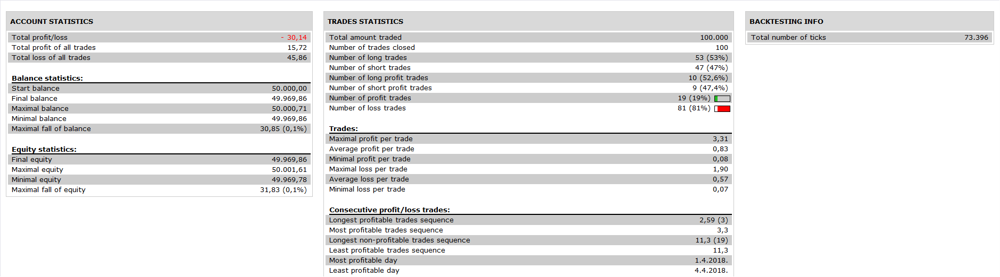

# cpc_cs Strategy

> Source: https://fxcodebase.com/code/viewtopic.php?f=31&t=67279  
> Forum: 31 · Topic 67279 · 5 post(s)

---

## cpc_cs Strategy

**Apprentice** · Fri Jan 18, 2019 6:03 am

 

Based on request.
[viewtopic.php?f=27&t=67268](https://fxcodebase.com/code/viewtopic.php?f=27&t=67268)

 [cpc_cs Strategy.lua](files/123420/cpc_cs%20Strategy.lua)

---

## Re: cpc_cs Strategy

**cpc_cs** · Fri Jan 18, 2019 6:47 am

Dear Apprentice,

Thank you very much - you gave me lot more options that I requested - thank you.

Back testing the strategy - I will let you know if I find any problems.

Thanks and Regards

S. Joseph

---

## Re: cpc_cs Strategy

**cpc_cs** · Sun Jan 20, 2019 4:49 pm

Dear Apprentice,

Few Observations:

1) Close Trade: Sometimes trades closes immediately after opening - see picture below:

 

As you can see Long Trade Opened and Closed on 25.01.2018 @ 20:00. Trade should have closed on 29.01.2018 @ 04:00. This I think is due to the way change in SAR is checked:

 --1) SAR Down changes to SAR Up
 return SAR.DATA[period] > source.close[period];

This statement just checks if SAR is above the Close value - it does not check the change from Down to Up - which should be the correct way.

Can you please arrange to correct it.

2) Open Trade: If I use "End of Turn" Option for "Entry Execution Type", then trades are being opened one candle later than expected (two candles after the entry conditions are satisfied) - see picture below - Red Lines are where trades are being opened - Green Lines are where trades should have opened:

 

If I use "Live" Option for "Entry Execution Type", then sometimes entry conditions are getting satisfied when the candle is still not closed - but then candle closes below (for long trades) and above (for short trades) making the entry a wrong entry.

I think "End of Turn" is what I am looking for - but Trades are being Opened one candle later which most of the time costs pips. How to avoid this? Can you correct this?

Any help / suggestions will be very much appreciated. Others functions appears to work correctly - will continue to test.

Thanks and Regards,

S. Joseph

---

## Re: cpc_cs Strategy

**Apprentice** · Mon Jan 28, 2019 6:55 am

Fixed.
The difference is likely due to the EMA. EMA can show different
values on a chart and inside of strategy.

---

## Re: cpc_cs Strategy

**cpc_cs** · Mon Jan 28, 2019 1:43 pm

Dear Apprentice,

Thanks for the quick fix - it works as intended.

I will continue testing and let you know if I find anything unusual.

Thanks and Regards

S. Joseph
