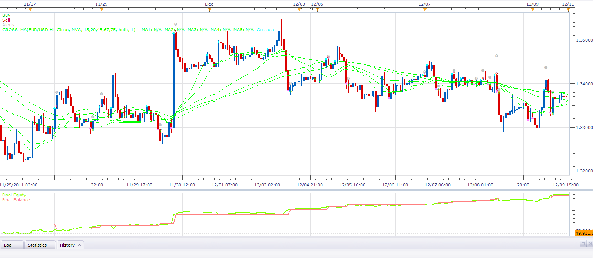

# CrossMA strategy

> Source: https://fxcodebase.com/code/viewtopic.php?f=31&t=9702  
> Forum: 31 · Topic 9702 · 25 post(s)

---

## CrossMA strategy

**Alexander.Gettinger** · Thu Dec 15, 2011 4:55 am

This strategy based on CrossMA indicator: [viewtopic.php?f=17&t=9701&p=20694#p20694](https://fxcodebase.com/code/viewtopic.php?f=17&t=9701&p=20694#p20694)

 

Download:

 [Cross_MA_Strategy.lua](files/20695/Cross_MA_Strategy.lua)

For this strategy must be installed CrossMA indicator ([viewtopic.php?f=17&t=9701&p=20694#p20694](https://fxcodebase.com/code/viewtopic.php?f=17&t=9701&p=20694#p20694)) and Averages indicator ([viewtopic.php?f=17&t=2430](https://fxcodebase.com/code/viewtopic.php?f=17&t=2430)).

The Strategy was revised and updated on December 11, 2018.

---

## Re: CrossMA strategy

**rebeljedi** · Mon Dec 19, 2011 11:59 am

hi Alexander,

could you kindly create a combination of this strategy CrossMA with the other ADX DMI strategy?

The strategy:

1. FasterMA crosses above SlowerMA and
ADX>=[specified value] and
DMIplus>=[specified value]
=> buy

2. 1. FasterMA crosses below SlowerMA and
ADX>=[specified value] and
DMIminus>=[specified value]
=> sell

thank you!

---

## Re: CrossMA strategy

**Kokomo** · Thu Dec 22, 2011 5:35 am

hi Alexander,
i have always wanted a strategy that entered into a trade at one M/A cross..(slow)
and closed the trade at another M/A cross...(fast)

is this possible

regaeds
Mark

---

## Re: CrossMA strategy

**rebeljedi** · Wed Jan 04, 2012 12:37 pm

> **rebeljedi wrote:**
> hi Alexander,
>
> could you kindly create a combination of this strategy CrossMA with the other ADX DMI strategy?
>
> The strategy:
>
> 1. FasterMA crosses above SlowerMA and
> ADX>=[specified value] and
> DMIplus>=[specified value]
> => buy
>
> 2. 1. FasterMA crosses below SlowerMA and
> ADX>=[specified value] and
> DMIminus>=[specified value]
> => sell
>
> thank you!

Hi,
Happy New Year!

I know there must be a chain of requests for coding.
I am dropping this note to let you know that I am still very much interested in the EA.
I hope to have some indication that it will be considered for coding, thanks!

---

## Re: CrossMA strategy

**PascalFXCM** · Wed Jan 04, 2012 3:53 pm

Hi Jedi, what would you chose for typical "specified values" in your code description? I would have a look at it as well.

Cheers,
Pascal

---

## Re: CrossMA strategy

**Alexander.Gettinger** · Wed Feb 08, 2012 9:23 pm

> **rebeljedi wrote:**
> hi Alexander,
>
> could you kindly create a combination of this strategy CrossMA with the other ADX DMI strategy?
>
> The strategy:
>
> 1. FasterMA crosses above SlowerMA and
> ADX>=[specified value] and
> DMIplus>=[specified value]
> => buy
>
> 2. 1. FasterMA crosses below SlowerMA and
> ADX>=[specified value] and
> DMIminus>=[specified value]
> => sell
>
> thank you!

 [Cross_MA_ADX_DMI_Strategy.lua](files/25483/Cross_MA_ADX_DMI_Strategy.lua)

For this strategy must be installed CrossMA ([viewtopic.php?f=17&t=9701&p=20694#p20694](https://fxcodebase.com/code/viewtopic.php?f=17&t=9701&p=20694#p20694)) and Averages ([viewtopic.php?f=17&t=2430](https://fxcodebase.com/code/viewtopic.php?f=17&t=2430)) indicators.

---

## Re: CrossMA strategy

**Jigit Jigit** · Fri Feb 10, 2012 4:59 am

Could you please please add VAMA to this strategy/indicator.

I'll be much obliged.

Thank you

---

## Re: CrossMA strategy

**Apprentice** · Sun Feb 12, 2012 4:47 am

Your request is added to the list of development .

---

## Re: CrossMA strategy

**rebeljedi** · Thu Feb 16, 2012 2:38 am

> **Alexander.Gettinger wrote:**
>
>
> > **rebeljedi wrote:**
> > hi Alexander,
> >
> > could you kindly create a combination of this strategy CrossMA with the other ADX DMI strategy?
> >
> > The strategy:
> >
> > 1. FasterMA crosses above SlowerMA and
> > ADX>=[specified value] and
> > DMIplus>=[specified value]
> > => buy
> >
> > 2. 1. FasterMA crosses below SlowerMA and
> > ADX>=[specified value] and
> > DMIminus>=[specified value]
> > => sell
> >
> > thank you!
>
>
>
>
>
> Cross_MA_ADX_DMI_Strategy.lua
>
>
>
> For this strategy must be installed CrossMA ([viewtopic.php?f=17&t=9701&p=20694#p20694](https://fxcodebase.com/code/viewtopic.php?f=17&t=9701&p=20694#p20694)) and Averages ([viewtopic.php?f=17&t=2430](https://fxcodebase.com/code/viewtopic.php?f=17&t=2430)) indicators.

Hi Alexander,
please kindly advise.
My forward test showed the open trade went past +150pips (TP target) but the strategy did not close the trade.

I think it may be because of my trade parameters settings:
Allow strategy to trade: yes
Account to trade on: xxxxxxx
Trade amount in Lots
Set Limit orders: no (because I wanted mkt order)
Limit order in pips: 150
**Set stop orders: no => should i set this to yes so that it will close on 150pips profit/loss?**
stop order in pips: 150
Trailing stop order: no
Allow direction for positions: both

Thank you.

---

## Re: CrossMA strategy

**Alexander.Gettinger** · Thu Feb 23, 2012 11:06 am

CrossMA strategy with VAMA indicator.

Download:

 [Cross_VAMA_Strategy.lua](files/26699/Cross_VAMA_Strategy.lua)

For this strategy must be installed Cross_VAMA indicator ([viewtopic.php?f=17&t=9701&p=26697#p26697](https://fxcodebase.com/code/viewtopic.php?f=17&t=9701&p=26697#p26697)) and VAMA ([viewtopic.php?f=17&t=2349](https://fxcodebase.com/code/viewtopic.php?f=17&t=2349)).

---

## Re: CrossMA strategy

**Jigit Jigit** · Fri Feb 24, 2012 2:21 pm

Thank you Alexander.
It's excellent

---

## Re: CrossMA strategy

**fabfxcm** · Wed Feb 29, 2012 2:45 am

What number stand for in the parameters of the cross_ma strategy??

---

## Re: CrossMA strategy

**Apprentice** · Wed Feb 29, 2012 5:11 am

I do not understand your question.
What are the parameters used in this strategy?

---

## Re: CrossMA strategy

**fabfxcm** · Sun Mar 04, 2012 4:01 am

Sorry, i saw that in the parameters of cross MA strategy there is a voice named "number": what does it means? I mean number of what and which values can assume?

---

## Re: CrossMA strategy

**Apprentice** · Mon Mar 05, 2012 3:06 am

Number is CrossMA indicator parameter.
[viewtopic.php?f=17&t=9701&p=26697&hilit=CROSS_MA#p26697](https://fxcodebase.com/code/viewtopic.php?f=17&t=9701&p=26697&hilit=CROSS_MA#p26697)
A number that tells us how many periods after MA cross we will have a signal.
What will be the signal delay.

---

## Re: CrossMA strategy

**Alokasi** · Tue Mar 06, 2012 4:29 pm

I have been pilfering code snippets from this strategy for a personal project of mine and I think I've found a bug. In the section where it checks for trades before entering into the code for executing trades there is a line (line 182):

Code: [Select all](https://fxcodebase.com/code/)
`haveTrades = (trades:find('AccountID', Account) ~= nil);`
that checks for existing trades. However, if this strategy is run on more than one instrument, a trade in one instrument keeps a trade in the second instrument from being opened because it will think there are trades. Perhaps a better check for trades is:

Code: [Select all](https://fxcodebase.com/code/)
`haveTrades = (trades:find("OfferID", Offer) ~= nil);`
This will, I believe, look for existing trades only for the instrument that the strategy is running on.

---

## Re: CrossMA strategy

**69TomD** · Sun Mar 18, 2012 12:37 am

Just a quick question for those of you who know. Trying to backtest the "CrossMA strategy" and can't figure out what does the " Price [open,close,high, low .....]" parameter mean. Thank you in advance. Tom

---

## Re: CrossMA strategy

**Apprentice** · Sun Mar 18, 2012 2:53 am

Almost all the moving averages use only one component of a candle, or and one data stream as source.
for example
Candle consists of open, close, high, low....
Whit this parameter, you have option to select one of them.

---

## Re: CrossMA strategy

**69TomD** · Sun Mar 18, 2012 1:57 pm

Apprentice, thank you for your quick reply.
 That's what I thought it could be for an opening of a position. However, I don't understand how any position is closed. I have a set of three MVA. I don't use Limit and Stop. A position was opened exactly how I thought it would be. On the candle closed, when the price action crossed all of three MVA's.
 Now I would suggest that the position will close when the price action crosses the closest MVA. In reality, the position is closed when the price action crossed all of three MVA's on the candle closed and actualy opens new position in the opposite direction. Am I doing something wrong? Or am I expecting something what can not be done? Could you possibly split open and close actions in a way that I can open a position on candle closed and close it on tick when it hits the closest MVA?

Thanks again, appreciate what you are doing for us Tom

---

## Re: CrossMA strategy

**Apprentice** · Mon Mar 19, 2012 1:16 am

In the current implementation stand alone exit is not used.
Positions are closed when creating a new position in the opposite direction.

---

## Re: CrossMA strategy

**Dkooops** · Mon May 07, 2012 2:28 am

Can this strategy be modified so a displaced (shifted) MA as the entry?

---

## Re: CrossMA strategy

**Apprentice** · Mon May 07, 2012 11:26 am

Such a modification is possible.

---

## Re: CrossMA strategy

**4x4partners** · Fri Apr 10, 2015 4:56 am

Hi Apprentice,

I would greatly appreciate an option in which this strategy doesn't close the positions. Allowing the stop/limit orders to handle. Plus a fixed trailing stop would be great like on MA ADVISOR.

Would it also be possible to add the option of multiple positions, with a max number of positions + an interval between opening new positions (eg in minutes)?

Thanks a lot
4x4

---

## Re: CrossMA strategy

**Apprentice** · Sun Apr 12, 2015 10:10 am

Your request is added to the development list.

---

## Re: CrossMA strategy

**Apprentice** · Sun Dec 11, 2016 2:34 pm

Strategy was revised and updated.
