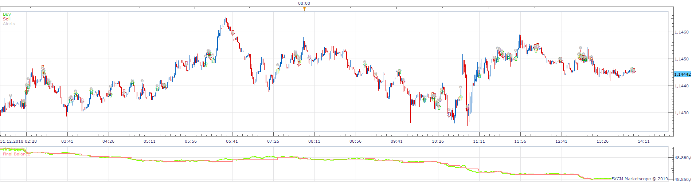
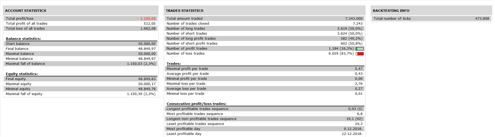

# Cumulative Volume Strategy

> Source: https://fxcodebase.com/code/viewtopic.php?f=31&t=68960  
> Forum: 31 · Topic 68960 · 1 post(s)

---

## Cumulative Volume Strategy

**Apprentice** · Sat Sep 28, 2019 3:56 pm

 

Based on Cumulative Volume.lua
[viewtopic.php?f=17&t=42392](https://fxcodebase.com/code/viewtopic.php?f=17&t=42392)

Cumulative volume (Relative, Separated)
If positiv > +50 = BUY
If negativ < -50 = SELL

 [Cumulative Volume Strategy.lua](files/128895/Cumulative%20Volume%20Strategy.lua)
