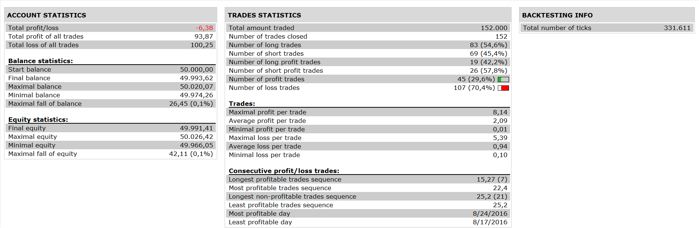

# Custom BB RSI strategy

> Source: https://fxcodebase.com/code/viewtopic.php?f=31&t=64567  
> Forum: 31 · Topic 64567 · 1 post(s)

---

## Custom BB RSI strategy

**Apprentice** · Wed Apr 05, 2017 3:45 pm

 

**Bollinger band is calculated based on RSI**

Open Long
RSI> Bollinger band Top Line
1. & 2. Time Frame
Open Short

RSI< Bollinger band Bottom Line
1. & 2. Time Frame

Exit Long
RSI< Bollinger band Top Line
1. or 2. Time Frame

Exit Short
RSI> Bollinger band Bottom Line
1. or 2. Time Frame

 [Custom BB RSI strategy.lua](files/111836/Custom%20BB%20RSI%20strategy.lua)

The Strategy was revised and updated on January 19, 2019.
