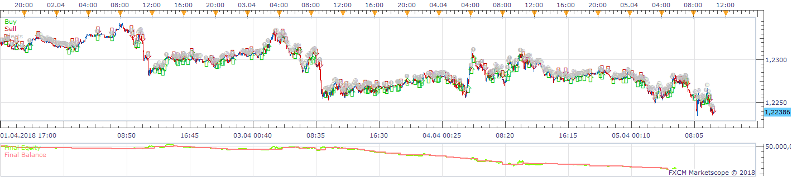
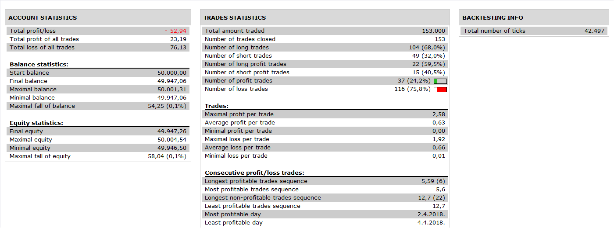

# DCS Strategy

> Source: https://fxcodebase.com/code/viewtopic.php?f=31&t=66891  
> Forum: 31 · Topic 66891 · 1 post(s)

---

## DCS Strategy

**Apprentice** · Mon Nov 05, 2018 6:00 am

 

Based on request.
[viewtopic.php?f=27&t=66884](https://fxcodebase.com/code/viewtopic.php?f=27&t=66884)

BUY signal

As soon as DMI goes green (ie D+ crosses D-)
ADX is above trigger line
SAR is below price
In whichever order, this occurs

OPen x positions

Stop Loss

x% of the difference between SAR value and price or preset value

Take profit 1 at x% of stop-loss or preset value. Close x positions. Move S/L to breakeven.

When SAR moves above B/E trail S/L with SAR.

Reverse for Sell signals.

 [DCS Strategy.lua](files/121958/DCS%20Strategy.lua)
