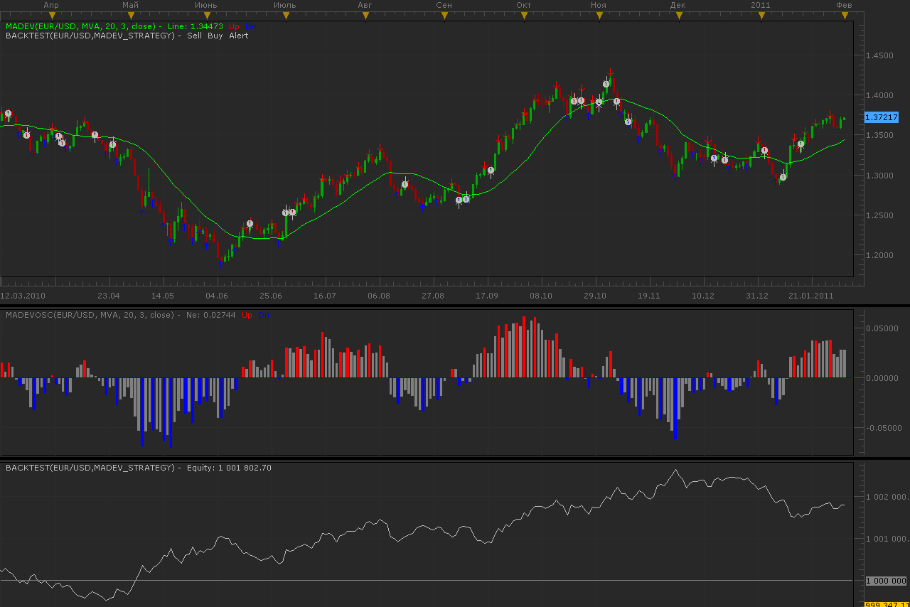

# Deviation from MA strategy

> Source: https://fxcodebase.com/code/viewtopic.php?f=31&t=3297  
> Forum: 31 · Topic 3297 · 6 post(s)

---

## Deviation from MA strategy

**Alexander.Gettinger** · Mon Jan 31, 2011 10:18 pm

Strategy based on this indicator: [viewtopic.php?f=17&t=3293](https://fxcodebase.com/code/viewtopic.php?f=17&t=3293)
Added parameter [MinValue], it assign minimum value for open/close orders.
Supported direct and reverse signals of indicator.

 

Download:

 [MaDev_Strategy.lua](files/7832/MaDev_Strategy.lua)

For this strategy must be installed indicators:
MaDevOsc: [viewtopic.php?f=17&t=3293](https://fxcodebase.com/code/viewtopic.php?f=17&t=3293)
Averages: [viewtopic.php?f=17&t=2430](https://fxcodebase.com/code/viewtopic.php?f=17&t=2430)

The Strategy was revised and updated on January 21, 2019.

---

## Re: Deviation from MA strategy

**craige** · Tue Feb 01, 2011 10:48 am

Hi Guys

great works.

two questions

1. when I use this strategy, the option "allow the strategy to trade" can not be used, if I choosed true, there is a reminder "string: Madev strategy.lua 136: unsupported".

2. the strategy was able to work if I turn off the option "allow the strategy to trade", but the alert signal which could appear on the marketscope did not have the up or down arrow, only having the signal.

thanks for your help

all the best

Craige

---

## Re: Deviation from MA strategy

**Alexander.Gettinger** · Fri Feb 18, 2011 12:54 am

Closing the program after loading the strategy into the list then re-launching Tradestation worked.

---

## Re: Deviation from MA strategy

**Apprentice** · Wed Nov 30, 2016 5:02 am

Bump Up.

---

## Re: Deviation from MA strategy

**jaricarr** · Fri Aug 25, 2017 7:53 pm

[quote="Alexander.Gettinger"]Strategy based on this indicator: [viewtopic.php?f=17&t=3293](https://fxcodebase.com/code/viewtopic.php?f=17&t=3293)
Added parameter [MinValue], it assign minimum value for open/close orders.
Supported direct and reverse signals of indicator.

Hi Alexander and Apprentice,

Can you please explain how "MinValue" works ?
and if possible, please incorporate this logic to the indicator.

---

## Re: Deviation from MA strategy

**Apprentice** · Mon Aug 28, 2017 5:16 am

"MinValue" will define the minimum value of MaDevOsc indicator.
