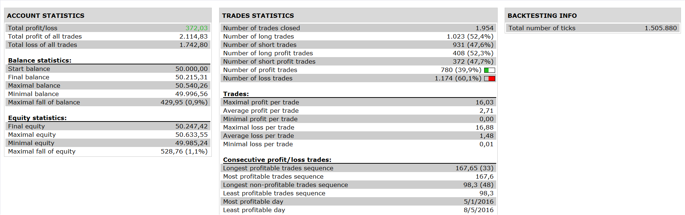

# Direction Movement Index with MA Trading System

> Source: https://fxcodebase.com/code/viewtopic.php?f=31&t=63953  
> Forum: 31 · Topic 63953 · 2 post(s)

---

## Direction Movement Index with MA Trading System

**Apprentice** · Tue Oct 11, 2016 5:28 am

 

Long Entry
5 WMA> 11 MA,
Sar below the candles,
ADX DI+ positive > (greater than) DI- negative

Short Entry
5 WMA< 11 MA,
Sar above the candles,
ADX DI- negative > (greater than) DI+ positive

Exits and Stop
Parabolic SAR signal in opposite direction

 [Direction Movement Index with MA Trading System.lua](files/108506/Direction%20Movement%20Index%20with%20MA%20Trading%20System.lua)

The Strategy was revised and updated on January 18, 2019.

---

## Re: Direction Movement Index with MA Trading System

**Apprentice** · Sun Dec 18, 2016 5:32 am

Strategy was revised and updated.
