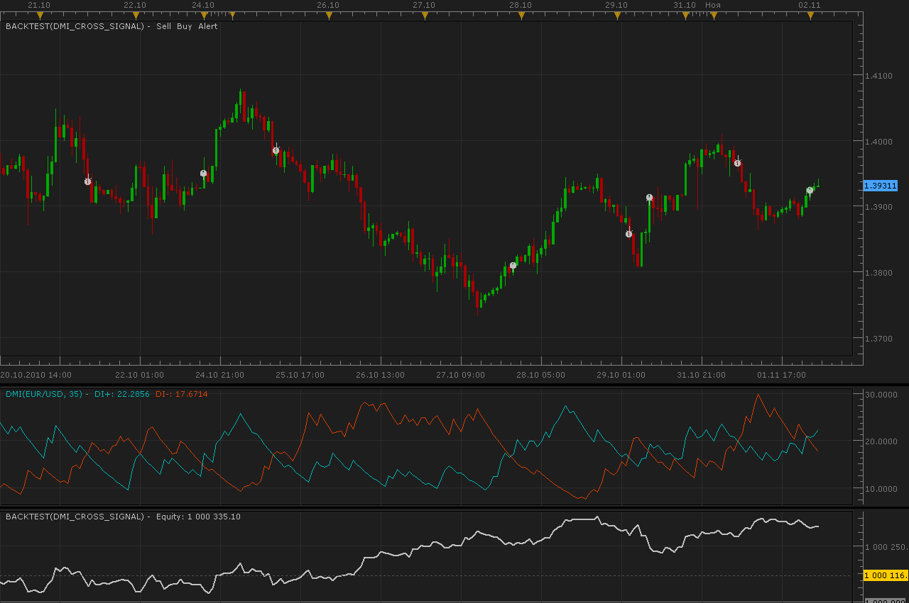
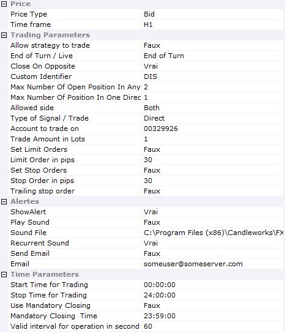

# DMI Cross strategy

> Source: https://fxcodebase.com/code/viewtopic.php?f=31&t=2572  
> Forum: 31 · Topic 2572 · 16 post(s)

---

## DMI Cross strategy

**Alexander.Gettinger** · Tue Nov 02, 2010 1:57 am



Signals appear when DMI+ and DMI- crossing.
The signal can be direct or reverse.
MT4/MQ4 version.
[viewtopic.php?f=38&t=69485](https://fxcodebase.com/code/viewtopic.php?f=38&t=69485)

 [DMI_Cross_Signal.lua](files/5741/DMI_Cross_Signal.lua)

---

## Re: DMI Cross strategy

**sabrumea** · Thu Dec 09, 2010 6:18 pm

could anyone check if sound is playing in this strategy?... because i only get alerts on the screen and no sound even though i specified the file and everything..

---

## Re: DMI Cross strategy

**PipGrabber** · Thu Feb 24, 2011 1:35 am

Greetings! What line of code can be added to modify the buy/sell logic. I want to have another filter to it. Like only buy/sell only if the cross occurs on a certain DMI Level, say 25 or could be any constant value. I know it can be added as another "AND" condition greater than our constant. But how to know the value of DMI when the cross occurs is my problem. Thanks!

like AND CROSS value > 25

```lua
local MustB=false;
    local MustS=false;
    if (dip[period]<dim[period] and dip[period-1]>dim[period-1] and instance.parameters.TypeSignal=="direct") or (dip[period]>dim[period] and dip[period-1]<dim[period-1] and instance.parameters.TypeSignal=="reverse") then
     MustS=true;
    end
    if (dip[period]>dim[period] and dip[period-1]<dim[period-1] and instance.parameters.TypeSignal=="direct") or (dip[period]<dim[period] and dip[period-1]>dim[period-1] and instance.parameters.TypeSignal=="reverse") then
     MustB=true;
    end
```

---

## Re: DMI Cross strategy

**sunshine** · Mon Feb 28, 2011 9:16 am

Hi PipGrabber,
I've added the Cross parameter with default value 25.
Unfortunately there is no function to easily define the crossing value, so I calculate it as follows:

```lua
-- calculation of the crossing value 

    local iXStart, iXEnd;
    iXStart = DMI.DIP:date(period - 1);
    iXEnd = DMI.DIP:date(period);

    local iXDelta;
    iXDelta = iXEnd - iXStart;

    local iYLine1Start, iYLine1End;    -- rates for dip stream (DI+)
    iYLine1Start = DMI.DIP:tick(period - 1);
    iYLine1End = DMI.DIP:tick(period);

    local iYLine2Start, iYLine2End;    -- rates for dim stream (DI-)
    iYLine2Start = DMI.DIM:tick(period - 1);
    iYLine2End = DMI.DIM:tick(period);

    local iXIntersection, CROSS;

    local iYDelta1, iYDelta2;
    iYDelta1 = iYLine1Start - iYLine1End;
    iYDelta2 = iYLine2Start - iYLine2End;

    local dA = iXStart * iYLine1End - iYLine1Start * iXEnd;
    local dB = iXStart * iYLine2End - iYLine2Start * iXEnd;
    local dC = iXDelta * iYDelta2 - iYDelta1 * iXDelta;

    CROSS = (dB * iYDelta1 - dA * iYDelta2) / dC;

-- end of calculation
```

And then I've added "AND CROSS > CrossValue" to the Buy/Sell conditions (where CrossValue is the value defined in the properties, CROSS is the value of DI+ and DI- crossing).

---

## Re: DMI Cross strategy

**PipGrabber** · Tue Mar 01, 2011 10:25 am

Thanks sunshine! I really appreciate the effort you put into making a work around on the crossed value. Hope lua has a built in function that makes things easier..hehe.

---

## Re: DMI Cross strategy

**sagymmm** · Thu Sep 27, 2012 11:04 pm

I would appreciate if we can add an option of having a limit and SL specified by pips

---

## Re: DMI Cross strategy

**Apprentice** · Sat Sep 29, 2012 1:36 am

What's wrong with current Stop/Limit settings.

---

## Re: DMI Cross strategy

**sagymmm** · Sat Sep 29, 2012 7:20 pm

They are ok but sometimes when the crossover happens in the opposite direction the trade turns to loss though it has been profitable
That was clear when I made a backtest for the strategy as it ends with few pips as a profit though sometimes it may reach more than 100 pips before it gets closed for 10-20 pips
So I think that having SL with certain amount of pips and trailing stop would endup in more profits

---

## Re: DMI Cross strategy

**Avignon** · Mon Dec 01, 2014 1:18 am

> **sunshine wrote:**
> Hi PipGrabber,
> I've added the Cross parameter with default value 25.
> Unfortunately there is no function to easily define the crossing value, so I calculate it as follows:
>
>
> Code: [Select all](https://fxcodebase.com/code/)
> `-- calculation of the crossing value 
>
>     local iXStart, iXEnd;
>     iXStart = DMI.DIP:date(period - 1);
>     iXEnd = DMI.DIP:date(period);
>
>     local iXDelta;
>     iXDelta = iXEnd - iXStart;
>
>     local iYLine1Start, iYLine1End;    -- rates for dip stream (DI+)
>     iYLine1Start = DMI.DIP:tick(period - 1);
>     iYLine1End = DMI.DIP:tick(period);
>
>     local iYLine2Start, iYLine2End;    -- rates for dim stream (DI-)
>     iYLine2Start = DMI.DIM:tick(period - 1);
>     iYLine2End = DMI.DIM:tick(period);
>
>     local iXIntersection, CROSS;
>
>     local iYDelta1, iYDelta2;
>     iYDelta1 = iYLine1Start - iYLine1End;
>     iYDelta2 = iYLine2Start - iYLine2End;
>
>     local dA = iXStart * iYLine1End - iYLine1Start * iXEnd;
>     local dB = iXStart * iYLine2End - iYLine2Start * iXEnd;
>     local dC = iXDelta * iYDelta2 - iYDelta1 * iXDelta;
>
>     CROSS = (dB * iYDelta1 - dA * iYDelta2) / dC;
>
> -- end of calculation`
>
> And then I've added "AND CROSS > CrossValue" to the Buy/Sell conditions (where CrossValue is the value defined in the properties, CROSS is the value of DI+ and DI- crossing).

Hello,

After importing I have the message that is present yet it does not appear in the indicators.

---

## Re: DMI Cross strategy

**Avignon** · Mon Dec 01, 2014 3:50 pm

> **Avignon wrote:**
>
>
> > **sunshine wrote:**
> > Hi PipGrabber,
> > I've added the Cross parameter with default value 25.
> > Unfortunately there is no function to easily define the crossing value, so I calculate it as follows:
> >
> >
> > Code: [Select all](https://fxcodebase.com/code/)
> > `-- calculation of the crossing value 
> >
> >     local iXStart, iXEnd;
> >     iXStart = DMI.DIP:date(period - 1);
> >     iXEnd = DMI.DIP:date(period);
> >
> >     local iXDelta;
> >     iXDelta = iXEnd - iXStart;
> >
> >     local iYLine1Start, iYLine1End;    -- rates for dip stream (DI+)
> >     iYLine1Start = DMI.DIP:tick(period - 1);
> >     iYLine1End = DMI.DIP:tick(period);
> >
> >     local iYLine2Start, iYLine2End;    -- rates for dim stream (DI-)
> >     iYLine2Start = DMI.DIM:tick(period - 1);
> >     iYLine2End = DMI.DIM:tick(period);
> >
> >     local iXIntersection, CROSS;
> >
> >     local iYDelta1, iYDelta2;
> >     iYDelta1 = iYLine1Start - iYLine1End;
> >     iYDelta2 = iYLine2Start - iYLine2End;
> >
> >     local dA = iXStart * iYLine1End - iYLine1Start * iXEnd;
> >     local dB = iXStart * iYLine2End - iYLine2Start * iXEnd;
> >     local dC = iXDelta * iYDelta2 - iYDelta1 * iXDelta;
> >
> >     CROSS = (dB * iYDelta1 - dA * iYDelta2) / dC;
> >
> > -- end of calculation`
> >
> > And then I've added "AND CROSS > CrossValue" to the Buy/Sell conditions (where CrossValue is the value defined in the properties, CROSS is the value of DI+ and DI- crossing).
>
>
>
>
> Hello,
>
> After importing I have the message that is present yet it does not appear in the indicators.

I was wrong: the topic strategy here.

---

## Re: DMI Cross strategy

**WardStradlater** · Fri Sep 11, 2015 7:39 am

Hi,
Is that possible to have this kind of parameters for this strategy?

 



Thanks in advance.

---

## Re: DMI Cross strategy

**Apprentice** · Mon Sep 21, 2015 5:24 am

DMI_Cross_Signal updated.

---

## Re: DMI Cross strategy

**Apprentice** · Tue Dec 13, 2016 4:22 pm

Strategy was revised and updated.

---

## Re: DMI Cross strategy

**easytrading** · Sun Mar 01, 2020 6:34 pm

Hello Apprentice,

If you please, to have the MT4 version for DMI_Cross_Signal.lua strategy.

your help is highly appreciated.

---

## Re: DMI Cross strategy

**Apprentice** · Mon Mar 02, 2020 2:07 pm

Your request is added to the development list.
Development reference 808.

---

## Re: DMI Cross strategy

**Apprentice** · Tue Mar 03, 2020 6:46 am

MT4/MQ4 version.
[viewtopic.php?f=38&t=69485](https://fxcodebase.com/code/viewtopic.php?f=38&t=69485)
