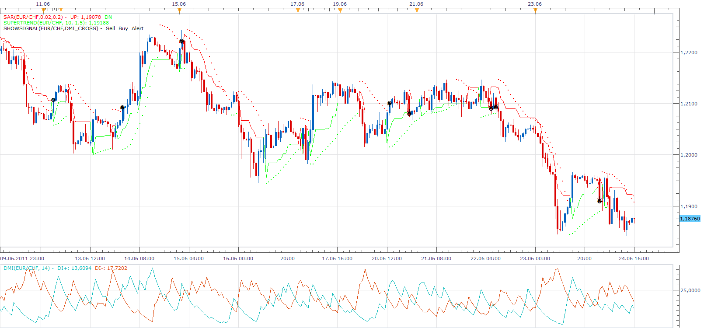

# DMI SAR Super Trend Strategy

> Source: https://fxcodebase.com/code/viewtopic.php?f=31&t=4855  
> Forum: 31 · Topic 4855 · 18 post(s)

---

## DMI SAR Super Trend Strategy

**Apprentice** · Sat Jun 25, 2011 11:37 am

This strategy Trade only if all three indicators give identical signal.

 [DMI SAR Super Trend Confirmation.lua](files/12046/DMI%20SAR%20Super%20Trend%20Confirmation.lua)

Install SuperTrend Indicator
[viewtopic.php?f=17&t=3102&p=9394&hilit=SUPER+TREND#p9394](https://fxcodebase.com/code/viewtopic.php?f=17&t=3102&p=9394&hilit=SUPER+TREND#p9394)

The Strategy was revised and updated on December 09, 2018.

---

## Re: DMI SAR Super Trend Strategy

**nookie** · Thu Jul 14, 2011 9:58 am

Hello,

This strategy looks fine but it seems to not work according to the rules set: it is opening long while DMI is bearish, any idea why?
please find attached the screenshot

Regards

Nookie

---

## Re: DMI SAR Super Trend Strategy

**Apprentice** · Thu Jul 14, 2011 3:51 pm

I examined the algorithm, and can not find that there is nothing wrong.
Do you use Reverse trade Direction ?

One reason may be, tick approximation.
Try to use Close values.

---

## Re: DMI SAR Super Trend Strategy

**nookie** · Fri Jul 15, 2011 3:08 am

I am using the direct, I know if I use "reverse" it will be totally the reverse signals .. checked my settings again, all seems fine

Ok, another example.. as you see on the screenshot - supertrend is short, sar is short but dmi has a cros although below 25 - and strategy is opening long position, this looks weird..

---

## Re: DMI SAR Super Trend Strategy

**bluepip** · Sun Sep 04, 2011 4:52 am

Hello,

please, can you programm on / off each Strategie or make a new Strategie with only SAR-Supertrend Parameters.

Thank you

---

## Re: DMI SAR Super Trend Strategy

**Apprentice** · Sun Sep 04, 2011 11:05 am

Your request is added to the developmental cue.

---

## Re: DMI SAR Super Trend Strategy

**Apprentice** · Sun Sep 04, 2011 12:00 pm

Something Like this.

 [DMI SAR Super Trend Confirmation With Selector.lua](files/14504/DMI%20SAR%20Super%20Trend%20Confirmation%20With%20Selector.lua)

You can choose whether you want to use DMI, SAR or both.
Super Trend filter is always turned on.

---

## Re: DMI SAR Super Trend Strategy

**bluepip** · Sun Sep 04, 2011 1:12 pm

Perfect !!!!!!!

Thank you for your quick reply.
You are my hero!

bluepip

---

## Re: DMI SAR Super Trend Strategy

**ronald3rg** · Tue Jan 31, 2012 12:03 am

Hello apprentice,

Could you add adx to this strategy. I think Adx at certain level before open would add great value to this strategy.

Thanks in advance

3RG

Don't stop 3 feet from Gold

---

## Re: DMI SAR Super Trend Strategy

**Apprentice** · Tue Jan 31, 2012 4:12 am

Your request is added to the developmental cue.

---

## Re: DMI SAR Super Trend Strategy

**luigipg** · Wed Feb 01, 2012 2:30 am

WARNING this does not work (as already noted nookie), often it open false positions in the sense that no open positions in accordance with the rules. It would seem to be a good strategy, please can someone correct any bugs? Thank you. Luigi!!!

---

## Re: DMI SAR Super Trend Strategy

**ronald3rg** · Wed Feb 01, 2012 9:41 am

Luigi,

I have noticed that on certain back-test as-well. I have been running an optimizer for this strategy for the last couple of days for about 500,000 runs I've gotten some good results but for very few trades in the year.

If you would zoom in to when the trade was given I believe its because of the last candle was headed in the direction of that trade and when the period open it probably was still there but it changed around during the course of that candle in TF. The trigger opens at the open of the candle so when you see the results in the back-test it appears as a wrong trigger but it wasn't wrong it just turned around on it.

I didn't write this strategy but from looking at it closely that's what I gathered. Thats why I put in a request for confirmation by ADX.

---

## Re: DMI SAR Super Trend Strategy

**luigipg** · Wed Feb 01, 2012 12:16 pm

Ronald,
I do not think as you say, first of all I have tested on closing bar not on alive bar, if you see the previous posts you'll notice that the supertrends (for example) is in contradiction with the opening of the position already several bars before and several bars after. For me there is something wrong in software development. In any case, be careful. Luigi!!!

---

## Re: DMI SAR Super Trend Strategy

**holod86** · Tue May 01, 2012 6:43 am

Hi.
Could you programmer this strategy without DMI indecator and without "count of bar" parameter and add Gann_Multi_Trend from here:
[http://fxcodebase.com/code/viewtopic.php?f=17&t=3845&p=9400&hilit=multi+trend+gann+multi+trend#p9400](https://fxcodebase.com/code/viewtopic.php?f=17&t=3845&p=9400&hilit=multi+trend+gann+multi+trend#p9400)
thank you! (and sorry about my english )

---

## Re: DMI SAR Super Trend Strategy

**holod86** · Tue May 01, 2012 7:07 am

Hi.
please, can you programm off DMI indecator and count of bars and add please Gann_Multi_Trend from here:
[http://fxcodebase.com/code/viewtopic.php?f=17&t=3845&p=9400&hilit=multi+trend+gann+multi+trend#p9400](https://fxcodebase.com/code/viewtopic.php?f=17&t=3845&p=9400&hilit=multi+trend+gann+multi+trend#p9400)

and do the SAR can be stop or when one of indecators change his direction.
if this impossible please do somthink like this.

thank you.

---

## Re: DMI SAR Super Trend Strategy

**Apprentice** · Tue May 01, 2012 8:00 am

Your request is added to the development list.

---

## Re: DMI SAR Super Trend Strategy

**BabyBull** · Sun Jul 22, 2012 7:10 pm

I am new to this and have a question regarding this and all strategies. Can this strategy go only long or short based on the same criteria from a larger time frame? For example If I wanted to trade the 5 min time frame in only the direction of the 30 min time frame. That way most pull back trades would not be entered, a person could stay in a trade longer with confidence and could the close of a candle either above or below the super trend indicator be used as a stop with a second emergency stop if the price action got ugly going in the opposite direction of the trade.

---

## Re: DMI SAR Super Trend Strategy

**Apprentice** · Mon Dec 05, 2016 10:30 am

Bump up.
