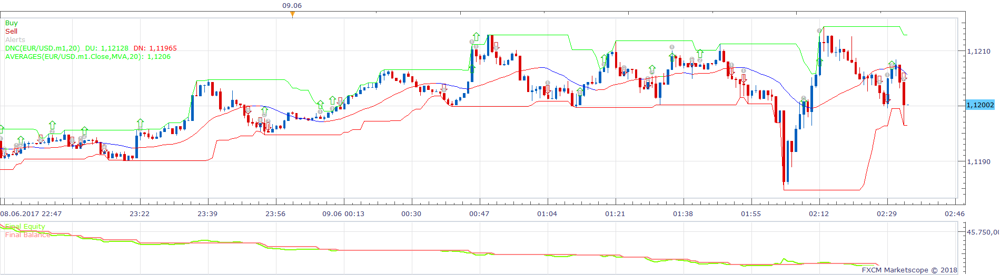
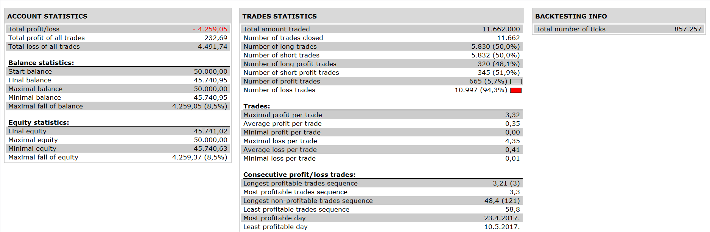

# DNC Averages strategy

> Source: https://fxcodebase.com/code/viewtopic.php?f=31&t=66593  
> Forum: 31 · Topic 66593 · 7 post(s)

---

## DNC Averages strategy

**Apprentice** · Thu Aug 23, 2018 3:22 am

 

Based on request.
[viewtopic.php?f=27&t=66592](https://fxcodebase.com/code/viewtopic.php?f=27&t=66592)

Entry Long
After DNC breaks wait for the average to change color then enter a trade crossunder

Exit Long
Either on the price/center line or price/top bottom line crossunder

Viceversa for short

 [DNC Averages strategy.lua](files/120749/DNC%20Averages%20strategy.lua)

DNC.lua is available here.
[viewtopic.php?f=17&t=20](https://fxcodebase.com/code/viewtopic.php?f=17&t=20)
AVERAGES.lua is available here.
[viewtopic.php?f=17&t=2430](https://fxcodebase.com/code/viewtopic.php?f=17&t=2430)

---

## Re: DNC Averages strategy

**chai88888** · Thu Aug 23, 2018 3:36 am

thanks apprentice

---

## Re: DNC Averages strategy

**chai88888** · Thu Aug 23, 2018 3:48 am

thanks apprentice i noticed that it dosent have exit on the center line of the dnc thanks

---

## Re: DNC Averages strategy

**chai88888** · Thu Aug 23, 2018 4:19 am

apprentice the exit type will be the dnc line either center or top bottom not the average thanks

---

## Re: DNC Averages strategy

**Apprentice** · Thu Aug 23, 2018 8:33 am

For Exit Long we have
(Source.close[period] < DNC.DM[period] and Source.close[period-1] >= DNC.DM[period-1])
or
(Source.close[period] < DNC.DU[period] and Source.close[period-1] >= DNC.DU[period-1] )

---

## Re: DNC Averages strategy

**chai88888** · Thu Aug 23, 2018 8:55 am

hi apprentice i dont see option of exit type to chooose from center or top bottom
thanks

---

## Re: DNC Averages strategy

**Apprentice** · Wed Aug 29, 2018 4:18 am

Try it now.
