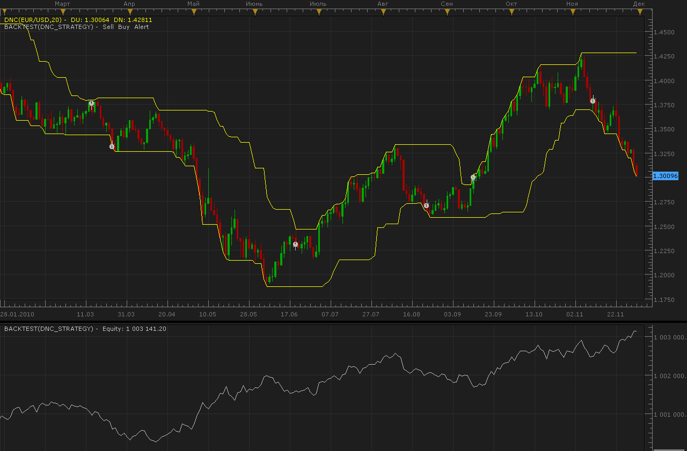

# DNC strategy

> Source: https://fxcodebase.com/code/viewtopic.php?f=31&t=2829  
> Forum: 31 · Topic 2829 · 15 post(s)

---

## DNC strategy

**Alexander.Gettinger** · Tue Nov 30, 2010 4:27 am

Strategy based on DNC channel indicator ([viewtopic.php?f=17&t=20&p=21&hilit=DNC#p21](https://fxcodebase.com/code/viewtopic.php?f=17&t=20&p=21&hilit=DNC#p21)).
Strategy open/close orders when price touch channel.

 

Download:

 [DNC_Strategy.lua](files/6455/DNC_Strategy.lua)

For this strategy must be installed DNC indicator ([viewtopic.php?f=17&t=20&p=21&hilit=DNC#p21](https://fxcodebase.com/code/viewtopic.php?f=17&t=20&p=21&hilit=DNC#p21)).

The Strategy was revised and updated on November 21, 2018.

---

## Re: DNC strategy

**DS0167** · Tue Nov 30, 2010 5:41 am

thanks a lot

---

## Re: DNC strategy

**coldrecs** · Thu Dec 02, 2010 10:00 am

Hello,

Thank you for this code. I managed to modify it a little to fit my actual trading strategy.
Still, I have a question: why none of the strategies posted here work on tick time frame ?

Thanks again,
Coldrecs

---

## Re: DNC strategy

**Alexander.Gettinger** · Thu Dec 02, 2010 10:17 pm

DNC indicator use high and low prices which are absent for ticks.

---

## Re: DNC strategy

**BlueBloodedTrader** · Fri Jul 29, 2011 5:01 pm

May I request an improvement to this strategy? There needs to be a directional bias. Trades should open in the direction of the trend only. Consequently, long trades will open on higher highs: short trades will open on lower lows. The way to hard code this into the strategy appears simple. At the moment the trade is opened when the specified DNC channel is breached , i.e. a "breakout" in either direction. This may be achieved by comparing plateaus (horizontal parts of the DNC channels) such that a long trade should only open if the "breakout" is of an upper DNC channel that is ascending i.e. the breakout is of a plateau that is higher than the last upper channel plateau; and similarly, a short trade should only be opened if the breakout is of a lower DNC channel that is decending, i.e. the breakout plateau is lower than the last lower channel plateau. Are you able to code this please?

---

## Re: DNC strategy

**BlueBloodedTrader** · Tue Aug 09, 2011 3:39 pm

I am actually having problems with this strategy. I tried to use the funciton "exit on centre line crossover" but it didn't seem to exit. I obviously misunderstand what this function does.

Can you explain each of the parameters on this very complex strategy please?

---

## Re: DNC strategy

**BlueBloodedTrader** · Wed Aug 10, 2011 5:18 am

There is a latency problem with this strategy. Please see the attachment (3 screen shots) and the comments on that image.

---

## Re: DNC strategy

**fxcruiser** · Fri Aug 12, 2011 3:39 pm

BlueBloodedTrader, Hi,
It seems to me that the strategy waits for the candle to close and if the conditions met at the close of the candle then the exit or entry follows in the subsequent candle. That makes sense since it could be false breakout.

---

## Re: DNC strategy

**laners303** · Mon Sep 05, 2011 9:15 am

Would it be possible to change it so that the strategy enters a trade the moment it touches or passes the Donchian Channel, instead of waiting for the candle to close?

Thanks
Laners303

---

## Re: DNC strategy

**Apprentice** · Mon Sep 05, 2011 12:27 pm

Such a thing is possible.
We can use the High / Low values ​​instead Closing Price.

---

## Re: DNC strategy

**bedayan** · Sun Nov 27, 2011 1:02 pm

Is it possible to add trend filter in this strategy.Like moving average .If price action above moving average then only take long break out and if price action below moving average take only short trade.

---

## Re: DNC strategy

**bedayan** · Sun Nov 27, 2011 1:13 pm

I require DNC strategy based on multiple time frame.

For example based on daily or H4 chart trend is defined by the moving average.Suppose price action above moving average trend is up and if price action below moving average trend is down.
Now based on this move to lower time for example if we define trend from daily then move to H4 and then based on DNC break enter short or long trade.

---

## Re: DNC strategy

**Apprentice** · Sun Nov 27, 2011 6:12 pm

Added to the developmental cue.

---

## Re: DNC strategy

**Apprentice** · Sat Dec 03, 2016 7:31 am

Bump up.

---

## Re: DNC strategy

**Alexander.Gettinger** · Fri Feb 08, 2019 10:21 pm

Please try this strategy:

 [DNC_Str.lua](files/123792/DNC_Str.lua)
