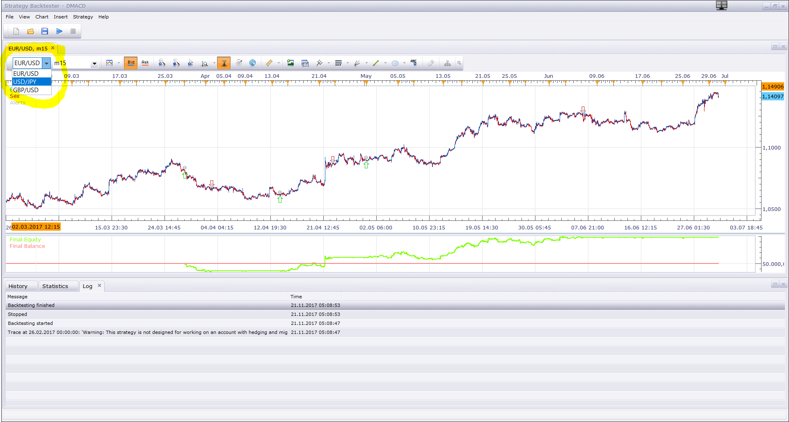

# Donchian Channel Break Out strategy

> Source: https://fxcodebase.com/code/viewtopic.php?f=31&t=2893  
> Forum: 31 · Topic 2893 · 74 post(s)

---

## Donchian Channel Break Out strategy

**Apprentice** · Tue Dec 07, 2010 7:59 am

 [Donchian Strategy.lua](files/6596/Donchian%20Strategy.lua)

Basic Rules
Enter on Long Channel Break Out.
Exit on Short Channel Break In.

Buy's on a break of the 55 day high (with a stop on the 20 day low)
Sell's on a break of the 55 day low (with a stop on the 20 day high).

Filter Option Added.
1. Filter - Price / 1. MA
2. Filter - 1. MA / 2. MA
3. Filter - 1. MA Slope

---

## Re: Donchian Channel Break Out strategy

**cwallin** · Tue Dec 07, 2010 9:56 am

Thanks for the quick response. I added the strategy and tried to backtest it, but nothing happened. I tried to attach a screenshot. I made sure "allow for trade" was set to 'Yes'. Also, my program shut down twice while trying to load it.?

---

## Re: Donchian Channel Break Out strategy

**Apprentice** · Tue Dec 07, 2010 10:37 am

Oops, you do not have a beta version.
I have upload new version.
This is probably working.

---

## Re: Donchian Channel Break Out strategy

**cwallin** · Tue Dec 07, 2010 11:02 am

I did see results after backtesting, however, I am still getting closed out of program.
Thanks!

---

## Re: Donchian Channel Break Out strategy

**Apprentice** · Tue Dec 07, 2010 11:23 am

Did you download updated version?
Strange.
I think I'll need to install the regular version

---

## Re: Donchian Channel Break Out strategy

**cwallin** · Tue Dec 07, 2010 11:36 am

I deleted the previous download I had and downloaded the one at the top of this post. Is this the correct version?
Thanks!

---

## Re: Donchian Channel Break Out strategy

**Apprentice** · Tue Dec 07, 2010 1:19 pm

Yes Top Most is correct one.

---

## Re: Donchian Channel Break Out strategy

**cwallin** · Tue Dec 07, 2010 6:10 pm

Alright, so now I can change parameters and time frames, etc.. However, after about 30 seconds to 1 minute or so, the program still closes on me. Any ideas?
Thanks Again!

---

## Re: Donchian Channel Break Out strategy

**bbauernschmitt** · Thu Dec 23, 2010 3:11 pm

Is there an easy way to add a long term directional filter (such as a 200 period EMA) to this strategy?

So, it only buys or sells breakouts in the direction of the LT trend.

---

## Re: Donchian Channel Break Out strategy

**Apprentice** · Thu Dec 23, 2010 3:20 pm

Modification of this type is possible.

---

## Re: Donchian Channel Break Out strategy

**Leisure** · Fri Dec 24, 2010 10:46 am

Is this set up for Marketscope charts?

I see nothing when backtesting nor do I see the channels...

Thanks,

---

## Re: Donchian Channel Break Out strategy

**BlueBloodedTrader** · Tue Feb 15, 2011 6:19 pm

Is it possible to further develop this strategy to include the following:

1. "Stop" set at a user defined multiple of the 20 period ATR.
2. Keep the existing strategy to enter trade on break of one user defined Donchian channel (perhaps 55) and exit the trade on the break of another Donchian channel (perhaps 20) in the opposite direction (as is the case with this indicator currently). These entry and exit levels will be defined by the user.
3. Trade will stop on the first of either the Stop defined in (1) being hit or the other Donchian Channel being touched as defined in (2).
4. If a trade entry is successfully triggered then for each move of half the 20 day ATR in the money, a new trade is entered (upto 3 more trades making a maximum of 4 concurrent trades) and each time a new trade is opened the STOP, as defined by the calculation in (1), is recalculated based on the most recent trade to be opened and that STOP is used for all of the trades that are opened at that time. For example, the first trade is long at 1.3500 with a stop at 1.3400, and a second trade is subsequently opened long at 1.3550 with a stop at 1.3450, then the stop on the first trade is also moved to the 1.3450, and so on.
5. If a trade is triggered as defined in (4) then, other than the set of upto 3 additional related trades that will be triggered if the price moves in the money, no additional trade entries will be triggered until this set of trades is closed (either by hitting the most recent STOP level as defined in (4) or by hitting the opposite Donchian Channel as defined in (2) for either a profit or a loss)

Thanks for your help with this.

---

## Re: Donchian Channel Break Out strategy

**Apprentice** · Thu Feb 17, 2011 4:17 pm

Your request has been placed in a developmental cue.

---

## Re: Donchian Channel Break Out strategy

**fxprobie** · Mon Feb 21, 2011 2:10 pm

Is it possible to modify or create an alternative to this? Ie create an alert when price crosses mid line of Donchian Channel?

---

## Re: Donchian Channel Break Out strategy

**Apprentice** · Tue Feb 22, 2011 5:21 am

It is possible.

---

## Re: Donchian Channel Break Out strategy

**ancient-school** · Fri Jun 17, 2011 1:30 pm

Hi,

Could you please add an option for the direction? i.e.:

Long Only
Short Only
Long & Short

will be Highly Appreciated if it can be done before Monday June 20 / 2011:) ... !!!

---

## Re: Donchian Channel Break Out strategy

**Apprentice** · Fri Jun 17, 2011 2:22 pm

Option Added

---

## Re: Donchian Channel Break Out strategy

**ancient-school** · Fri Jun 17, 2011 3:24 pm

What to say now? No words!

**Thank YOU ... !!!**

---

## Re: Donchian Channel Break Out strategy

**ancient-school** · Sat Jun 18, 2011 3:58 pm

I wonder ... Could you please add the option below? Just a little more control over the Strategy...

**Options to De-Activate Strategy**

**1. Trade Once
2. Trade Continuously**

**Option 1. "Trade Once"** or more precisely worded, **"Trade Till Stop Exit"**

This Means it will Trade Once, as per Allowed Side, WILL take further positions if Allow Multiple is Set to YES. But if Stop Exit is Hit, Strategy is De-Activated

**Option 2. "Trade Continuously"**

This Option is as Strategy is functioning presently, i.e. it Trades all the time and according to All Options selected in Parameters.

I am aware I am overdoing it here now, but if this too can be done before Monday June 20 / 2011, will be Highly Appreciated ... "Offer a Camel your hand, and it sure will take your arm" ...

Much Obliged...

---

## Re: Donchian Channel Break Out strategy

**Apprentice** · Sun Jun 19, 2011 7:20 am

It is possible. I hope that someone will find time soon.

---

## Re: Donchian Channel Break Out strategy

**ancient-school** · Sun Jun 19, 2011 8:49 am

Hi,

Please review the code for Long Only, Short Only, Long & Short ... These options are not being respected...

Much Obliged

---

## Re: Donchian Channel Break Out strategy

**vstrelnikov** · Thu Jun 23, 2011 7:10 pm

There is a version with fixed Buy/Sell/Both issue attached.
Top post will be updated after some testing.

 [Donchian Strategy.lua](files/12004/Donchian%20Strategy.lua)

---

## Re: Donchian Channel Break Out strategy

**ancient-school** · Thu Jun 23, 2011 10:17 pm

Hi,

Thank you for the effort ... Currently testing Long, Short, Both options, however one other issue I have noticed is that the Strategy interferes with other open positions of the instrument it is attached too, irrespective of whether the positions belong to the Strategy or not.

Would be good if the Strategy would strictly track and trade its own positions ... i.e. not to interfere with other open positions not initiated by the Strategy itself.

---

## Re: Donchian Channel Break Out strategy

**ancient-school** · Fri Jun 24, 2011 6:47 am

> **vstrelnikov wrote:**
> There is a version with fixed Buy/Sell/Both issue attached.
> Top post will be updated after some testing.

**Test Results**

Now that the options for specific direction to trade are working, "Use Stop Exit" is not working ...

i.e.: If "Stop Donchian Channel Period" has been breached by Price, Open Positions are not Closed using "Use Stop Exit: YES," even if parameter for "Use Stop Exit" is set to Yes

**Re-Cap:** If "Allow Side" is set to either "Long Only" or "Short Only"... Parameter "Use Stop Exit: YES," is not repected.

---

## Re: Donchian Channel Break Out strategy

**vstrelnikov** · Tue Jul 05, 2011 3:35 pm

Would you please, try the attached version. "Exit stop" problem should be fixed here.

 [Donchian Strategy.lua](files/12391/Donchian%20Strategy.lua)

---

## Re: Donchian Channel Break Out strategy

**ancient-school** · Tue Jul 05, 2011 6:30 pm

> **vstrelnikov wrote:**
> Would you please, try the attached version. "Exit stop" problem should be fixed here.

Use **Stop Exit on Central Line Crossover Does not work** ...
Exit **Works on High and Low Lines ONLY**, and according to setting of "Stop Donchian Channel Period" Parameter ...

**Re-Cap** - **If Parameter: "Exit on Central Line Cross Over" is set to "Yes"; All Open Trades should be Exited if the Central Line of "Stop Donchian Channel Period" is Breached by Price**

Thank you for fixing Stop Exit on High and Low Lines!

---

## Re: Donchian Channel Break Out strategy

**BlueBloodedTrader** · Fri Jul 29, 2011 5:08 pm

can you introduce a directional bias so that trades are only taken in the direction of the trend? For example, long trades should be taken on breakouts of higher highs (not lower highs) and similarly short trades should be taken on breakouts of lower lows (not higher lows). This will improve the win trade ratio...."the trend is your friend". What needs to be done is to look at the plateaus (horizontal parts of the donchian channels): if the breakout is of a horizontal upper channel that is higher than the last horizontal upper channel, then we have a higher high and a long trade should be entered....but if the breakout is of the horizontal upper channel that is lower than the last horizontal upper channel then the market is trending down and a long trade would not be desirable so none is entered. The same applies in reverse for the lower donchian channel and entries of short trades. Could you modify this please or publish a new version of this strategy with this improvement? Thanks

---

## Re: Donchian Channel Break Out strategy

**deetrader999** · Fri Jul 06, 2012 9:56 pm

Thanks. Can you make a strategy that enters on the big channel high or low? And only exits on the same big channel, high or low? Instead of the 2 channels. Everything else is fine. I thought of editing it myself but it looks complicated. Thank-You.

---

## Re: Donchian Channel Break Out strategy

**Apprentice** · Mon Jul 09, 2012 6:49 am

Your request is already added to the list of development

---

## Re: Donchian Channel Break Out strategy

**automan** · Wed Oct 10, 2012 3:15 pm

I see that the Donchian indicator is popular, downloaded more than 9000 times

Would it be possible to add an option to this strategy (or if there is a similar one) that to enter the trade on first tick that cross the channel? (High or low)

Now it enter the trade on close of the bar

Even if using 1 minute it can take multiple bars before close if the bar doesent close on high/low

---

## Re: Donchian Channel Break Out strategy

**automan** · Wed Oct 10, 2012 3:26 pm

For example

If using 20 period donchian high and the high is on the 10th bar at 3900

then when the last alive bar cross the 3900 level the strategy should enter long on the first tick

---

## Re: Donchian Channel Break Out strategy

**automan** · Thu Oct 11, 2012 1:17 am

An option to set the "analyze the current period" to no (as on the indicator) would solve the most of the problem

Then one can use 1 minute timeframe

---

## Re: Donchian Channel Break Out strategy

**Apprentice** · Thu Oct 11, 2012 2:37 am

Your request is added to the development list.

---

## Re: Donchian Channel Break Out strategy

**Eric1704** · Wed Mar 06, 2013 2:05 pm

Can someone help me with a strategy too? It is based on Donchian Channels too. Could not figure out how to start a new topic under "Strategies".
Thanks.

---

## Re: Donchian Channel Break Out strategy

**Eric1704** · Wed Mar 06, 2013 9:02 pm

It goes something like this. The trend is determined by a 50 period SMA. If the Donchian Channels are trading above the 50 day SMA the trend is up and vice versa. For a long entry we want to see a bar trading completely inside the mid and lower Donchian Bands. Then we place a buy stop a tic or two above this bar. The reverse is true for a sell.
Thank you.

---

## Re: Donchian Channel Break Out strategy

**Apprentice** · Sat Mar 09, 2013 6:10 am

Your request is added to the development list.
As for starting new topics.
New requests should be poster under Indicator and Signal Requests, here.
[viewforum.php?f=27](https://fxcodebase.com/code/viewforum.php?f=27)

---

## Re: Donchian Channel Break Out strategy

**yakimovevgeny** · Wed Apr 03, 2013 4:24 am

Hi,
Help me please. I have got one problem. I added the strategy and tried to backtest it but i am getting closed out of program while its backtesting process running. sorry for my bad english

---

## Re: Donchian Channel Break Out strategy

**Apprentice** · Thu Apr 04, 2013 4:58 am

I made a backtest, with no problems.
I have one task for you.
Uninstall TS, Install new version, can be found on the FXCM website.
If problems persist, share parameters that you use with us.
Also send, crash report generated.
For this, you need, to copy crash report from crash folder before closing the platform.

---

## Re: Donchian Channel Break Out strategy

**yakimovevgeny** · Thu Apr 04, 2013 9:55 am

thanks for the response. i think i figure out the problem its due to trying to backtest the too much history data. now its ok everything is fine. and sorry for make a request if possible could you add 2 MA filter for example if fast MA > slow MA then only take buy signal etc

---

## Re: Donchian Channel Break Out strategy

**Apprentice** · Sat Apr 06, 2013 4:40 am

Your request is added to the development list.

---

## Re: Donchian Channel Break Out strategy

**napitt** · Wed May 01, 2013 10:44 pm

If I understand right, the option of allowing ticks is for entering the trade 1 tick after breaking the channel, instead of waiting for the bar that broke the channel to close.
If so this option (allow ticks set to yes ) is not being honored by the strategy.
No matter yes or no the strategy is waiting for the candle to close and entering on next candle.

If you find yourself with spare time and bored, nothing to do (yeh, right) could you please look into this? Best would be if we could choose how many pips after breaking channel before entering and exiting.

Love this strategy, but losing too many trades waiting for candle close,
Thank you

---

## Re: Donchian Channel Break Out strategy

**Taskryr** · Sun Jan 26, 2014 3:43 pm

Was the channel break issue every resolved? When I test I'm losing a lot of pips due to having to wait for the candle to close instead of the entry/exit on the break of the channel. Didn't know if there was another link to a file that already addressed this issue.

Thanks,

---

## Re: Donchian Channel Break Out strategy

**Apprentice** · Mon Jan 27, 2014 3:46 am

If you're talking about Tick Version, with instantaneous executions, Unfortunately not.
I have not found the time.

---

## Re: Donchian Channel Break Out strategy

**Stance** · Thu Jul 30, 2015 9:31 pm

> **bbauernschmitt wrote:**
> Is there an easy way to add a long term directional filter (such as a 200 period EMA) to this strategy?
>
> So, it only buys or sells breakouts in the direction of the LT trend.

+1 can you please add a moving average filter to this strategy.

---

## Re: Donchian Channel Break Out strategy

**Stance** · Fri Jul 31, 2015 5:50 am

> **bbauernschmitt wrote:**
> Is there an easy way to add a long term directional filter (such as a 200 period EMA) to this strategy?
>
> So, it only buys or sells breakouts in the direction of the LT trend.

With my limited programming knowledge I've managed to add in a moving average filter. Feel free to test it.

[https://dl.dropboxusercontent.com/u/68353796/Donchian%20Strategy%20with%20Filters.lua](https://dl.dropboxusercontent.com/u/68353796/Donchian%20Strategy%20with%20Filters.lua)

---

## Re: Donchian Channel Break Out strategy

**jetaro** · Wed Aug 31, 2016 11:12 am

> **Stance wrote:**
>
>
> > **bbauernschmitt wrote:**
> > Is there an easy way to add a long term directional filter (such as a 200 period EMA) to this strategy?
> >
> > So, it only buys or sells breakouts in the direction of the LT trend.
>
>
>
> With my limited programming knowledge I've managed to add in a moving average filter. Feel free to test it.
>
> [https://dl.dropboxusercontent.com/u/68353796/Donchian%20Strategy%20with%20Filters.lua](https://dl.dropboxusercontent.com/u/68353796/Donchian%20Strategy%20with%20Filters.lua)

Hi, this link doesn't appear to work anymore, is it posted somewhere else?

---

## Re: Donchian Channel Break Out strategy

**Apprentice** · Fri Sep 02, 2016 3:25 am

Major update.
Filter Option Added.
1. Filter - Price / 1. MA
2. Filter - 1. MA / 2. MA
3. Filter - 1. MA Slope

---

## Re: Donchian Channel Break Out strategy

**oldporkchops2** · Thu Nov 17, 2016 12:32 am

Dear Apprentice,

Thank you very much for helping to develop this powerful strategy.

When I did backtesting, it didn't pick up any trades. Am I doing anything wrong? Here's a screenshot of the parameters: [http://screencast.com/t/hNXZFvV8](http://screencast.com/t/hNXZFvV8)

Could you please help share some ideal parameters?

Thanks.

---

## Re: Donchian Channel Break Out strategy

**jetaro** · Thu Nov 17, 2016 4:32 pm

hi oldporkchops2, I just tried it with those settings and it did trade for me on the backtest.

what dates are you using? 10/1/2016 to 11/17/2016 on the GBP/USD.

also if you scroll down past what your screen shot shows make sure the times for trading aren't restricting it. I have 00:00:00, 24:00:00, No, 23:59:00, 60 as the Time Parameters.

also you can trying opening the .LUA file, change this line from false to true, save it, then re install it.

 strategy.parameters:addBoolean("AllowTrade", "Allow strategy to trade", "", false);

good luck!

---

## Re: Donchian Channel Break Out strategy

**jetaro** · Thu Nov 17, 2016 6:34 pm

oh, also I discovered today that if my initial balance is too low it will not do any trades, which surprised me. I was pulling my hair out trying to figure out why the debugger was showing trades but not the backtester in marketscope. Then I changed the initial balance to a higher value and voila, it worked. I thought maybe it was because it was below the MMR, but it wasn't. it was set to 100 and I was only trading 1 lot on the EUR/USD which has a $24 MMR.

Anyway, you can try setting your initial balance to 500 or 1000 and see if that fixes it too.

---

## Re: Donchian Channel Break Out strategy

**Apprentice** · Sat Nov 26, 2016 7:51 am

I could not reproduce this issue.
Try to increase the Max Number Of Open Position In Any Direction / Max Number Of Position In One Direction

---

## Re: Donchian Channel Break Out strategy

**Apprentice** · Sun Dec 18, 2016 9:56 am

Strategy was revised and updated.

---

## Re: Donchian Channel Break Out strategy

**albertparis** · Tue Dec 20, 2016 8:49 am

hello

Can add you

show close or high / low

thank you for your work

---

## Re: Donchian Channel Break Out strategy

**Apprentice** · Thu Dec 22, 2016 1:38 pm

Strategys can not have indicator elements.

---

## Re: Donchian Channel Break Out strategy

**stainer** · Thu Nov 02, 2017 7:10 pm

I am havinf some trouble with this strategy, It wont let me deselect Eur/Usd when back testing and even if I select another pair it only gives results for Eur/Usd.

I am trying to back test Gbp/Aud can someone have a look and see if this can be resolved as it would be extremely helpful.

Thanks

---

## Re: Donchian Channel Break Out strategy

**Apprentice** · Tue Nov 21, 2017 7:00 am

Use Currency par selector.

---

## Re: Donchian Channel Break Out strategy

**chai88888** · Mon Apr 23, 2018 10:48 pm

can this strategy take a trade when it break upper and lower line continously like a quantum indicator?

open a trade when a candle breaks the line open a position at the close of the candle contiounsly and closes all trade when it reaches the centerline.

---

## Re: Donchian Channel Break Out strategy

**chai88888** · Tue Apr 24, 2018 4:42 am

like this

thanks

---

## Re: Donchian Channel Break Out strategy

**Apprentice** · Fri May 18, 2018 5:24 am

Your request is added to the development list under Id Number 4142

---

## Re: Donchian Channel Break Out strategy

**Victor.Tereschenko** · Wed May 30, 2018 9:19 am

> **chai88888 wrote:**
> can this strategy take a trade when it break upper and lower line continously like a quantum indicator?
>
> open a trade when a candle breaks the line open a position at the close of the candle contiounsly and closes all trade when it reaches the centerline.

This strategy already doing so. You need just to set "Max Number Of Open Position In Any Direction" and "Max Number Of Position In One Direction" to a higher value.

---

## Re: Donchian Channel Break Out strategy

**chai88888** · Thu Jun 14, 2018 2:08 pm

dear apprentice

can you add an option close all trades on the center line

thanks

---

## Re: Donchian Channel Break Out strategy

**iamdric** · Sat Jun 23, 2018 12:43 am

Hi Apprentice,

I can't seem to make it work the Buy on 55 Break out (Exit on 20 day Break out).

How to do the settings for this?

Rather, How to make it work the 'Stop Donchian Channel Period'?

Thanks,
Dric

---

## Re: Donchian Channel Break Out strategy

**Apprentice** · Sat Aug 04, 2018 7:26 am

Your request is added to the development list under Id Number 4216

---

## Re: Donchian Channel Break Out strategy

**Apprentice** · Tue Aug 07, 2018 8:34 am

> can you add an option close all trades on the center line

 [Donchian Strategy.lua](files/120403/Donchian%20Strategy.lua)

Try this version.

---

## Re: Donchian Channel Break Out strategy

**chai88888** · Mon Aug 20, 2018 9:15 pm

hi apprentice

if the ma number of position is greater than 1.

it is possible that it will take a trade if the end of turn close candle is higher or slower than the previous

thanks

il post some examples thanks

---

## Re: Donchian Channel Break Out strategy

**Apprentice** · Wed Aug 29, 2018 4:09 am

I'm not sure I understand, can you clarify?

---

## Re: Donchian Channel Break Out strategy

**chai88888** · Wed Aug 29, 2018 11:10 am

hi apprentice

lets say the price breakout on the high end of turn candle the next candle should be close higher than previous candle high to open a trade. and vice versa.

in short the current candle should CLOSE end of turn higher than the previous candle to open a trade position

thanks

---

## Re: Donchian Channel Break Out strategy

**chai88888** · Thu Jun 06, 2019 4:37 am

hi there can i request to add an option on tha doncahin channel strategy

enter long when the price close above the middle line
enter short when the price close below the middle line

exit on the middle line or outer line

so basically when the price close above it will enter long then if the price goes below the middle line it will close the long and enter a short position thats when exit on the middle line

thanks

---

## Re: Donchian Channel Break Out strategy

**Apprentice** · Sun Jun 30, 2019 6:15 pm

Your request is added to the development list under Id Number 4761

---

## Re: Donchian Channel Break Out strategy

**Apprentice** · Mon Jul 01, 2019 12:33 pm

[Donchian Strategy v2.lua](files/127177/Donchian%20Strategy%20v2.lua)

Try this version.

---

## Re: Donchian Channel Break Out strategy

**tuhadfe** · Thu May 29, 2025 9:31 am

Hi

I dont understand this but this strategy works on the timeframe m1. but not on any other timeframes.

Trades trigger on the m1 but not on the other timeframes. Can you just tell me is there a setting that needs changing?

I have noticed this on other strategies can you tell me what is wrong?

---

## Re: Donchian Channel Break Out strategy

**Apprentice** · Sun Jun 01, 2025 1:45 pm

We have added your request to the development list.
Development reference 363

---

## Re: Donchian Channel Break Out strategy

**tuhadfe** · Mon Jun 02, 2025 9:07 am

Hi

I am not looking for any development just wanting to know why this strategy and others are not executing on timeframes higher than m1. Works fine on m1 but not on others everthough the strategy allows you to choose higher timeframes. I just want to know is there some setting, I have incorrect. not looking for development?

---

## Re: Donchian Channel Break Out strategy

**Apprentice** · Wed Jun 04, 2025 2:45 pm

I don’t have any issues on H1
