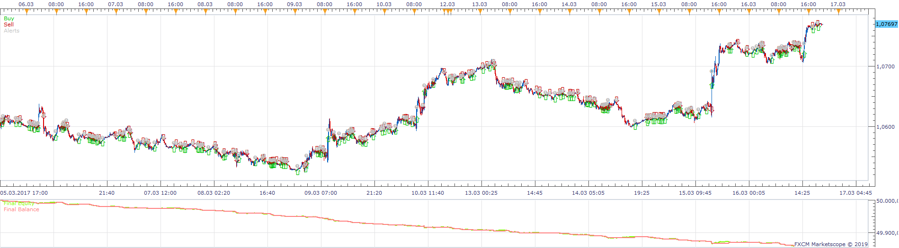
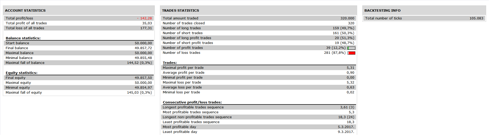

# Donchian Channel Middle line Strategy

> Source: https://fxcodebase.com/code/viewtopic.php?f=31&t=68575  
> Forum: 31 · Topic 68575 · 23 post(s)

---

## Donchian Channel Middle line Strategy

**Apprentice** · Thu Jun 13, 2019 1:29 pm

 

Based on request.
[viewtopic.php?f=27&t=68542](https://fxcodebase.com/code/viewtopic.php?f=27&t=68542)
Based on Donchian Channel with Alert.lua
[viewtopic.php?f=17&t=20](https://fxcodebase.com/code/viewtopic.php?f=17&t=20)

 [Donchian Channel Middle line Strategy.lua](files/126909/Donchian%20Channel%20Middle%20line%20Strategy.lua)

---

## Re: Donchian Channel Middle line Strategy

**chai88888** · Sun Jun 16, 2019 10:18 pm

thanks apprentice

but can you add to exit on the outer lines

thanks

---

## Re: Donchian Channel Middle line Strategy

**Apprentice** · Sun Jun 30, 2019 6:21 pm

Your request is added to the development list under Id Number 4763

---

## Re: Donchian Channel Middle line Strategy

**Apprentice** · Tue Jul 02, 2019 4:48 am

It already has it.

---

## Re: Donchian Channel Middle line Strategy

**chai88888** · Thu Jul 04, 2019 8:53 pm

hi apprentice can you add a filter

if the middle line is above the MA it will take only a buy signal

and vice versa

thanks

---

## Re: Donchian Channel Middle line Strategy

**Apprentice** · Sun Jul 14, 2019 4:57 am

Your request is added to the development list under Id Number 4783

---

## Re: Donchian Channel Middle line Strategy

**Apprentice** · Mon Jul 15, 2019 7:49 am

Try this version.

 [Donchian Channel Middle line Strategy.lua](files/127361/Donchian%20Channel%20Middle%20line%20Strategy.lua)

---

## Re: Donchian Channel Middle line Strategy

**Stomp2k** · Fri Jul 26, 2019 12:06 pm

Can this strategy be made available for mt4

---

## Re: Donchian Channel Middle line Strategy

**Apprentice** · Sun Jul 28, 2019 7:30 am

Your request is added to the development list under Id Number 4811

---

## Re: Donchian Channel Middle line Strategy

**Apprentice** · Wed Jul 31, 2019 5:57 am

Try this version.

 [Dochian_Channel EA.mq4](files/127649/Dochian_Channel%20EA.mq4)

You will have to install Dochian_Channel.mq4
[viewtopic.php?f=38&t=20206](https://fxcodebase.com/code/viewtopic.php?f=38&t=20206)

---

## Re: Donchian Channel Middle line Strategy

**yolerap** · Sat Sep 07, 2019 9:26 am

Hi apprentice,

I saw lot of strategies based on the middle Line of Donchian Channel but i've never seen this ( simple ) strategy :

If the middle line of Donchian Channel is positive -> Open a long position
If the middle line of Donchian Channel is negative -> Open a short position

Could you create this strategy ?

If it's possible , for best results , could you please add this option :

1) If the middle line is neutral -> Choose "close position" or "do nothing"

2) Timeframe trading

3) Timeframe for the Donchian Channel

4) Day profit -> If its reach , close all position and don't open any others positions

5) Time to trade

6) Close on opposite

Simple but effective according to my analyzes

Thanks a lot !

---

## Re: Donchian Channel Middle line Strategy

**Apprentice** · Tue Sep 10, 2019 8:15 am

Your request is added to the development list.
Development reference 65.

---

## Re: Donchian Channel Middle line Strategy

**Apprentice** · Wed Sep 11, 2019 6:13 am

What is a positive/negative/neutral middle line?

---

## Re: Donchian Channel Middle line Strategy

**yolerap** · Wed Sep 11, 2019 7:35 am

Hi,

Look the picture ;

The first arrow shows the negative middle line
The second arrow shows the neutral middle line
And the third arroww shows the positive line

I don't know if the language LUA can integrate and recognize these specifics aspects.

Thank you for your help,

---

## Re: Donchian Channel Middle line Strategy

**Apprentice** · Fri Sep 13, 2019 6:33 am

[Donchian Channel Middle line Strategy yolerap.lua](files/128660/Donchian%20Channel%20Middle%20line%20Strategy%20yolerap.lua)

Try this version.

---

## Re: Donchian Channel Middle line Strategy

**yolerap** · Wed Sep 25, 2019 6:14 pm

Hi again !

Thanks a lot for the strategy ! It works very good but I have just one request about it ;
Could you add an option for open and close position please ?
The strategy open buy position when the middle line is neutral and sometimes, close the position when the middle line is always neutral.. But it's not I want.. And conversely...
You can see an example on the picture at the first and second arrows.

So, is it possible add this option :
The positions are open when there are "X" pip's of difference ;
If the middle line increase "X" pip's -> Buy position
If the middle line down "X" pip's -> Short position

this will prevent the strategy from opening and closing positions while the middle line does not move like on the picture.

Thank you

---

## Re: Donchian Channel Middle line Strategy

**Apprentice** · Sat Sep 28, 2019 4:07 pm

Your request is added to the development list.
Development reference 141.

---

## Re: Donchian Channel Middle line Strategy

**Apprentice** · Fri Oct 04, 2019 5:55 am

There is a parameter for that - "Close on neutral"

---

## Re: Donchian Channel Middle line Strategy

**yolerap** · Fri Oct 04, 2019 6:42 am

No, the parameters are on " Not closing positions on the neutral line " but it's also closing positions..

---

## Re: Donchian Channel Middle line Strategy

**tuhadfe** · Tue Mar 25, 2025 11:29 am

Can you do a donchian strategy that uses the outward inner channel to enter and exit trades.

The quarter lines as opposed to the middle lines thanks

---

## Re: Donchian Channel Middle line Strategy

**Apprentice** · Wed Mar 26, 2025 6:21 am

We have added your request to the development list.
Development reference 229

---

## Re: Donchian Channel Middle line Strategy

**tuhadfe** · Mon Apr 21, 2025 5:25 am

HI any update on this

Also I noticed the rules dont appear to be check on each new bid and ask. Is it possible I think the function is extUpdate that the rules can be checked and enter a trader on each new bid and ask.
Any idea when this may be looked at?

Thanks

---

## Re: Donchian Channel Middle line Strategy

**Apprentice** · Thu Jun 05, 2025 3:07 pm

[Donchian Channel Band.lua](files/159508/Donchian%20Channel%20Band.lua)

 [Donchian_Channel_Band_Strategy.lua](files/159508/Donchian_Channel_Band_Strategy.lua)

Something like this?
