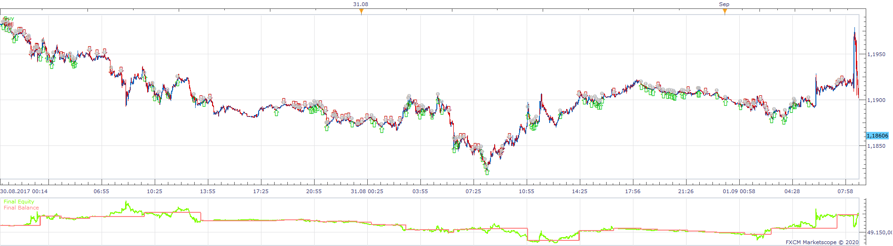
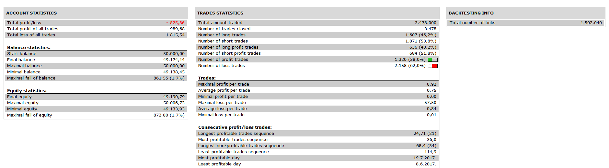

# Double Top Strategy

> Source: https://fxcodebase.com/code/viewtopic.php?f=31&t=69799  
> Forum: 31 · Topic 69799 · 6 post(s)

---

## Double Top Strategy

**Apprentice** · Tue May 05, 2020 5:04 am

 

Based on the indicator.
[viewtopic.php?f=17&t=59574](https://fxcodebase.com/code/viewtopic.php?f=17&t=59574)

 [Double Top Strategy.lua](files/133549/Double%20Top%20Strategy.lua)

---

## Re: Double Top Strategy

**SANTOSH** · Tue May 05, 2020 10:35 am

Hi ,
Nice efforts to build the strategy .
Following is the attached error .
The strategy trades seems a mismatch with the indicator alerts .

---

## Re: Double Top Strategy

**SANTOSH** · Tue May 05, 2020 10:45 am

Another example of strategy mismatch with the indicator.

---

## Re: Double Top Strategy

**Apprentice** · Tue May 05, 2020 7:33 pm

Your request is added to the development list.
Development reference 1232.

---

## Re: Double Top Strategy

**Apprentice** · Wed May 06, 2020 5:59 am

Try this version.

---

## Re: Double Top Strategy

**SANTOSH** · Wed May 06, 2020 10:22 am

Its working and the alerts sync the trades .
Good work .
