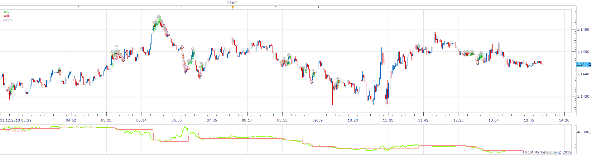
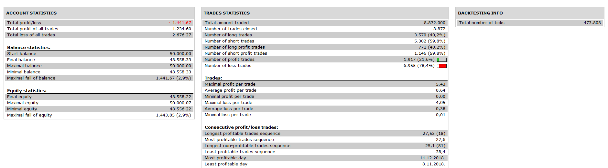

# Dynamic Trend following algorithm Strategy

> Source: https://fxcodebase.com/code/viewtopic.php?f=31&t=68878  
> Forum: 31 · Topic 68878 · 1 post(s)

---

## Dynamic Trend following algorithm Strategy

**Apprentice** · Tue Sep 03, 2019 10:53 am

 

Based on the article "The Application of Trend Following Strategies in Stock Market Trading" and "Trend following algorithms in automated derivatives market trading"
Simon Fong, Jackie Tai

Pseudo code of Adaptive P&Q Rules
Repeat
Compute RSI(t) and EMA(RSI(t))
If price is advancing at t
If RSI(t)>EMA(RSI(t)) and 40<EMA(RSI(t))>60
If no position opened
Open a long position, P'
Else if short position opened
Close out short position, Q'
Else if price is declining at t
If RSI(t)<EMA(RSI(t)) and 40<EMA(RSI(t))>60
If no position opened
Open a short position, Q'
Else if long position opened
Close out long position, P'
If end of market
Close all opened position
Until Market Close

 [Dynamic Trend following algorithm Strategy.lua](files/128408/Dynamic%20Trend%20following%20algorithm%20Strategy.lua)
