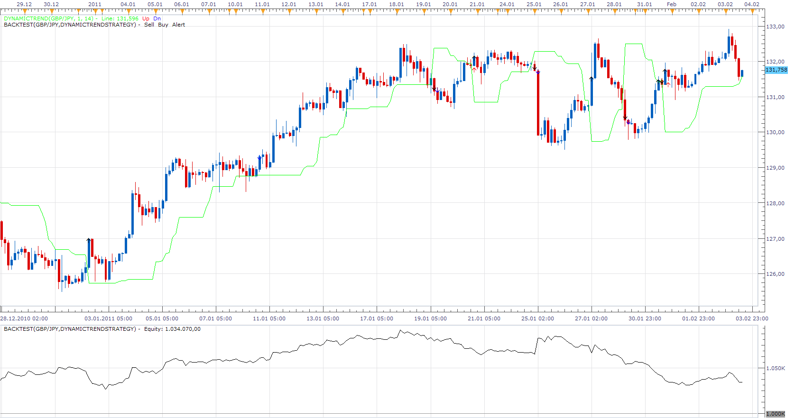

# Dynamic Trend Strategy

> Source: https://fxcodebase.com/code/viewtopic.php?f=31&t=3316  
> Forum: 31 · Topic 3316 · 7 post(s)

---

## Dynamic Trend Strategy

**Apprentice** · Thu Feb 03, 2011 2:20 pm

Simple strategies, shows crossover of indicator and the closing price.

 [DynamicTrendStrategy.lua](files/7898/DynamicTrendStrategy.lua)

To make this strategy could work, please download and install DynamicTrend indicator.
[viewtopic.php?f=17&t=1839&p=4639&hilit=Dynamic+Trend#p4639](https://fxcodebase.com/code/viewtopic.php?f=17&t=1839&p=4639&hilit=Dynamic+Trend#p4639)

The Strategy was revised and updated on December 10, 2018.

---

## Re: Dynamic Trend Strategy

**elmcceen** · Tue May 17, 2011 3:12 pm

I backtested this indicator visuel a lot and find a way for a profitable system.
Is there anybody can create this strategy? plz contact me

---

## Re: Dynamic Trend Strategy

**Gregopat** · Thu Jul 07, 2011 5:56 pm

Hello,
 I'm new to the forum and thank all those who contribute to the development on this site.
 I begin to learn the basic lua so that builds upon the indicators and strategies.
 not knowing enough lua at the moment can you add this indicator in the strategy dynamic trend.

 [ARSI.lua](files/12477/ARSI.lua)

You can change the strategy. Arsi a buy when going over the dynamic trend. 2 Arsi sell when drops below the dynamic trend.
 3 possibility to take position as in the multiple regression strategy super trend.

thank you in advance

---

## Re: Dynamic Trend Strategy

**Apprentice** · Fri Jul 08, 2011 4:10 am

Required can be found here.
[viewtopic.php?f=31&t=5119](https://fxcodebase.com/code/viewtopic.php?f=31&t=5119)

---

## Re: Dynamic Trend Strategy

**arstechnica** · Tue Oct 30, 2012 11:29 am

It should be easy to add a **MTF supertrend strategy**.

Trade opens when ST in one Time frame became same direction of a bigger TF
Trade close when ST of a specified TF change direction

Stochastic and ADX filter would be appreciated

---

## Re: Dynamic Trend Strategy

**Apprentice** · Wed Oct 31, 2012 2:27 am

And this request is in Dynamic Trend Strategy topic because?

---

## Re: Dynamic Trend Strategy

**Apprentice** · Wed Dec 07, 2016 3:54 pm

Strategy has been revised and updated.
