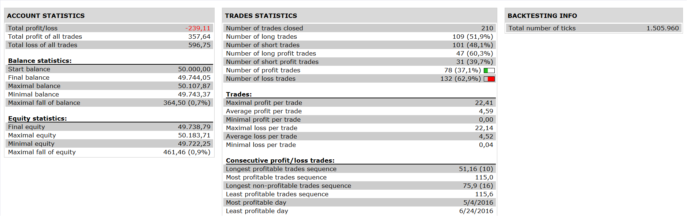

# Dynamic Zone RSI

> Source: https://fxcodebase.com/code/viewtopic.php?f=31&t=63990  
> Forum: 31 · Topic 63990 · 2 post(s)

---

## Dynamic Zone RSI

**Apprentice** · Tue Oct 18, 2016 7:31 am

 

buy
center line > buy level
and rsi cross over bottom line
and price >EMA 200

sell
center line < sell level
and rsi cross under top line
and price < ema 200

 [Dynamic Zone RSI Strategy.lua](files/108652/Dynamic%20Zone%20RSI%20Strategy.lua)

Dynamic Zone RSI is required.
[viewtopic.php?f=17&t=2040&p=108653#p108653](https://fxcodebase.com/code/viewtopic.php?f=17&t=2040&p=108653#p108653)

The Strategy was revised and updated on January 18, 2019.

---

## Re: Dynamic Zone RSI

**Apprentice** · Sun Dec 18, 2016 7:08 am

Strategy was revised and updated.
