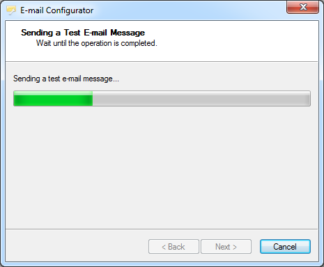

# E-mail Configurator: simplest way to configure e-mail alerts

> Source: https://fxcodebase.com/code/viewtopic.php?f=31&t=23349  
> Forum: 31 · Topic 23349 · 3 post(s)

---

## E-mail Configurator: simplest way to configure e-mail alerts

**sunshine** · Wed Sep 12, 2012 8:41 pm

Trading Station II/Marketscope has a feature to send an e-mail when particular signal or strategy events occur. To use this feature, you should configure the e-mail settings.
These settings include the address and the port of the SMTP server to be used to send e-mails, the flag indicating if the secure (SSL) connection should be used and others.

Sometimes it is not so simple to configure the settings. For example, it's not clear where to get all these tricky parameters. Or you typed all the parameters correctly, but alerts sending still fails.

To simplify the configuration of the e-mail settings, E-mail Configurator Wizard has been introduced. It makes the whole configuration process easier and more understandable. The wizard is available in Marketscope under the File -> Configure Email command.

You can find step-by-step instruction on how to configure e-mail settings with E-mail Configurator Wizard here:
[http://www.fxcorporate.com/help/MS/FIFO ... Email.html](http://www.fxcorporate.com/help/MS/FIFO/web-content.html?key=index.html#Configure_Email.html)

---

## Re: E-mail Configurator: simplest way to configure e-mail al

**david123M** · Tue May 12, 2015 3:30 am

Sometimes it is not so simple to configure the settings. For example, it's not clear where to get all these tricky parameters. Or you typed all the parameters correctly, but alerts sending still fails.

---

## Re: E-mail Configurator: simplest way to configure e-mail al

**Apprentice** · Tue May 12, 2015 3:45 am

After you configure e-mail settings.
You should receive a test email.
If you received this email, you configure your email settings correctly.

Still do not getting emails from indicators, strategys.
1) Make sure your indicator have active _Alert helper for the respective currency.
Soon, the indicator will have native support to Alerts.
_Alert Helper will no longer be required.
2) Check your strategy settings.
