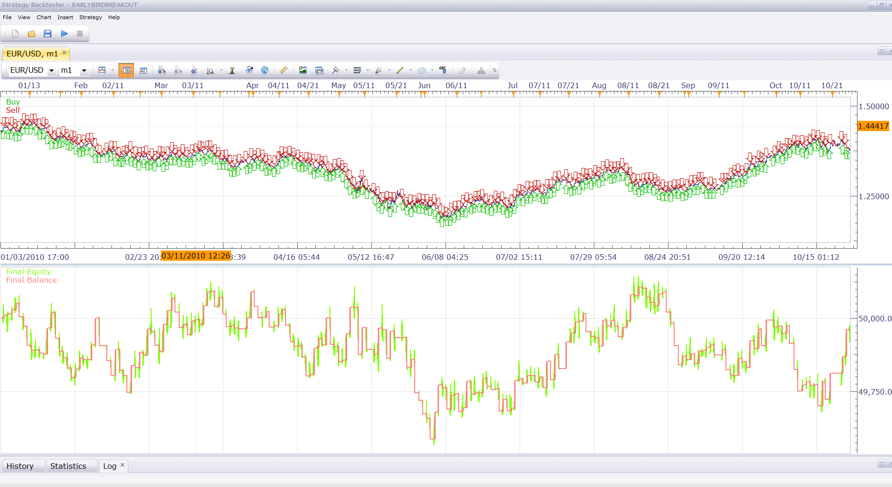
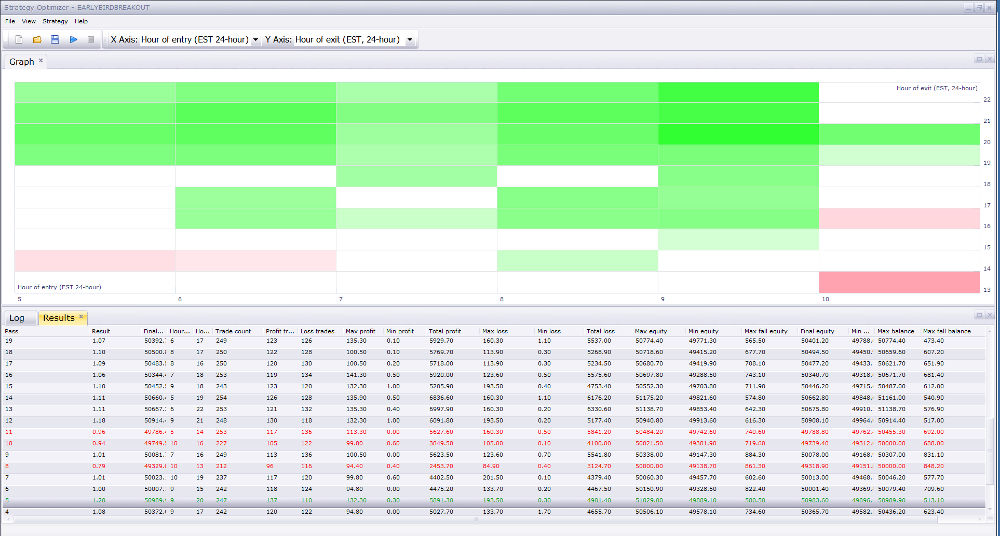
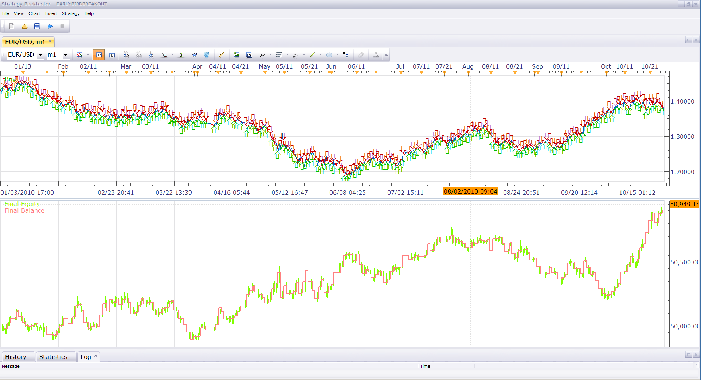

# Early Bird Breakout System

> Source: https://fxcodebase.com/code/viewtopic.php?f=31&t=6862  
> Forum: 31 · Topic 6862 · 10 post(s)

---

## Early Bird Breakout System

**Nikolay.Gekht** · Mon Sep 26, 2011 10:48 am

The system was originally requested here:
[http://forexforums.dailyfx.com/signal-s ... ystem.html](http://forexforums.dailyfx.com/signal-strategy-fxcm-marketscope/417182-early-bird-breakout-system.html)

> **MFX630 wrote:**
> i came across this and was wondering if anyone can code this for the marketscope and allow real trades
> Trading setup:
>
> Time frame: 1 hour.
> Currency pair: preferred but not limited to EUR/USD and GBP/USD.
> This Forex breakout system uses no indicators.
> Trading rules:
> The system is called "early bird" because it requires a trader being ready to trade Forex as early as 5:00 am EST.Find the Highest High and the Lowest Low for the candles from 00:00 EST to 4:59 am EST. (We should have 5 candles for each hour: 0, 1, 2, 3 and 4).
> At 5:00 am EST set 2 entry orders: buy order - above the highest high +5 pips, sell order - below the lowest low and -5 pips.Set initial profit target to +90 pips for EUR/USD and +140 pips for GBP/USD - both targets are way too high if to consider that daily range average for EUR/USD is only 110-120 pips and daily range average for GBP/USD is 180-200 pips.
> If those targets get hit - very good!However, our profits will be determined mainly by the time factor instead of a fixed amount of pips.So, we close all open positions at 12:59 EST (1:00 pm EST) and cancel all remaining orders. The next trading opportunity - only next day at 5:00 am EST.

The simple version of this strategy developed for upcoming Trading Station 2011-III release here here:

 [EarlyBirdBreakout.lua](files/15504/EarlyBirdBreakout.lua)

The limitation:
1) the system works on non-FIFO accounts only
2) the system does not care about restart/relogins and so on.

I run this version over the whole 2010 EUR/USD history (~3M ticks simulated, 1-minute source history data), mini non-FIFO account w/o hedging, in beta of the next TS release. The strategy looks promising, at least it does not loss a lot:

Please see equity curve and statistics attached (click on images to enlarge):

 

Statistics:

 

I also run the strategy trough optimizer, it looks like 13:00 EST is too early to forced exit. Please see the optimization result graph per entry/exit hour and the result of the testing of the most successful result:

 

 

The Strategy was revised and updated on December 11, 2018.

---

## Re: Early Bird Breakout System

**bomberone3** · Sat Oct 29, 2011 6:28 am

This system is not good to use in real trading.
It should be improved too much.

---

## Re: Early Bird Breakout System

**sunshine** · Fri Feb 24, 2012 7:13 am

The version that works with both non-FIFO and FIFO accounts.

---

## Re: Early Bird Breakout System

**crnizec** · Thu Jul 12, 2012 1:20 am

can I please request Stop Loss to be added to this strategy.
thank you

---

## Re: Early Bird Breakout System

**Apprentice** · Fri Jul 13, 2012 7:04 am

Your request is added to the development list.

---

## Re: Early Bird Breakout System

**mjf1288** · Mon Jul 16, 2012 3:42 pm

Hello,

When I try to backtest this strategy, I get an error which reads "index is out of range". Any advice as to what incorrect setting or data set selection could be causing this? Thanks

---

## Re: Early Bird Breakout System

**surfandturf** · Tue Oct 02, 2012 4:01 pm

Dear Developer,
could you expand the strategy in a way, that it is possible to get the breakout over 24 hours independently of the timezones. Right now, it looks like I can use only 5 bars because of the different timezone (Europe). Also, could you add a parameter to set the entry by a certain number of pips higher or lower and add also a Stop Loss.

Thanks

---

## Re: Early Bird Breakout System

**Apprentice** · Wed Oct 03, 2012 1:08 am

Your request is added to the development list.

---

## Re: Early Bird Breakout System

**ezechiel2517** · Sun Apr 27, 2014 1:48 pm

hey, is anyone able to modify this strategy to sell at resistance level and to buy at support? have been looking at the code but can't figure it out.

---

## Re: Early Bird Breakout System

**Apprentice** · Sun Dec 11, 2016 6:28 am

Strategy was revised and updated.
