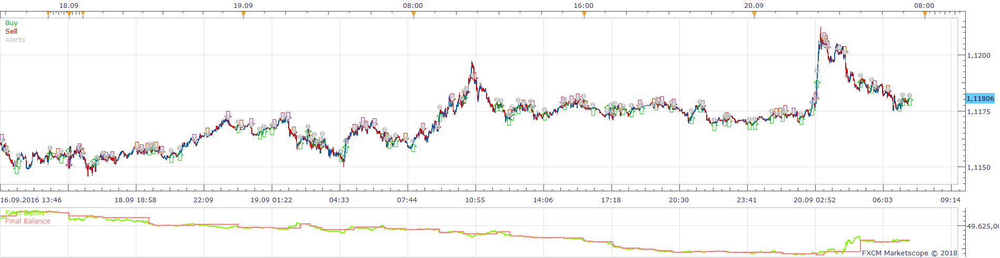
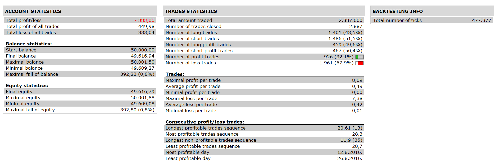

# EHLER CYBER CYCLE AND CG STRATEGY

> Source: https://fxcodebase.com/code/viewtopic.php?f=31&t=66254  
> Forum: 31 · Topic 66254 · 1 post(s)

---

## EHLER CYBER CYCLE AND CG STRATEGY

**Apprentice** · Tue Jul 10, 2018 1:58 pm

 

Ehlers_CG.lua and Ehlers_Cyber_Cycle.lua are available here.
[viewtopic.php?f=17&t=1262](https://fxcodebase.com/code/viewtopic.php?f=17&t=1262)

Open Long
1. BUFF 1> BUFF2 AND BUFF 2> BUY LEVEL IN EHLER CYBER CYCLE
2. BUFF 1 > BUFF 2 AND BUFF 2 CROSS OVER BUY LEVEL IN EHLER CG

Open Short
1. BUFF 1< BUFF2 AND BUFF 2 < SELL LEVEL IN EHLER CYBER CYCLE
2. BUFF 1 < BUFF 2 AND BUFF 2 CROSS UNDER SELL LEVEL IN EHLER CG

 [EHLER CYBER CYCLE AND CG STRATEGY.lua](files/119878/EHLER%20CYBER%20CYCLE%20AND%20CG%20STRATEGY.lua)
